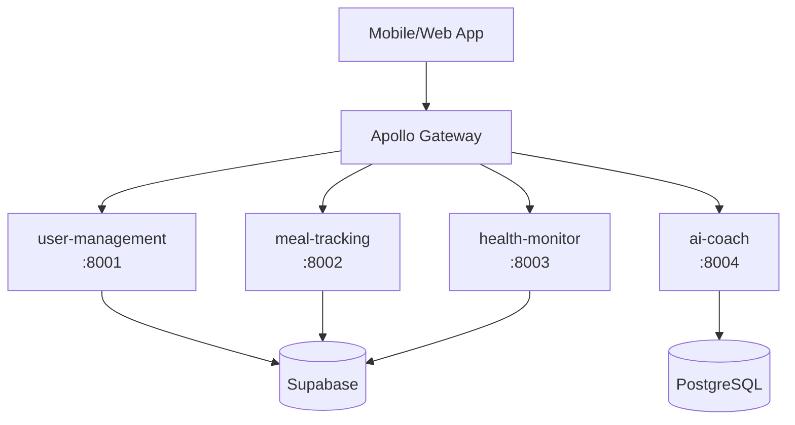

# 🌐 GymBro Platform - GraphQL Federation Guide

**Apollo Federation v2.3** | **Created**: 9 settembre 2025  
**Platform**: GymBro Fitness Platform | **Architecture**: Distributed GraphQL

---

## 📋 Table of Contents

1. [🎯 Federation Overview](#-federation-overview)
2. [🏗️ Architecture](#-architecture)
3. [🚀 Quick Start](#-quick-start)
4. [📝 Schema Design](#-schema-design)
5. [🔧 Service Configuration](#-service-configuration)
6. [🌐 Apollo Gateway Setup](#-apollo-gateway-setup)
7. [📊 Query Examples](#-query-examples)
8. [🧪 Testing Federation](#-testing-federation)
9. [🚀 Deployment](#-deployment)
10. [📚 Best Practices](#-best-practices)

---

## 🎯 Federation Overview

GymBro Platform uses **Apollo Federation v2.3** to create a unified GraphQL API from multiple microservices. Each service exposes a federated schema that can be combined into a single graph.

### **Benefits**
- ✅ **Unified API**: Single GraphQL endpoint for clients
- ✅ **Service Autonomy**: Each team owns their domain schema
- ✅ **Type Safety**: Strong typing across service boundaries  
- ✅ **Performance**: Efficient query planning and execution
- ✅ **Scalability**: Independent service scaling

### **Federation Architecture**



---

## 🏗️ Architecture

### **Current Services**

| Service | Port | Type | Status | Federation Role |
|---------|------|------|--------|----------------|
| **user-management** | 8001 | Supabase | ✅ Active | User entity owner |
| **meal-tracking** | 8002 | Supabase | 🔄 Planned | Meal & food entities |
| **health-monitor** | 8003 | Supabase | 🔄 Planned | Health data entities |
| **ai-coach** | 8004 | PostgreSQL | 🔄 Planned | Recommendations |
| **apollo-gateway** | 4000 | Gateway | 🔄 Planned | Schema composition |

### **Schema Ownership**

```graphql
# user-management owns:
type User @key(fields: "id") {
  id: ID!
  email: String!
  username: String
  profile: UserProfile
}

# meal-tracking owns:
type Meal @key(fields: "id") {
  id: ID!
  userId: ID!
  user: User  # Reference type
  foods: [Food!]!
}

# health-monitor owns:
type HealthData @key(fields: "id") {
  id: ID!
  userId: ID!
  user: User  # Reference type
  vitals: [Vital!]!
}
```

---

## 🚀 Quick Start

### **1. Start Existing Services**

```bash
# Start user-management service
cd services/user-management
poetry run uvicorn app.main:app --host 0.0.0.0 --port 8001 --reload

# Verify federation schema
curl -X POST http://localhost:8001/graphql \
  -H "Content-Type: application/json" \
  -d '{"query": "{ _service { sdl } }"}'
```

### **2. Generate New Service**

```bash
# Generate meal-tracking service
./scripts/generate-microservice.sh meal-tracking supabase

# Start the service
cd services/meal-tracking
poetry run uvicorn app.main:app --host 0.0.0.0 --port 8002 --reload
```

### **3. Setup Apollo Gateway** (Coming Soon)

```bash
# Will be available after Phase 2 implementation
cd services/apollo-gateway
npm start
```

---

## 📝 Schema Design

### **Federation Directives**

Our services use Apollo Federation v2.3 directives:

```graphql
# Enable federation
schema @link(url: "https://specs.apollo.dev/federation/v2.3", import: ["@key", "@external", "@requires"]) {
  query: Query
  mutation: Mutation
}

# Entity with federation key
type User @key(fields: "id") {
  id: ID!
  email: String!
  username: String
}

# Reference to external entity
type Meal @key(fields: "id") {
  id: ID!
  userId: ID!
  user: User  # Will be resolved by user-management
}
```

### **Federation Types**

Every federated schema includes these special types:

```graphql
# Service metadata
type _Service {
  sdl: String
}

# Entity union for federation
union _Entity = User | Meal | HealthData

# Federation queries
type Query {
  _entities(representations: [_Any!]!): [_Entity]!
  _service: _Service!
}
```

---

## 🔧 Service Configuration

### **Strawberry GraphQL Setup**

Each service uses this configuration:

```python
# app/graphql/schema.py
import strawberry
from strawberry.fastapi import GraphQLRouter

@strawberry.federation.type(keys=["id"])
class UserType:
    id: strawberry.ID
    email: str
    username: str | None = None

@strawberry.type
class Query:
    @strawberry.field
    def get_user(self, id: strawberry.ID) -> UserType | None:
        # Service-specific logic
        pass

# Create federated schema
schema = strawberry.federation.Schema(
    query=Query,
    enable_federation_2=True
)

# Add to FastAPI
graphql_router = GraphQLRouter(
    schema,
    graphiql=True,
    path="/graphql"
)
```

### **Environment Configuration**

```env
# .env
SERVICE_NAME=user-management
SERVICE_PORT=8001
GRAPHQL_INTROSPECTION=true
GRAPHQL_PLAYGROUND=true

# Database (varies by template)
SUPABASE_URL=your_supabase_url
SUPABASE_ANON_KEY=your_anon_key
SUPABASE_SERVICE_KEY=your_service_key
```

---

## 🌐 Apollo Gateway Setup

### **Gateway Configuration** (Phase 2)

```javascript
// services/apollo-gateway/src/index.js
import { ApolloGateway, IntrospectAndCompose } from '@apollo/gateway';
import { ApolloServer } from '@apollo/server';

const gateway = new ApolloGateway({
  supergraphSdl: new IntrospectAndCompose({
    subgraphs: [
      { name: 'user-management', url: 'http://localhost:8001/graphql' },
      { name: 'meal-tracking', url: 'http://localhost:8002/graphql' },
      { name: 'health-monitor', url: 'http://localhost:8003/graphql' },
      { name: 'ai-coach', url: 'http://localhost:8004/graphql' },
    ],
  }),
});

const server = new ApolloServer({
  gateway,
});

await server.listen({ port: 4000 });
console.log('🚀 Gateway ready at http://localhost:4000');
```

### **Health Checks**

```bash
# Check individual services
curl http://localhost:8001/health
curl http://localhost:8002/health

# Check gateway (Phase 2)
curl http://localhost:4000/.well-known/apollo/server-health
```

---

## 📊 Query Examples

### **Single Service Queries**

```graphql
# user-management service
query GetUser {
  user(id: "123") {
    id
    email
    username
    profile {
      firstName
      lastName
    }
  }
}
```

### **Federated Queries** (Phase 2)

```graphql
# Cross-service query through gateway
query GetUserWithMeals {
  user(id: "123") {
    id
    email
    username
    meals {  # Resolved by meal-tracking
      id
      name
      calories
      consumedAt
      foods {
        id
        name
        nutritionPer100g {
          calories
          protein
          carbs
          fat
        }
      }
    }
    healthData {  # Resolved by health-monitor
      id
      date
      weight
      bodyFat
      vitals {
        heartRate
        bloodPressure
      }
    }
    recommendations {  # Resolved by ai-coach
      id
      type
      message
      confidence
    }
  }
}
```

### **Mutation Examples**

```graphql
# Create user (user-management)
mutation CreateUser {
  createUser(input: {
    email: "john@example.com"
    username: "john_doe"
    password: "secure123"
  }) {
    id
    email
    username
  }
}

# Log meal (meal-tracking) - Phase 2
mutation LogMeal {
  createMeal(input: {
    name: "Breakfast"
    foods: [
      { id: "food_1", quantity: 100 }
      { id: "food_2", quantity: 250 }
    ]
  }) {
    id
    totalCalories
    user {  # Cross-service reference
      id
      username
    }
  }
}
```

---

## 🧪 Testing Federation

### **Schema Validation**

```bash
# Test federation schema for each service
./scripts/test-federation-schema.sh

# Manual validation
curl -X POST http://localhost:8001/graphql \
  -H "Content-Type: application/json" \
  -d '{"query": "{ _service { sdl } }"}' | jq '.data._service.sdl'
```

### **Entity Resolution Testing**

```bash
# Test entity resolution
curl -X POST http://localhost:8001/graphql \
  -H "Content-Type: application/json" \
  -d '{
    "query": "query($_representations: [_Any!]!) { _entities(representations: $_representations) { ... on User { id email } } }",
    "variables": {
      "_representations": [{"__typename": "User", "id": "123"}]
    }
  }'
```

### **Performance Testing**

```python
# tests/test_federation_performance.py
import asyncio
import time
from strawberry.test import BaseGraphQLTestClient

async def test_query_performance():
    client = BaseGraphQLTestClient(schema)
    
    start = time.time()
    result = await client.query("""
        query {
          users(limit: 100) {
            id
            email
            username
          }
        }
    """)
    end = time.time()
    
    assert result.errors is None
    assert end - start < 1.0  # Should complete under 1 second
```

---

## 🚀 Deployment

### **Docker Configuration**

```dockerfile
# Dockerfile (each service)
FROM python:3.11-slim

WORKDIR /app
COPY pyproject.toml poetry.lock ./
RUN pip install poetry && poetry install --no-dev

COPY . .
EXPOSE 8000

CMD ["poetry", "run", "uvicorn", "app.main:app", "--host", "0.0.0.0", "--port", "8000"]
```

### **Kubernetes Deployment**

```yaml
# k8s/user-management.yaml
apiVersion: apps/v1
kind: Deployment
metadata:
  name: user-management
spec:
  replicas: 3
  selector:
    matchLabels:
      app: user-management
  template:
    metadata:
      labels:
        app: user-management
    spec:
      containers:
      - name: user-management
        image: gymbro/user-management:latest
        ports:
        - containerPort: 8000
        env:
        - name: SERVICE_PORT
          value: "8000"
        readinessProbe:
          httpGet:
            path: /health
            port: 8000
---
apiVersion: v1
kind: Service
metadata:
  name: user-management-service
spec:
  selector:
    app: user-management
  ports:
  - port: 8001
    targetPort: 8000
```

### **Gateway Deployment**

```yaml
# k8s/apollo-gateway.yaml
apiVersion: apps/v1
kind: Deployment
metadata:
  name: apollo-gateway
spec:
  replicas: 2
  selector:
    matchLabels:
      app: apollo-gateway
  template:
    metadata:
      labels:
        app: apollo-gateway
    spec:
      containers:
      - name: gateway
        image: gymbro/apollo-gateway:latest
        ports:
        - containerPort: 4000
        env:
        - name: USER_MANAGEMENT_URL
          value: "http://user-management-service:8001/graphql"
        - name: MEAL_TRACKING_URL
          value: "http://meal-tracking-service:8002/graphql"
```

---

## 📚 Best Practices

### **Schema Design**

✅ **DO:**
- Use meaningful federation keys: `@key(fields: "id")`
- Keep entities focused on single responsibility
- Use consistent naming conventions
- Document all federated types

❌ **DON'T:**
- Share database tables between services
- Create circular entity references
- Use complex composite keys unless necessary
- Expose internal implementation details

### **Performance**

✅ **DO:**
- Implement field-level caching
- Use DataLoader for N+1 prevention
- Monitor query complexity
- Implement query timeouts

❌ **DON'T:**
- Make unnecessary database calls
- Ignore query depth limits
- Skip performance monitoring
- Allow unbounded list queries

### **Error Handling**

```python
# Good: Service-specific error handling
@strawberry.type
class UserNotFoundError:
    message: str = "User not found"
    code: str = "USER_NOT_FOUND"

@strawberry.field
def get_user(self, id: strawberry.ID) -> UserType | UserNotFoundError:
    user = find_user(id)
    if not user:
        return UserNotFoundError()
    return UserType.from_model(user)
```

### **Testing Strategy**

```python
# Integration tests for federation
async def test_cross_service_query():
    # Test that user can be resolved from meal-tracking
    result = await meal_client.query("""
        query {
          meal(id: "123") {
            id
            user {  # This should resolve via user-management
              email
              username
            }
          }
        }
    """)
    
    assert result.errors is None
    assert result.data.meal.user.email is not None
```

---

## 🔗 Resources

### **Documentation**
- [Apollo Federation Specification](https://www.apollographql.com/docs/federation/)
- [Strawberry GraphQL Federation](https://strawberry.rocks/docs/guides/federation)
- [GraphQL Best Practices](https://graphql.org/learn/best-practices/)

### **Tools**
- [Apollo Studio](https://studio.apollographql.com/) - Schema registry and monitoring
- [GraphQL Playground](http://localhost:8001/graphql) - Interactive queries
- [Rover CLI](https://www.apollographql.com/docs/rover/) - Schema management

### **Internal Resources**
- 📁 `templates/microservice-template/` - Service templates
- 📁 `scripts/generate-microservice.sh` - Service generator  
- 📁 `docs/microservizi_python.md` - Python microservices guide
- 📁 `services/user-management/` - Reference implementation

---

**Last Updated**: 9 settembre 2025  
**Version**: 1.0.0  
**Maintainer**: GymBro Platform Team
