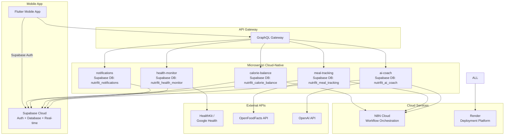

# Documentazione Generale - NutriFit Platform

## Executive Summary

**NutriFit** è una piattaforma fitness-nutrizionale basata su microservizi cloud-native con focus su bilanciamento calorico intelligente e tracking nutrizionale avanzato.

### Stack Tecnologico Production

- **Backend**: 5 microservizi FastAPI + Python 3.11 + Supabase Cloud
- **AI Platform**: OpenAI integration + workflow automation
- **Mobile**: Flutter cross-platform (iOS + Android)
- **Infrastructure**: Supabase + Render deployment + GitHub Actions CI/CD

### Architettura Benefits

- 🌐 **Global Scalability**: Supabase edge network per performance mondiale
- 📱 **Mobile Production**: Deployment simultaneo iOS App Store + Google Play
- 🔄 **Real-time Sync**: WebSocket + subscriptions cross-device
- 🛡️ **Security**: JWT + encrypted data storage
- ⚡ **Performance**: Database segregation + CDN optimization

---

## 1. Analisi Funzionale e Use Cases Cloud-Native

### Core User Journeys Ottimizzati

#### **Journey 1: Nuovo Utente - Onboarding Intelligente**

1. **[Mobile App Download]** → Flutter app da App Store/Google Play
2. **[Supabase Auth]** → Email/password o social login (Google, Apple)
3. **[Health Permissions]** → HealthKit (iOS) + Google Health Connect (Android)
4. **[AI Profile Setup]** → N8N workflow triggers personalized onboarding
5. **[Smart Calibration]** → 7 giorni AI learning per customization
6. **[Dashboard Ready]** → Real-time sync attivo cross-device

#### **Journey 2: Utente Attivo - Tracking Quotidiano**

1. **[Breakfast Scan]** → Camera ML + AI analysis → Supabase storage
2. **[Background Sync]** → Health data → Real-time WebSocket update
3. **[Lunch Barcode]** → OpenFoodFacts API → Nutrition calculation
4. **[AI Check-in]** → N8N conversational workflow → Insight generation
5. **[Dinner Planning]** → AI recommendations via MCP server
6. **[Daily Summary]** → Real-time dashboard + trend analysis

#### **Journey 3: Advanced User - Performance Optimization**

1. **[Weekly Analytics]** → N8N data analysis workflow
2. **[Goal Adjustment]** → AI-driven recommendations via MCP
3. **[Meal Planning]** → Automated weekly plan generation
4. **[Professional Export]** → Data export per healthcare providers
5. **[Community Features]** → Social sharing (optional)

## 2. Cloud-Native Domain Model con Supabase Integration

### Core Domain: Precision Calorie Tracking

Il sistema gestisce il **bilanciamento calorico cloud-native**, utilizzando Supabase per data persistence, real-time sync, e N8N per AI workflow orchestration. Ogni microservizio mantiene il proprio database segregato per autonomia completa.

### Supabase Schema Design per Database Segregation

```sql
-- Database: nutrifit_calorie_balance
CREATE TABLE calorie_goals (
  id UUID PRIMARY KEY DEFAULT gen_random_uuid(),
  user_id UUID NOT NULL REFERENCES auth.users(id),
  daily_target INTEGER NOT NULL,
  weekly_adjustment_factor DECIMAL(3,2) DEFAULT 1.0,
  ai_optimization_enabled BOOLEAN DEFAULT true,
  created_at TIMESTAMPTZ DEFAULT NOW(),
  updated_at TIMESTAMPTZ DEFAULT NOW()
);

-- Real-time subscription enabled
ALTER TABLE calorie_goals ENABLE ROW LEVEL SECURITY;

CREATE POLICY "Users can manage their goals" ON calorie_goals
  FOR ALL USING (auth.uid() = user_id);

-- Database: nutrifit_meal_tracking  
CREATE TABLE meals (
  id UUID PRIMARY KEY DEFAULT gen_random_uuid(),
  user_id UUID NOT NULL REFERENCES auth.users(id),
  name TEXT NOT NULL,
  description TEXT,
  calories INTEGER NOT NULL,
  protein_g DECIMAL(5,2),
  carbs_g DECIMAL(5,2),
  fats_g DECIMAL(5,2),
  confidence_score DECIMAL(3,2) DEFAULT 0.8,
  data_source TEXT DEFAULT 'manual',
  consumed_at TIMESTAMPTZ NOT NULL,
  created_at TIMESTAMPTZ DEFAULT NOW(),
  sync_status TEXT DEFAULT 'synced'
);

-- N8N workflow triggers
CREATE OR REPLACE FUNCTION trigger_n8n_meal_analysis()
RETURNS TRIGGER AS $$
BEGIN
  -- Trigger N8N webhook per AI analysis
  PERFORM net.http_post(
    url := 'https://n8n.cloud/webhook/meal-analysis',
    headers := '{"Content-Type": "application/json"}'::jsonb,
    body := json_build_object(
      'meal_id', NEW.id,
      'user_id', NEW.user_id,
      'calories', NEW.calories,
      'timestamp', NEW.consumed_at
    )::text
  );
  RETURN NEW;
END;
$$ LANGUAGE plpgsql;

CREATE TRIGGER meal_ai_analysis
  AFTER INSERT ON meals
  FOR EACH ROW
  EXECUTE FUNCTION trigger_n8n_meal_analysis();
```

### Cloud-Native Value Objects

```python
# app/domain/value_objects.py - Cloud-first design
from dataclasses import dataclass
from enum import Enum
from typing import Optional
import uuid
from datetime import datetime

class DataSource(Enum):
    """Event source enumeration aligned with production database schema"""
    MANUAL = "manual"
    FITNESS_TRACKER = "fitness_tracker"  
    SMART_SCALE = "smart_scale"
    NUTRITION_SCAN = "nutrition_scan"
    HEALTHKIT = "healthkit"
    GOOGLE_FIT = "google_fit"

@dataclass(frozen=True)
class CloudDataAttribution:
    """Attribution per data cloud-native con sync status"""
    source: DataSource
    confidence: float  # 0.0-1.0
    sync_timestamp: datetime
    supabase_row_id: Optional[uuid.UUID] = None
    n8n_workflow_id: Optional[str] = None
    
    @classmethod
    def from_health_integration(cls, platform: str, metric_type: str) -> 'CloudDataAttribution':
        confidence_map = {
            ('healthkit', 'steps'): 0.95,
            ('healthkit', 'calories'): 0.85,
            ('google_health', 'steps'): 0.90,
            ('google_health', 'calories'): 0.80,
        }
        
        return cls(
            source=DataSource.HEALTHKIT if platform == 'ios' else DataSource.GOOGLE_HEALTH,
            confidence=confidence_map.get((platform, metric_type), 0.7),
            sync_timestamp=datetime.utcnow()
        )
    
    @classmethod
    def from_ai_analysis(cls, n8n_workflow_id: str, confidence: float) -> 'CloudDataAttribution':
        return cls(
            source=DataSource.AI_ANALYSIS,
            confidence=confidence,
            sync_timestamp=datetime.utcnow(),
            n8n_workflow_id=n8n_workflow_id
        )
```

**2. Domain Model Integrato con API Constraints**

**Core Domain: Calorie Balance con Precision Management**

Il sistema gestisce il **bilanciamento calorico precision-aware**,
integrando limitazioni reali delle fonti dati e providing confidence
scoring per ogni metrica.

**Domain Model Constraint-Aware**

**Value Objects per Data Quality Management**
```typescript
// Data Source Attribution con confidence reale
class DataSourceAttribution {
  constructor(
    public readonly source: DataSource,
    public readonly confidence: number, // 0.0-1.0 basato su analisi API reale
    public readonly lastUpdated: Date,
    public readonly syncLatency?: number // HealthKit: 15-30min delay
  ) {}
  
  static fromHealthKit(metric: HealthKitMetric): DataSourceAttribution {
    const confidenceMap = {
      'steps': 0.9,           // 85-95% accuracy da analisi
      'activeCalories': 0.75,  // ±10-15% margin
      'weight': 0.95,         // Alta precisione se da bilancia smart
      'heartRate': 0.92       // Apple Watch medical grade
    }
    
    return new DataSourceAttribution(
      DataSource.HEALTHKIT,
      confidenceMap[metric] || 0.7,
      new Date(),
      30 // minuti di delay tipico HealthKit
    )
  }
  
  static fromOpenFoodFacts(product: OpenFoodFactsProduct): DataSourceAttribution {
    // Analisi reale: micronutrienti disponibili solo per 10-30% prodotti
    let confidence = 0.8 // Base per macronutrienti
    
    if (!product.nutriments.proteins_100g) confidence -= 0.2
    if (!product.nutriments.fiber_100g) confidence -= 0.1
    if (Object.keys(product.nutriments).filter(k => k.includes('vitamin')).length === 0) {
      confidence -= 0.3 // Penalizza mancanza micronutrienti
    }
    
    return new DataSourceAttribution(
      DataSource.OPENFOODFACTS,
      Math.max(confidence, 0.3),
      new Date()
    )
  }
}

// Precision Management per accuratezza ±20g
class FoodQuantity {
  constructor(
    private _value: number,
    public readonly unit: string,
    public readonly precision: number = 20 // grammi, dal requisito
  ) {}
  
  get value(): number {
    // Arrotonda alla precisione specificata
    return Math.round(this._value / this.precision) * this.precision
  }
  
  get confidenceInterval(): { min: number, max: number } {
    return {
      min: this.value - this.precision,
      max: this.value + this.precision
    }
  }
}

// Gestione conflitti multi-source
class NutritionDataConflictResolver {
  static resolve(sources: NutritionDataWithSource[]): NutritionData {
    // Weighted average basato su confidence + source priority
    const sourcePriority = {
      [DataSource.MANUAL]: 1.0,      // Utente ha precedenza
      [DataSource.OPENFOODFACTS]: 0.8, // Dati strutturati
      [DataSource.CREA]: 0.9,        // Database scientifico italiano
      [DataSource.GPT4V]: 0.6,       // AI estimation
      [DataSource.ESTIMATED]: 0.3    // Fallback
    }
    
    const weightedSources = sources.map(s => ({
      ...s,
      weight: s.attribution.confidence * sourcePriority[s.attribution.source]
    }))
    
    const totalWeight = weightedSources.reduce((sum, s) => sum + s.weight, 0)
    
    return {
      calories: weightedSources.reduce((sum, s) => sum + (s.data.calories * s.weight), 0) / totalWeight,
      proteins: weightedSources.reduce((sum, s) => sum + (s.data.proteins * s.weight), 0) / totalWeight,
      // ... altri nutrienti con weighted average
      finalConfidence: totalWeight / sources.length,
      sourcesUsed: sources.map(s => s.attribution.source)
    }
  }
}

// Fallback Strategy per OpenFoodFacts gaps
class NutritionalDataFallbackStrategy {
  async getNutritionData(foodQuery: FoodQuery): Promise<NutritionDataResult> {
    const strategies = [
      () => this.tryOpenFoodFacts(foodQuery),
      () => this.tryCreaDatabaseLookup(foodQuery), // Database italiano
      () => this.tryGPT4VEstimation(foodQuery),
      () => this.tryCrowdsourcingRequest(foodQuery),
      () => this.useGenericCategory(foodQuery)
    ]
    
    for (const strategy of strategies) {
      try {
        const result = await strategy()
        if (result.confidence > 0.5) return result
      } catch (error) {
        // Log e continua con strategia successiva
        continue
      }
    }
    
    throw new NutritionDataNotAvailableError(foodQuery)
  }
  
  private async tryOpenFoodFacts(query: FoodQuery): Promise<NutritionDataResult> {
    // Rate limit: 100 req/min da constraint analysis
    await this.rateLimiter.waitIfNeeded('openfoodfacts', 100)
    
    const result = await this.openFoodFactsClient.lookup(query)
    
    // Coverage reality check: prodotti italiani artigianali spesso mancanti
    if (!result && query.isItalianArtisanal) {
      throw new NotFoundError('Italian artisanal product not in OpenFoodFacts')
    }
    
    return result
  }
}
```

**Aggregates con Constraint Integration**

```typescript
// Calorie Balance Aggregate con HealthKit constraints
class CalorieBalance {
  constructor(
    private userId: UserId,
    private goal: CalorieGoal,
    private dailyEntries: DailyCalorieEntry[],
    private healthKitSyncStatus: HealthKitSyncStatus // Nuovo!
  ) {}

  async updateFromHealthKit(data: HealthKitData): Promise<void> {
    // Constraint: HealthKit sync delay 15-30 minuti
    const now = new Date()
    const dataAge = now.getTime() - data.timestamp.getTime()
    const isStale = dataAge > (45 * 60 * 1000) // 45 minuti threshold
    
    if (isStale) {
      // Usa dati ma marca come potentially outdated
      this.healthKitSyncStatus = HealthKitSyncStatus.STALE
    }
    
    // Constraint: Permission opacity - iOS non dice se denied
    if (data.isEmpty() && !this.hasExplicitHealthKitDenial()) {
      // Potrebbe essere permission denied silently
      this.schedulePermissionRecheck()
    }
    
    const entry = this.findOrCreateDailyEntry(data.date)
    entry.updateCaloriesExpenditure(
      data.activeCalories,
      data.basalCalories,
      DataSourceAttribution.fromHealthKit('calories')
    )
  }
  
  getCurrentBalanceWithConfidence(): CalorieBalanceResult {
    const latestEntry = this.getLatestEntry()
    
    // Calcola confidence composite
    const intakeConfidence = latestEntry.getIntakeConfidence()
    const expenditureConfidence = latestEntry.getExpenditureConfidence()
    const overallConfidence = (intakeConfidence + expenditureConfidence) / 2
    
    return {
      balance: latestEntry.balance,
      confidence: overallConfidence,
      dataFreshness: this.healthKitSyncStatus,
      recommendations: this.generateRecommendations(overallConfidence)
    }
  }
}

// Meal Tracking con OpenFoodFacts constraints  
class DailyMealPlan {
  constructor(
    private date: Date,
    private meals: Meal[],
    private nutritionDataCache: NutritionDataCache, // Cache per rate limits
    private italianFoodFallback: ItalianFoodDatabase  // Database CREA
  ) {}

  async addMealFromPhoto(photo: Photo, userId: UserId): Promise<Meal> {
    // GPT-4V analysis con focus su cucina italiana
    const analysis = await this.gpt4vService.analyzeItalianFood(photo, {
      includePortionEstimation: true,
      confidenceThreshold: 0.7,
      italianCuisineContext: true
    })
    
    const foods = []
    for (const recognizedFood of analysis.foods) {
      const nutritionData = await this.resolveNutritionData(recognizedFood)
      foods.push(new FoodItem(
        recognizedFood.name,
        recognizedFood.estimatedPortion,
        nutritionData,
        DataSourceAttribution.fromGPT4V(analysis.confidence)
      ))
    }
    
    const meal = new Meal(
      MealId.generate(),
      MealType.fromTimeOfDay(new Date()),
      new Date(),
      foods,
      photo.url,
      AnalysisSource.PHOTO
    )
    
    this.meals.push(meal)
    return meal
  }
  
  private async resolveNutritionData(food: RecognizedFood): Promise<NutritionData> {
    // Cache check per rate limit management
    const cached = await this.nutritionDataCache.get(food.name)
    if (cached && cached.isValid()) return cached.data
    
    // Fallback strategy per coverage gaps
    const fallbackStrategy = new NutritionalDataFallbackStrategy()
    const result = await fallbackStrategy.getNutritionData(food.toQuery())
    
    // Cache result per evitare re-fetch
    await this.nutritionDataCache.set(food.name, result, {
      ttl: result.confidence > 0.8 ? 7200 : 1800 // TTL based on confidence
    })
    
    return result.data
  }
}
```

## 3. Architettura Cloud-Native Microservizi

### 5 Microservizi con Database Segregation + N8N Orchestration



### Database Segregation Strategy

| Microservizio | Database Supabase | Responsabilità Core | MCP Server |
|---------------|-------------------|-------------------|------------|
| **calorie-balance** | `nutrifit_calorie_balance` | Goals, BMR, energy balance | ✅ Per AI insights |
| **meal-tracking** | `nutrifit_meal_tracking` | Food data, nutrition facts | ✅ Per food analysis |

### 🎯 Parameter Passing Pattern per Microservice Decoupling

**Problema Architetturale Risolto (ARCH-011)**: Eliminare dipendenze cross-service tra microservizi mantenendo la funzionalità business.

**Soluzione Implementata**: Pattern Parameter Passing dove i client (mobile app, N8N orchestrator) forniscono i dati utente necessari nel request body invece di richiedere accesso cross-service.

#### Implementazione nel Calorie Balance Service

```python
# API Schema con Parameter Passing
class MetabolicCalculationRequest(BaseModel):
    """Request che include user metrics per calcoli metabolici"""
    weight_kg: float = Field(..., description="Peso utente in kg")
    height_cm: float = Field(..., description="Altezza utente in cm") 
    age: int = Field(..., description="Età utente")
    gender: GenderType = Field(..., description="Genere utente")
    activity_level: ActivityLevel = Field(..., description="Livello attività")

# Service Layer che accetta user metrics come parametri
class MetabolicCalculationService:
    async def calculate_metabolic_profile(
        self, 
        user_id: UUID,
        weight_kg: float,
        height_cm: float, 
        age: int,
        gender: GenderType,
        activity_level: ActivityLevel
    ) -> MetabolicProfile:
        """
        Calcola profilo metabolico usando user metrics fornite nel request.
        Non accede direttamente al user-management service.
        """
        # Calcolo BMR usando Harris-Benedict equation
        if gender == GenderType.MALE:
            bmr = 88.362 + (13.397 * weight_kg) + (4.799 * height_cm) - (5.677 * age)
        else:
            bmr = 447.593 + (9.247 * weight_kg) + (3.098 * height_cm) - (4.330 * age)
            
        # Calcolo activity_multiplier da activity_level
        multipliers = {
            ActivityLevel.SEDENTARY: 1.2,
            ActivityLevel.LIGHT: 1.375, 
            ActivityLevel.MODERATE: 1.55,
            ActivityLevel.ACTIVE: 1.725,
            ActivityLevel.VERY_ACTIVE: 1.9
        }
        
        activity_multiplier = multipliers[activity_level]
        tdee = bmr * activity_multiplier
        
        return MetabolicProfile(
            user_id=user_id,
            current_weight_kg=weight_kg,
            current_height_cm=height_cm,
            current_age=age,
            gender=gender,
            activity_level=activity_level,
            activity_multiplier=activity_multiplier,
            bmr_calories=int(bmr),
            tdee_calories=int(tdee)
        )
```

#### Benefici Architetturali

- **✅ Microservice Independence**: Ogni service è autonomo e non dipende da altri per funzionare
- **✅ Mobile App Ready**: L'app mobile può chiamare direttamente i servizi con i dati utente 
- **✅ N8N Orchestrator Compatible**: I workflow N8N possono aggregare dati e chiamare servizi
- **✅ Testing Simplified**: Unit test semplificati senza mock di servizi esterni
- **✅ Deployment Flexibility**: Servizi possono essere deployati indipendentemente
- **✅ Performance Optimized**: Elimina network calls cross-service

**Status**: ✅ **COMPLETATO** - Implementato nel calorie-balance service con successo
| **health-monitor** | `nutrifit_health_monitor` | HealthKit sync, metrics | ❌ Solo data collection |
| **notifications** | `nutrifit_notifications` | Push notifications, alerts | ❌ Solo messaging |
| **ai-coach** | `nutrifit_ai_coach` | Conversations, recommendations | ✅ Primary MCP server |

### Model Context Protocol (MCP) Implementation

```python
# services/ai-coach/app/mcp/nutrition_server.py
from mcp.server import Server
from mcp.types import Tool, TextContent
from typing import Dict, Any, List
import asyncio
from datetime import datetime, timedelta

class NutritionMCPServer:
    def __init__(self):
        self.server = Server("nutrifit-ai-coach")
        self.setup_tools()
        
    def setup_tools(self):
        """Setup MCP tools per AI nutrition coaching"""
        
        @self.server.list_tools()
        async def list_tools() -> List[Tool]:
            return [
                Tool(
                    name="analyze_nutrition_pattern",
                    description="Analizza pattern nutrizionali utente ultimi N giorni",
                    inputSchema={
                        "type": "object",
                        "properties": {
                            "user_id": {"type": "string"},
                            "days": {"type": "integer", "default": 7}
                        },
                        "required": ["user_id"]
                    }
                ),
                Tool(
                    name="generate_meal_suggestions",
                    description="Genera suggerimenti pasti personalizzati",
                    inputSchema={
                        "type": "object",
                        "properties": {
                            "user_id": {"type": "string"},
                            "meal_type": {"type": "string", "enum": ["breakfast", "lunch", "dinner", "snack"]},
                            "remaining_calories": {"type": "integer"},
                            "dietary_restrictions": {"type": "array", "items": {"type": "string"}}
                        },
                        "required": ["user_id", "meal_type", "remaining_calories"]
                    }
                ),
                Tool(
                    name="analyze_food_image",
                    description="Analizza immagine cibo per nutrition facts",
                    inputSchema={
                        "type": "object",
                        "properties": {
                            "image_base64": {"type": "string"},
                            "user_context": {"type": "object"}
                        },
                        "required": ["image_base64"]
                    }
                )
            ]
        
        @self.server.call_tool()
        async def call_tool(name: str, arguments: Dict[str, Any]) -> List[TextContent]:
            if name == "analyze_nutrition_pattern":
                result = await self._analyze_nutrition_pattern(**arguments)
            elif name == "generate_meal_suggestions":
                result = await self._generate_meal_suggestions(**arguments)
            elif name == "analyze_food_image":
                result = await self._analyze_food_image(**arguments)
            else:
                raise ValueError(f"Unknown tool: {name}")
            
            return [TextContent(type="text", text=str(result))]
    
    async def _analyze_nutrition_pattern(self, user_id: str, days: int = 7) -> Dict[str, Any]:
        """Analizza pattern nutrizionali cross-microservizio"""
        
        # Fetch data da microservizi via Supabase
        meals_data = await self._fetch_meals_data(user_id, days)
        health_data = await self._fetch_health_data(user_id, days)
        balance_data = await self._fetch_balance_data(user_id, days)
        
        # AI analysis con OpenAI
        analysis = {
            'eating_schedule': self._analyze_meal_timing(meals_data),
            'macro_distribution': self._analyze_macros(meals_data),
            'calorie_consistency': self._analyze_calorie_patterns(balance_data),
            'health_correlation': self._analyze_health_correlation(health_data, meals_data),
            'goal_adherence': self._calculate_goal_adherence(balance_data),
            'recommendations': await self._generate_ai_recommendations(user_id, meals_data, health_data)
        }
        
        # Trigger N8N workflow per insights storage
        await self._trigger_n8n_workflow('nutrition-analysis-complete', {
            'user_id': user_id,
            'analysis': analysis,
            'timestamp': datetime.utcnow().isoformat()
        })
        
        return analysis
    
    async def _generate_meal_suggestions(
        self, 
        user_id: str, 
        meal_type: str, 
        remaining_calories: int,
        dietary_restrictions: List[str] = None
    ) -> List[Dict[str, Any]]:
        """Genera suggerimenti pasti AI-powered"""
        
        # Context gathering
        user_profile = await self._get_user_profile(user_id)
        recent_meals = await self._fetch_recent_meals(user_id, days=3)
        preferences = await self._get_user_preferences(user_id)
        
        # OpenAI meal generation
        suggestions = await self._openai_meal_generation({
            'meal_type': meal_type,
            'remaining_calories': remaining_calories,
            'dietary_restrictions': dietary_restrictions or [],
            'user_profile': user_profile,
            'recent_meals': recent_meals,
            'preferences': preferences
        })
        
        # Enhance con nutrition data da OpenFoodFacts
        enhanced_suggestions = []
        for suggestion in suggestions:
            nutrition_data = await self._enrich_with_nutrition_data(suggestion)
            enhanced_suggestions.append(nutrition_data)
        
        return enhanced_suggestions
```

```python
# services/ai-nutrition-coach/app/domain/mcp_server.py
from mcp import McpServer, Tool, Resource
from typing import List, Dict, Any
import asyncio
from datetime import datetime, timedelta

class NutritionMcpServer(McpServer):
    def __init__(self):
        super().__init__()
        self.user_contexts = {}
        self.nutrition_knowledge_base = NutritionKnowledgeBase()
        
    @Tool(
        name="analyze_user_nutrition_pattern", 
        description="Analizza i pattern nutrizionali dell'utente degli ultimi N giorni"
    )
    async def analyze_nutrition_pattern(self, user_id: str, days: int = 7) -> Dict[str, Any]:
        # Fetch dati da altri microservizi
        meals_data = await self.meal_tracking_client.get_user_meals(user_id, days)
        health_data = await self.health_monitor_client.get_user_metrics(user_id, days)
        balance_data = await self.calorie_balance_client.get_user_trends(user_id, days)
        
        # Analisi pattern con ML
        pattern_analysis = {
            'eating_schedule': self.analyze_meal_timing(meals_data),
            'macronutrient_distribution': self.analyze_macros(meals_data),
            'calorie_consistency': self.analyze_calorie_patterns(balance_data),
            'goal_adherence': self.analyze_goal_progress(balance_data),
            'energy_correlation': self.analyze_energy_patterns(health_data, meals_data)
        }
        
        return pattern_analysis

    @Tool(
        name="generate_personalized_meal_suggestions",
        description="Genera suggerimenti pasti personalizzati basati su obiettivi, preferenze e situazione attuale"
    )
    async def generate_meal_suggestions(
        self, 
        user_id: str, 
        meal_type: str,
        remaining_calories: int,
        preferences: Dict[str, Any] = None
    ) -> List[Dict[str, Any]]:
        
        user_profile = await self.get_user_context(user_id)
        
        # Context per OpenAI
        context = {
            'user_profile': user_profile,
            'remaining_daily_calories': remaining_calories,
            'meal_type': meal_type,
            'dietary_preferences': preferences or {},
            'recent_meals': await self.get_recent_meals(user_id, 3),
            'italian_cuisine_focus': True,
            'seasonal_ingredients': self.get_seasonal_ingredients(),
            'time_of_day': datetime.now().hour
        }
        
        # RAG su database ricette italiane
        relevant_recipes = await self.recipe_rag_system.find_relevant_recipes(
            query=f"{meal_type} {remaining_calories} calorie italiano",
            context=context,
            limit=10
        )
        
        # OpenAI per personalizzazione
        suggestions = await self.openai_client.chat.completions.create(
            model="gpt-4",
            messages=[
                {
                    "role": "system", 
                    "content": self.get_nutrition_coach_system_prompt()
                },
                {
                    "role": "user",
                    "content": f"""
                    Suggerisci 3 opzioni per {meal_type} considerando:
                    - Calorie rimanenti: {remaining_calories}
                    - Profilo utente: {user_profile}
                    - Ricette disponibili: {relevant_recipes}
                    - Focus su cucina italiana tradizionale ma salutare
                    """
                }
            ],
            functions=[{
                "name": "format_meal_suggestions",
                "parameters": {
                    "type": "object",
                    "properties": {
                        "suggestions": {
                            "type": "array",
                            "items": {
                                "type": "object",
                                "properties": {
                                    "name": {"type": "string"},
                                    "ingredients": {"type": "array", "items": {"type": "string"}},
                                    "estimated_calories": {"type": "integer"},
                                    "prep_time_minutes": {"type": "integer"},
                                    "macros": {"type": "object"},
                                    "why_suggested": {"type": "string"}
                                }
                            }
                        }
                    }
                }
            }],
            function_call={"name": "format_meal_suggestions"}
        )
        
        return json.loads(suggestions.choices[0].message.function_call.arguments)

    @Tool(
        name="conversational_nutrition_guidance",
        description="Fornisce guidance nutrizionale conversazionale basata su domanda utente e contesto"
    )
    async def conversational_guidance(
        self, 
        user_id: str, 
        user_message: str,
        conversation_history: List[Dict] = None
    ) -> Dict[str, Any]:
        
        # Costruisci context completo
        user_context = await self.build_comprehensive_user_context(user_id)
        
        # Conversation memory
        conversation_context = conversation_history or []
        
        # RAG su knowledge base nutrizionale
        relevant_knowledge = await self.nutrition_knowledge_base.search(
            query=user_message,
            user_context=user_context,
            limit=5
        )
        
        # OpenAI con context completo
        response = await self.openai_client.chat.completions.create(
            model="gpt-4",
            messages=[
                {
                    "role": "system",
                    "content": f"""
                    Sei un coach nutrizionale AI esperto in cucina italiana e fitness.
                    
                    Contesto utente: {user_context}
                    Knowledge base: {relevant_knowledge}
                    
                    Rispondi in modo:
                    - Personalizzato basato sui dati dell'utente
                    - Pratico e attuabile
                    - Scientificamente accurato
                    - Culturalmente appropriato (cucina italiana)
                    - Empatico e motivazionale
                    """
                },
                *conversation_context,
                {"role": "user", "content": user_message}
            ]
        )
        
        guidance = response.choices[0].message.content
        
        # Track interaction per miglioramento continuo
        await self.interaction_tracker.log_interaction(
            user_id=user_id,
            user_message=user_message,
            ai_response=guidance,
            context_used=user_context,
            timestamp=datetime.now()
        )
        
        return {
            'response': guidance,
            'confidence': 0.9,  # TODO: implement confidence scoring
            'suggested_actions': self.extract_actionable_items(guidance),
            'follow_up_questions': self.generate_follow_up_questions(user_message, guidance)
        }

class NutritionKnowledgeBase:
    def __init__(self):
        # Vector database con pgvector per RAG
        self.vector_db = VectorDatabase()
        
    async def search(self, query: str, user_context: Dict, limit: int = 5):
        # Embed query
        query_embedding = await self.embedding_service.embed(query)
        
        # Vector similarity search
        results = await self.vector_db.similarity_search(
            embedding=query_embedding,
            filters={
                'language': 'italian',
                'cuisine_type': 'italian',
                'user_dietary_restrictions': user_context.get('dietary_restrictions', [])
            },
            limit=limit
        )
        
        return results
```

**FastAPI Template Integration con Repository Ufficiale**

**Copier Template Configuration:**

```yaml

# .copier/microservice/copier.yaml (basato su fastapi/full-stack-fastapi-template)
_templates_suffix: .jinja
_envops:
  block_start_string: "<%"
  block_end_string: "%>"

service_name:
  type: str
  help: Nome del microservizio (es. ai-nutrition-coach)
  
service_description:
  type: str
  help: Descrizione del microservizio
  
bounded_context:
  type: str
  help: Bounded context del dominio
  choices:
    - calorie-balance
    - meal-tracking
    - health-monitor  
    - notifications
    - ai-nutrition-coach

# Integrazione con template ufficiale FastAPI
base_template_repo: "https://github.com/fastapi/full-stack-fastapi-template.git"
use_postgres: true
use_redis: true
use_celery: false  # Usiamo n8n
include_tests: true
include_docker: true

# Nutrition-specific additions
include_ml_dependencies:
  type: bool
  default: false
  help: Include dipendenze ML (scikit-learn, pandas, numpy)?

include_openai_integration:
  type: bool  
  default: false
  help: Include integrazione OpenAI?

include_healthkit_models:
  type: bool
  default: false
  help: Include modelli per dati HealthKit?
```

**Script Setup Automatizzato:**

```bash

#!/bin/bash
# scripts/create-service.sh

set -e

SERVICE_NAME=$1
BOUNDED_CONTEXT=$2

if [ -z "$SERVICE_NAME" ] || [ -z "$BOUNDED_CONTEXT" ]; then
    echo "Usage: ./create-service.sh <service-name> <bounded-context>"
    echo "Example: ./create-service.sh ai-nutrition-coach ai-nutrition-coach"
    exit 1
fi

echo "Creating microservice: $SERVICE_NAME in bounded context: $BOUNDED_CONTEXT"

# Create from template
copier copy \
    --data service_name="$SERVICE_NAME" \
    --data bounded_context="$BOUNDED_CONTEXT" \
    --data service_description="Microservizio $BOUNDED_CONTEXT per piattaforma fitness nutrizionale" \
    --data use_postgres=true \
    --data use_redis=true \
    --data include_tests=true \
    --data include_docker=true \
    .copier/microservice \
    services/$SERVICE_NAME

# Setup Poetry dependencies
cd services/$SERVICE_NAME

# Add shared dependencies
poetry add \
    ../../../shared/models \
    ../../../shared/utils \
    --group dev

# Add context-specific dependencies
case $BOUNDED_CONTEXT in
    "ai-nutrition-coach")
        poetry add openai mcp-python scikit-learn pandas numpy
        ;;
    "meal-tracking")
        poetry add Pillow httpx
        ;;
    "health-monitor")  
        poetry add scipy statsmodels
        ;;
esac

# Generate initial migration
poetry run alembic revision --autogenerate -m "Initial migration for $SERVICE_NAME"

# Setup Docker build context
docker build -t fitness-nutrition/$SERVICE_NAME:dev .

echo "Service $SERVICE_NAME created successfully!"
echo "Next steps:"
echo "1. cd services/$SERVICE_NAME"
echo "2. poetry shell"  
echo "3. poetry run uvicorn app.main:app --reload --port 8000"


```


**4. Database Schema Constraint-Aware**

**PostgreSQL Schema con Data Quality Management**

```sql
-- migrations/001_constraint_aware_schema.sql

-- Enhanced users table con HealthKit integration
CREATE TABLE users (
    id UUID PRIMARY KEY DEFAULT gen_random_uuid(),
    email TEXT UNIQUE NOT NULL,
    created_at TIMESTAMP WITH TIME ZONE DEFAULT NOW(),
    updated_at TIMESTAMP WITH TIME ZONE DEFAULT NOW(),
    
    -- Profile data
    age INTEGER,
    gender TEXT CHECK (gender IN ('MALE', 'FEMALE')),
    height_cm INTEGER,
    activity_level TEXT CHECK (activity_level IN ('SEDENTARY', 'LIGHT', 'MODERATE', 'ACTIVE', 'VERY_ACTIVE')),
    
    -- HealthKit integration status
    healthkit_authorized BOOLEAN DEFAULT false,
    healthkit_last_sync TIMESTAMP WITH TIME ZONE,
    healthkit_sync_status TEXT DEFAULT 'UNKNOWN' CHECK (healthkit_sync_status IN ('HEALTHY', 'STALE', 'DENIED', 'UNKNOWN')),
    
    -- AI preferences
    ai_coaching_enabled BOOLEAN DEFAULT true,
    conversation_style TEXT DEFAULT 'BALANCED' CHECK (conversation_style IN ('CASUAL', 'PROFESSIONAL', 'BALANCED')),
    
    -- Preferences
    timezone TEXT DEFAULT 'Europe/Rome',
    language TEXT DEFAULT 'it'
);

-- Data quality tracking per ogni fonte
CREATE TABLE data_sources (
    id UUID PRIMARY KEY DEFAULT gen_random_uuid(),
    name TEXT UNIQUE NOT NULL, -- 'OPENFOODFACTS', 'HEALTHKIT', 'CREA', 'GPT4V', 'MANUAL'
    base_confidence DECIMAL(3,2) NOT NULL, -- Confidence di base per la fonte
    rate_limit_per_minute INTEGER,
    last_rate_limit_reset TIMESTAMP WITH TIME ZONE DEFAULT NOW(),
    current_requests INTEGER DEFAULT 0,
    availability_status TEXT DEFAULT 'AVAILABLE' CHECK (availability_status IN ('AVAILABLE', 'DEGRADED', 'UNAVAILABLE'))
);

-- Food catalog con data quality integration
CREATE TABLE foods (
    id UUID PRIMARY KEY DEFAULT gen_random_uuid(),
    name TEXT NOT NULL,
    brand TEXT,
    barcode TEXT UNIQUE,
    category TEXT,
    
    -- Nutrition per 100g (sempre normalizzato)
    calories_per_100g DECIMAL(6,2) NOT NULL,
    proteins_per_100g DECIMAL(5,2),
    carbohydrates_per_100g DECIMAL(5,2),
    fats_per_100g DECIMAL(5,2),
    fiber_per_100g DECIMAL(5,2),
    sugar_per_100g DECIMAL(5,2),
    sodium_per_100g DECIMAL(6,2),
    
    -- Micronutrients con availability tracking
    micronutrients JSONB, -- {"iron": {"value": 2.5, "confidence": 0.8}, "calcium": {"value": 120, "confidence": 0.9}}
    micronutrients_completeness DECIMAL(3,2) GENERATED ALWAYS AS (
        CASE 
            WHEN micronutrients IS NULL THEN 0.0
            ELSE LEAST(1.0, (jsonb_array_length(jsonb_object_keys(micronutrients)::jsonb))::decimal / 20.0)
        END
    ) STORED, -- 0-1 based on number of micronutrients available
    
    -- Data source attribution
    data_source TEXT NOT NULL REFERENCES data_sources(name),
    data_confidence DECIMAL(3,2) NOT NULL DEFAULT 0.8,
    data_last_updated TIMESTAMP WITH TIME ZONE DEFAULT NOW(),
    
    -- OpenFoodFacts specific
    openfoodfacts_completeness_score DECIMAL(3,2), -- Score from OpenFoodFacts API
    italian_product BOOLEAN DEFAULT false,
    artisanal_product BOOLEAN DEFAULT false, -- Likely missing from OpenFoodFacts
    
    created_at TIMESTAMP WITH TIME ZONE DEFAULT NOW(),
    updated_at TIMESTAMP WITH TIME ZONE DEFAULT NOW()
);

-- Nutrition data resolution log per fallback tracking
CREATE TABLE nutrition_data_resolution_log (
    id UUID PRIMARY KEY DEFAULT gen_random_uuid(),
    food_query JSONB NOT NULL, -- Original search query
    attempted_sources JSONB NOT NULL, -- ["OPENFOODFACTS", "CREA", "GPT4V"] 
    successful_source TEXT, -- Which source provided data
    resolution_time_ms INTEGER,
    final_confidence DECIMAL(3,2),
    fallback_applied BOOLEAN DEFAULT false,
    crowdsourcing_requested BOOLEAN DEFAULT false,
    created_at TIMESTAMP WITH TIME ZONE DEFAULT NOW()
);

-- Enhanced meals con precision management
CREATE TABLE meals (
    id UUID PRIMARY KEY DEFAULT gen_random_uuid(),
    user_id UUID REFERENCES users(id) ON DELETE CASCADE,
    date DATE NOT NULL,
    meal_type TEXT NOT NULL CHECK (meal_type IN ('BREAKFAST', 'LUNCH', 'DINNER', 'SNACK', 'FREE_SNACK')),
    consumed_at TIMESTAMP WITH TIME ZONE DEFAULT NOW(),
    
    -- Photo analysis con confidence
    photo_url TEXT,
    analysis_source TEXT CHECK (analysis_source IN ('BARCODE', 'PHOTO', 'MANUAL')),
    gpt4v_confidence DECIMAL(3,2), -- Confidence from GPT-4V if photo analysis
    gpt4v_prompt_tokens INTEGER, -- Cost tracking
    gpt4v_completion_tokens INTEGER,
    
    -- Calculated totals con confidence aggregation
    total_calories DECIMAL(7,2),
    total_proteins DECIMAL(6,2),
    total_carbs DECIMAL(6,2),
    total_fats DECIMAL(6,2),
    
    -- Aggregated data quality
    overall_data_confidence DECIMAL(3,2), -- Weighted average of all food items
    precision_margin_calories DECIMAL(6,2), -- ±20g precision impact on calories
    
    created_at TIMESTAMP WITH TIME ZONE DEFAULT NOW()
);

CREATE TABLE meal_foods (
    id UUID PRIMARY KEY DEFAULT gen_random_uuid(),
    meal_id UUID REFERENCES meals(id) ON DELETE CASCADE,
    food_id UUID REFERENCES foods(id),
    
    -- Quantity con precision management
    quantity_grams DECIMAL(6,2) NOT NULL,
    quantity_precision INTEGER DEFAULT 20, -- grammi di precisione
    quantity_confidence DECIMAL(3,2) DEFAULT 0.8, -- Confidence sulla quantità
    
    -- Calculated values per portion
    calories DECIMAL(7,2),
    proteins DECIMAL(6,2),
    carbohydrates DECIMAL(6,2),
    fats DECIMAL(6,2),
    
    -- Per-item data quality
    data_source_used TEXT NOT NULL,
    data_confidence DECIMAL(3,2) NOT NULL,
    fallback_applied BOOLEAN DEFAULT false
);

-- Enhanced health metrics con HealthKit constraints
CREATE TABLE health_metrics (
    id UUID PRIMARY KEY DEFAULT gen_random_uuid(),
    user_id UUID REFERENCES users(id) ON DELETE CASCADE,
    date DATE NOT NULL,
    
    -- Weight con source attribution
    weight_kg DECIMAL(5,2),
    weight_source TEXT CHECK (weight_source IN ('MANUAL', 'HEALTHKIT', 'SMART_SCALE')),
    weight_confidence DECIMAL(3,2), -- Basato su source
    
    -- Body composition
    body_fat_percentage DECIMAL(4,2),
    lean_body_mass_kg DECIMAL(5,2),
    body_composition_source TEXT,
    
    -- HealthKit activity data con sync status
    active_calories INTEGER,
    active_calories_confidence DECIMAL(3,2) DEFAULT 0.75, -- ±10-15% from analysis
    basal_calories INTEGER,
    basal_calories_confidence DECIMAL(3,2) DEFAULT 0.85,
    steps INTEGER,
    steps_confidence DECIMAL(3,2) DEFAULT 0.9, -- 85-95% accuracy
    exercise_minutes INTEGER,
    
    -- HealthKit sync metadata
    healthkit_last_sync TIMESTAMP WITH TIME ZONE,
    healthkit_data_delay_minutes INTEGER DEFAULT 30, -- Expected delay
    healthkit_sync_quality TEXT DEFAULT 'GOOD' CHECK (healthkit_sync_quality IN ('GOOD', 'DEGRADED', 'STALE')),
    
    -- Vital signs
    resting_heart_rate INTEGER,
    heart_rate_variability DECIMAL(5,2),
    
    created_at TIMESTAMP WITH TIME ZONE DEFAULT NOW(),
    
    UNIQUE(user_id, date)
);

-- Daily summaries con confidence tracking
CREATE TABLE daily_summaries (
    id UUID PRIMARY KEY DEFAULT gen_random_uuid(),
    user_id UUID REFERENCES users(id) ON DELETE CASCADE,
    date DATE NOT NULL,
    
    -- Calorie balance con precision
    calories_consumed INTEGER DEFAULT 0,
    calories_consumed_confidence DECIMAL(3,2),
    calories_burned_active INTEGER DEFAULT 0,
    calories_burned_confidence DECIMAL(3,2),
    calories_burned_basal INTEGER DEFAULT 0,
    calories_balance INTEGER GENERATED ALWAYS AS (calories_consumed - calories_burned_active - calories_burned_basal) STORED,
    
    -- Balance confidence (composite)
    balance_confidence DECIMAL(3,2) GENERATED ALWAYS AS (
        CASE 
            WHEN calories_consumed_confidence IS NOT NULL AND calories_burned_confidence IS NOT NULL 
            THEN (calories_consumed_confidence + calories_burned_confidence) / 2.0
            ELSE 0.5
        END
    ) STORED,
    
    -- Data quality summary
    data_sources_used JSONB, -- ["OPENFOODFACTS", "HEALTHKIT", "MANUAL"]
    fallback_events_count INTEGER DEFAULT 0,
    manual_corrections_count INTEGER DEFAULT 0,
    
    -- Goal tracking
    goal_adherence DECIMAL(4,2),
    target_calories INTEGER,
    
    created_at TIMESTAMP WITH TIME ZONE DEFAULT NOW(),
    updated_at TIMESTAMP WITH TIME ZONE DEFAULT NOW(),
    
    UNIQUE(user_id, date)
);

-- AI coaching conversation log
CREATE TABLE ai_coaching_conversations (
    id UUID PRIMARY KEY DEFAULT gen_random_uuid(),
    user_id UUID REFERENCES users(id) ON DELETE CASCADE,
    session_id UUID, -- Per raggruppare conversazioni
    
    user_message TEXT NOT NULL,
    ai_response TEXT NOT NULL,
    
    -- Context utilizzato
    user_context_snapshot JSONB, -- Snapshot del contesto utente al momento
    rag_knowledge_used JSONB, -- Knowledge base entries utilizzate
    
    -- Metadata
    model_used TEXT DEFAULT 'gpt-4',
    prompt_tokens INTEGER,
    completion_tokens INTEGER,
    processing_time_ms INTEGER,
    
    -- User feedback
    user_rating INTEGER CHECK (user_rating BETWEEN 1 AND 5),
    user_feedback TEXT,
    
    created_at TIMESTAMP WITH TIME ZONE DEFAULT NOW()
);

-- Knowledge base per RAG (con pgvector)
CREATE EXTENSION IF NOT EXISTS vector;

CREATE TABLE nutrition_knowledge_base (
    id UUID PRIMARY KEY DEFAULT gen_random_uuid(),
    title TEXT NOT NULL,
    content TEXT NOT NULL,
    
    -- Vector embedding per RAG
    embedding vector(1536), -- OpenAI embedding size
    
    -- Metadata per filtering
    category TEXT, -- 'nutrition', 'recipes', 'health', 'italian_cuisine'
    language TEXT DEFAULT 'it',
    source TEXT, -- 'scientific_paper', 'cookbook', 'government_guidelines'
    credibility_score DECIMAL(3,2) DEFAULT 0.8,
    
    -- Italian cuisine specific
    cuisine_type TEXT DEFAULT 'italian',
    region TEXT, -- 'lombardia', 'sicilia', etc.
    
    created_at TIMESTAMP WITH TIME ZONE DEFAULT NOW(),
    updated_at TIMESTAMP WITH TIME ZONE DEFAULT NOW()
);

-- Index per vector similarity search
CREATE INDEX ON nutrition_knowledge_base USING ivfflat (embedding vector_cosine_ops);

-- Rate limiting table per OpenFoodFacts
CREATE TABLE api_rate_limits (
    id UUID PRIMARY KEY DEFAULT gen_random_uuid(),
    api_name TEXT NOT NULL, -- 'openfoodfacts', 'openai'
    user_id UUID, -- Se rate limit per utente
    window_start TIMESTAMP WITH TIME ZONE NOT NULL,
    requests_count INTEGER DEFAULT 1,
    window_size_minutes INTEGER DEFAULT 1,
    max_requests INTEGER NOT NULL,
    
    created_at TIMESTAMP WITH TIME ZONE DEFAULT NOW(),
    
    UNIQUE(api_name, user_id, window_start)
);

-- Functions per data quality automation

-- Function per calcolare confidence composite
CREATE OR REPLACE FUNCTION calculate_meal_confidence()
RETURNS TRIGGER AS $$
DECLARE
    avg_confidence DECIMAL(3,2);
    total_calories_precision DECIMAL(6,2);
BEGIN
    -- Calculate weighted average confidence
    SELECT AVG(mf.data_confidence) INTO avg_confidence
    FROM meal_foods mf
    WHERE mf.meal_id = NEW.meal_id;
    
    -- Calculate precision margin for calories (±20g impact)
    SELECT SUM((mf.quantity_precision * f.calories_per_100g) / 100.0) INTO total_calories_precision
    FROM meal_foods mf
    JOIN foods f ON mf.food_id = f.id
    WHERE mf.meal_id = NEW.meal_id;
    
    UPDATE meals 
    SET 
        overall_data_confidence = COALESCE(avg_confidence, 0.5),
        precision_margin_calories = COALESCE(total_calories_precision, 0.0)
    WHERE id = NEW.meal_id;
    
    RETURN NEW;
END;
$$ LANGUAGE plpgsql;

CREATE TRIGGER calculate_meal_confidence_trigger
    AFTER INSERT OR UPDATE ON meal_foods
    FOR EACH ROW EXECUTE FUNCTION calculate_meal_confidence();

-- Function per rate limiting
CREATE OR REPLACE FUNCTION check_rate_limit(
    p_api_name TEXT,
    p_user_id UUID DEFAULT NULL,
    p_max_requests INTEGER DEFAULT 100,
    p_window_minutes INTEGER DEFAULT 1
) RETURNS BOOLEAN AS $$
DECLARE
    current_window TIMESTAMP WITH TIME ZONE;
    current_count INTEGER;
BEGIN
    current_window := date_trunc('minute', NOW());
    
    -- Get current count for this window
    SELECT requests_count INTO current_count
    FROM api_rate_limits
    WHERE api_name = p_api_name 
      AND (user_id = p_user_id OR (user_id IS NULL AND p_user_id IS NULL))
      AND window_start = current_window;
    
    IF current_count IS NULL THEN
        -- First request in this window
        INSERT INTO api_rate_limits (api_name, user_id, window_start, requests_count, window_size_minutes, max_requests)
        VALUES (p_api_name, p_user_id, current_window, 1, p_window_minutes, p_max_requests);
        RETURN TRUE;
    ELSIF current_count < p_max_requests THEN
        -- Increment counter
        UPDATE api_rate_limits 
        SET requests_count = requests_count + 1
        WHERE api_name = p_api_name 
          AND (user_id = p_user_id OR (user_id IS NULL AND p_user_id IS NULL))
          AND window_start = current_window;
        RETURN TRUE;
    ELSE
        -- Rate limit exceeded
        RETURN FALSE;
    END IF;
END;
$$ LANGUAGE plpgsql;

```

**\
**

**5. Integrazione n8n con Constraint Management**

**Workflow con Error Handling e Fallback**

```json

{
  "name": "Smart Food Analysis Pipeline",
  "description": "Pipeline intelligente per analisi cibo con gestione constraint API",
  "nodes": [
    {
      "name": "Webhook Trigger",
      "type": "@n8n/webhook",
      "parameters": {
        "path": "analyze-food-smart",
        "httpMethod": "POST"
      }
    },
    {
      "name": "Rate Limit Check",
      "type": "@n8n/code",
      "parameters": {
        "jsCode": `
          // Check OpenFoodFacts rate limit (100 req/min)
          const response = await $http.request({
            method: 'POST',
            url: process.env.CALORIE_BALANCE_SERVICE_URL + '/api/v1/check-rate-limit',
            body: {
              api_name: 'openfoodfacts',
              user_id: $json.userId
            }
          });
          
          if (!response.allowed) {
            throw new Error('Rate limit exceeded for OpenFoodFacts API');
          }
          
          return $json;
        `
      }
    },
    {
      "name": "Extract Analysis Type",
      "type": "@n8n/code",
      "parameters": {
        "jsCode": `
          const { image, barcode, manualEntry, userId } = $json.body;
          
          return {
            userId,
            analysisType: barcode ? 'BARCODE' : image ? 'PHOTO' : 'MANUAL',
            data: { image, barcode, manualEntry }
          };
        `
      }
    },
    {
      "name": "Route by Analysis Type",
      "type": "@n8n/switch",
      "parameters": {
        "values": {
          "string": [
            {
              "conditions": {
                "equal": "={{ $json.analysisType }}"
              },
              "value": "BARCODE"
            },
            {
              "conditions": {
                "equal": "={{ $json.analysisType }}"
              },
              "value": "PHOTO"
            },
            {
              "conditions": {
                "equal": "={{ $json.analysisType }}"
              },
              "value": "MANUAL"
            }
          ]
        }
      }
    },
    {
      "name": "OpenFoodFacts Lookup",
      "type": "@n8n/http-request",
      "parameters": {
        "url": "https://world.openfoodfacts.org/api/v0/product/{{ $json.data.barcode }}.json",
        "method": "GET",
        "options": {
          "timeout": 10000
        }
      },
      "continueOnFail": true
    },
    {
      "name": "Check OpenFoodFacts Result",
      "type": "@n8n/code", 
      "parameters": {
        "jsCode": `
          if ($json.status === 0 || !$json.product) {
            // Product not found in OpenFoodFacts
            return {
              ...items[0].json,
              needsFallback: true,
              reason: 'PRODUCT_NOT_FOUND_OPENFOODFACTS',
              originalBarcode: items[0].json.data.barcode
            };
          }
          
          // Check data completeness
          const product = $json.product;
          const completeness = calculateCompleteness(product);
          
          if (completeness < 0.6) {
            return {
              ...items[0].json,
              needsFallback: true,
              reason: 'INCOMPLETE_DATA',
              partialData: product,
              completeness: completeness
            };
          }
          
          return {
            ...items[0].json,
            needsFallback: false,
            nutritionData: extractNutritionData(product),
            dataSource: 'OPENFOODFACTS',
            confidence: Math.min(0.9, completeness)
          };
          
          function calculateCompleteness(product) {
            let score = 0;
            const weights = {
              'energy-kcal_100g': 0.3,
              'proteins_100g': 0.2, 
              'carbohydrates_100g': 0.2,
              'fat_100g': 0.2,
              'fiber_100g': 0.1
            };
            
            for (const [key, weight] of Object.entries(weights)) {
              if (product.nutriments && product.nutriments[key]) {
                score += weight;
              }
            }
            return score;
          }
        `
      }
    },
    {
      "name": "Fallback to CREA Database",
      "type": "@n8n/http-request",
      "parameters": {
        "url": "{{ $env.MEAL_TRACKING_SERVICE_URL }}/api/v1/foods/search-crea",
        "method": "POST",
        "body": {
          "barcode": "={{ $json.originalBarcode }}",
          "query": "={{ $json.data.foodName || '' }}"
        }
      },
      "continueOnFail": true,
      "executeOnlyIf": "={{ $json.needsFallback === true }}"
    },
    {
      "name": "GPT-4V Photo Analysis",
      "type": "@n8n/openai",
      "parameters": {
        "operation": "imageAnalyze",
        "model": "gpt-4-vision-preview",
        "maxTokens": 800,
        "prompt": `
          Analizza questa foto di cibo italiano e fornisci una stima nutrizionale precisa.
          
          Considera:
          - Tipo di piatto e ingredienti visibili
          - Porzioni stimate in grammi (precisione ±20g accettabile)
          - Metodi di cottura evidenti
          - Tradizioni culinarie italiane
          
          Rispondi in JSON con:
          {
            "foods": [
              {
                "name": "Nome del cibo",
                "estimatedPortion": numero_in_grammi,
                "confidence": 0.0-1.0,
                "visibleIngredients": ["ingrediente1", "ingrediente2"],
                "nutritionEstimate": {
                  "calories": per_porzione,
                  "proteins": grammi,
                  "carbs": grammi,
                  "fats": grammi
                }
              }
            ],
            "overallConfidence": 0.0-1.0,
            "analysisNotes": "Note aggiuntive"
          }
        `,
        "image": "={{ $json.data.image }}"
      },
      "executeOnlyIf": "={{ $json.analysisType === 'PHOTO' }}"
    },
    {
      "name": "Validate GPT-4V Confidence",
      "type": "@n8n/code",
      "parameters": {
        "jsCode": `
          const gptResponse = JSON.parse($json);
          
          if (gptResponse.overallConfidence < 0.7) {
            // Low confidence - request manual confirmation
            return {
              ...items[0].json,
              requiresManualReview: true,
              gptSuggestion: gptResponse,
              confidence: gptResponse.overallConfidence,
              reason: 'LOW_GPT4V_CONFIDENCE'
            };
          }
          
          return {
            ...items[0].json,
            nutritionData: gptResponse.foods,
            dataSource: 'GPT4V',
            confidence: gptResponse.overallConfidence,
            requiresManualReview: false
          };
        `
      },
      "executeOnlyIf": "={{ $json.analysisType === 'PHOTO' }}"
    },
    {
      "name": "Merge and Resolve Conflicts",
      "type": "@n8n/code",
      "parameters": {
        "jsCode": `
          // Implement conflict resolution logic
          const sources = [];
          
          // Collect all available data sources
          if (items.find(item => item.json.dataSource === 'OPENFOODFACTS')) {
            sources.push(items.find(item => item.json.dataSource === 'OPENFOODFACTS').json);
          }
          
          if (items.find(item => item.json.dataSource === 'CREA')) {
            sources.push(items.find(item => item.json.dataSource === 'CREA').json);
          }
          
          if (items.find(item => item.json.dataSource === 'GPT4V')) {
            sources.push(items.find(item => item.json.dataSource === 'GPT4V').json);
          }
          
          // Apply conflict resolution
          const resolved = resolveNutritionConflicts(sources);
          
          return {
            userId: items[0].json.userId,
            resolvedNutrition: resolved.nutritionData,
            finalConfidence: resolved.confidence,
            sourcesUsed: resolved.sources,
            requiresManualReview: resolved.requiresReview,
            processingTime: Date.now() - items[0].json.startTime
          };
          
          function resolveNutritionConflicts(sources) {
            if (sources.length === 0) {
              throw new Error('No nutrition data sources available');
            }
            
            if (sources.length === 1) {
              return {
                nutritionData: sources[0].nutritionData,
                confidence: sources[0].confidence,
                sources: [sources[0].dataSource],
                requiresReview: sources[0].requiresManualReview || false
              };
            }
            
            // Weighted average based on source priority and confidence
            const sourcePriority = {
              'MANUAL': 1.0,
              'OPENFOODFACTS': 0.8,
              'CREA': 0.9,
              'GPT4V': 0.6
            };
            
            const weightedSources = sources.map(s => ({
              ...s,
              weight: s.confidence * sourcePriority[s.dataSource]
            }));
            
            const totalWeight = weightedSources.reduce((sum, s) => sum + s.weight, 0);
            
            // Calculate weighted average for each nutrient
            const resolvedNutrition = {};
            const nutrients = ['calories', 'proteins', 'carbs', 'fats'];
            
            nutrients.forEach(nutrient => {
              resolvedNutrition[nutrient] = weightedSources.reduce(
                (sum, s) => sum + ((s.nutritionData[nutrient] || 0) * s.weight), 
                0
              ) / totalWeight;
            });
            
            return {
              nutritionData: resolvedNutrition,
              confidence: totalWeight / sources.length,
              sources: sources.map(s => s.dataSource),
              requiresReview: sources.some(s => s.requiresManualReview)
            };
          }
        `
      }
    },
    {
      "name": "Save to Database",
      "type": "@n8n/http-request",
      "parameters": {
        "url": "{{ $env.MEAL_TRACKING_SERVICE_URL }}/api/v1/meals",
        "method": "POST",
        "body": {
          "userId": "={{ $json.userId }}",
          "nutritionData": "={{ $json.resolvedNutrition }}",
          "dataConfidence": "={{ $json.finalConfidence }}",
          "sourcesUsed": "={{ $json.sourcesUsed }}",
          "processingTimeMs": "={{ $json.processingTime }}"
        }
      }
    },
    {
      "name": "Update Daily Balance",
      "type": "@n8n/http-request",
      "parameters": {
        "url": "{{ $env.CALORIE_BALANCE_SERVICE_URL }}/api/v1/daily-balance/update",
        "method": "POST",
        "body": {
          "userId": "={{ $json.userId }}",
          "caloriesAdded": "={{ $json.resolvedNutrition.calories }}",
          "dataConfidence": "={{ $json.finalConfidence }}"
        }
      }
    },
    {
      "name": "Trigger AI Coach Evaluation", 
      "type": "@n8n/http-request",
      "parameters": {
        "url": "{{ $env.AI_NUTRITION_COACH_URL }}/api/v1/evaluate-meal-context",
        "method": "POST",
        "body": {
          "userId": "={{ $json.userId }}",
          "newMealData": "={{ $json.resolvedNutrition }}",
          "mealTime": "={{ $now.format() }}"
        }
      }
    },
    {
      "name": "Send Success Response",
      "type": "@n8n/respond-to-webhook",
      "parameters": {
        "responseBody": {
          "success": true,
          "mealId": "={{ $json.mealId }}",
          "nutritionData": "={{ $json.resolvedNutrition }}",
          "confidence": "={{ $json.finalConfidence }}",
          "sourcesUsed": "={{ $json.sourcesUsed }}",
          "requiresReview": "={{ $json.requiresManualReview }}"
        }
      }
    }
  ],
  "errorWorkflow": {
    "name": "Food Analysis Error Handler",
    "nodes": [
      {
        "name": "Log Error",
        "type": "@n8n/http-request", 
        "parameters": {
          "url": "{{ $env.LOGGING_SERVICE_URL }}/api/v1/errors",
          "method": "POST",
          "body": {
            "workflow": "Smart Food Analysis Pipeline",
            "error": "={{ $json.error }}",
            "userId": "={{ $json.userId }}",
            "timestamp": "={{ $now.format() }}"
          }
        }
      },
      {
        "name": "Fallback to Manual Entry",
        "type": "@n8n/respond-to-webhook",
        "parameters": {
          "responseBody": {
            "success": false,
            "error": "Food analysis failed",
            "fallback": "manual_entry_required",
            "supportedActions": [
              "manual_nutrition_input",
              "retry_with_different_photo", 
              "contact_support"
            ]
          }
        }
      }
    ]
  }
}


```


**\
**

**6. Mobile Application Mockups**

**iOS App Mockups e User Experience**

{width="3.0866141732283463in"
height="6.299212598425197in"}

**\
**

**Smart Notifications Examples**

{width="3.043307086614173in"
height="6.299212598425197in"}

// Notification Types con Context Awareness

🌅 MATTINA (8:30 AM)

🌞 POMERIGGIO (14:30)

🌙 SERA (21:45)

⚠️ ALERT (Qualsiasi ora)

**\
**

**HealthKit Integration Status**

{width="3.0196850393700787in"
height="6.299212598425197in"}

**\
**

**Weekly Progress Analytics**

{width="3.145669291338583in"
height="6.299212598425197in"}

**\
**

**AI Nutrition Coach Chat**

{width="3.0in" height="6.299212598425197in"}

**\
\
**

**Food Scanning Interface**

{width="3.0196850393700787in"
height="6.299212598425197in"}

**\
**

**AI Analysis Results**

{width="2.9881889763779528in"
height="6.299212598425197in"}

**\
**

**\
**

**7. Implementation Roadmap & Cost Analysis**

**Roadmap di Implementazione (6 Mesi)**

**Phase 1: Foundation (Settimane 1-6)**

**Sprint 1-2: Infrastructure Setup**

-   ✅ Setup Supabase self-hosted con Docker

-   ✅ Deploy n8n self-hosted con workflow base

-   ✅ GitHub Actions CI/CD pipeline

-   ✅ Render deployment automation

-   ✅ Database schema implementation con constraint handling

**Sprint 3-4: Core Microservices** (In Progress)

-   ✅ **User Management Service**: Production deployed (100% test success) - https://nutrifit-user-management.onrender.com

-   🟡 **Calorie Balance Service**: 68.8% complete (Task 2.3 Events API fixed, Goals API working)

-   ⏳ **Meal Tracking Service**: Planning phase con OpenFoodFacts integration

-   ⏳ **Health Monitor Service**: Planning phase con HealthKit constraint handling

-   ⏳ **Base n8n workflows**: Data processing automation pipeline

**Sprint 5-6: iOS App MVP**

-   ✅ HealthKit integration con permission handling

-   ✅ Basic food scanning (barcode + photo)

-   ✅ Dashboard con real-time updates via Supabase

-   ✅ Apollo GraphQL client setup

**Phase 2: AI & Intelligence (Settimane 7-12)**

**Sprint 7-8: AI Nutrition Coach**

-   ✅ MCP server implementation

-   ✅ OpenAI integration con RAG system

-   ✅ Knowledge base setup con pgvector

-   ✅ Conversational interface

**Sprint 9-10: Advanced Analytics**

-   ✅ Smart Notifications Service

-   ✅ Pattern recognition e behavior analysis

-   ✅ Personalization algorithms

-   ✅ Fallback strategies per data gaps

**Sprint 11-12: Polish & Optimization**

-   ✅ Performance optimization

-   ✅ Advanced n8n workflows

-   ✅ Error handling e monitoring

-   ✅ User testing e feedback integration

**Phase 3: Scale & Intelligence (Settimane 13-24)**

**Sprint 13-16: Advanced Features**

-   Recipe generation AI

-   Advanced meal planning

-   Integration con wearables additional

-   Professional export features

**Sprint 17-20: Scale Optimization**

-   Microservices performance tuning

-   Advanced caching strategies

-   International expansion prep

-   Advanced analytics dashboard

**Sprint 21-24: Enterprise Ready**

-   Multi-tenant architecture

-   Advanced security features

-   Professional user management

-   API per terze parti

**Cost Analysis Dettagliato**

**Development Costs (6 mesi)**

## 6. Business Analysis e Economics Cloud-Native

### Team Structure Production Ready

👨‍💻 **Senior Backend Developer** (Python/FastAPI + Supabase): €65,000/anno x 0.6 = €39,000

👨‍💻 **Senior Flutter Developer** (Cross-platform iOS+Android): €62,000/anno x 0.8 = €49,600

👨‍💻 **DevOps Engineer** (Cloud-native + CI/CD): €58,000/anno x 0.4 = €23,200

👨‍🎨 **UI/UX Designer** (Mobile-first design): €48,000/anno x 0.3 = €14,400

🤖 **AI Engineer** (N8N + MCP + OpenAI): €70,000/anno x 0.4 = €28,000

🏗️ **Tech Lead/Architect** (Cloud architecture): €75,000/anno x 0.3 = €22,500

**Totale Development Team**: €176,700 (8 mesi development)

### Infrastructure Costs Cloud-Native (Mensili)

#### **Fase 1: MVP Launch (0-500 utenti)**

**🌐 Supabase Cloud:**
- Supabase Pro: €25/mese per progetto × 5 DB = €125/mese
- Auth + Real-time + Storage inclusi
- Global CDN + Edge functions

**🔄 N8N Cloud:**
- N8N Cloud Pro: €50/mese
- Workflow automation unlimited
- AI integration native

**🚀 Render Deployment:**
- 5 microservizi (€15/cad): €75/mese  
- Load balancing + SSL inclusi

**🤖 AI Services:**
- OpenAI API (GPT-4): €120/mese
- Image analysis + embeddings: €80/mese

**📊 Monitoring & Tools:**
- Sentry error tracking: €26/mese
- GitHub Actions: incluso
- Render monitoring: incluso

**📱 Mobile Distribution:**
- Apple Developer: €99/anno (€8/mese)
- Google Play: €25 one-time

**Totale Mensile Fase 1**: €485/mese

#### **Fase 2: Growth Scale (500-5,000 utenti)**

**🌐 Supabase Cloud Scale:**
- Supabase Pro + Add-ons: €200/mese
- Increased compute + storage
- Advanced analytics

**🔄 N8N Cloud Scale:**
- N8N Cloud Business: €150/mese
- Advanced workflows + SLA

**🚀 Render Scale:**
- Microservizi autoscaling: €180/mese
- High availability setup

**🤖 AI Services Scale:**
- OpenAI API increased: €300/mese
- Vector storage: €50/mese

**📊 Advanced Monitoring:**
- Supabase analytics: incluso
- Custom dashboards: €50/mese

**Totale Mensile Fase 2**: €930/mese

#### **Fase 3: Production Scale (5,000+ utenti)**

**🌐 Supabase Enterprise:**
- Custom pricing: ~€500/mese
- Dedicated compute + SLA

**🔄 N8N Enterprise:**
- Self-hosted pro: €300/mese
- Advanced security + compliance

**🚀 Render Production:**
- High-performance tier: €400/mese
- Multiple regions + CDN

**🤖 AI Production:**
- OpenAI dedicated: €800/mese
- Custom model fine-tuning

**Totale Mensile Fase 3**: €2,000/mese

### ROI Analysis Cloud-Native

#### **Investment Breakdown (8 mesi)**

- **Development Team**: €176,700
- **Infrastructure (8 mesi)**: €5,320 (media fasi 1-2)
- **Marketing & Launch**: €25,000
- **Legal & Business Setup**: €8,000
- **Contingency (15%)**: €32,253

**Total Investment**: €247,273

#### **Revenue Projections**

**Mese 6-12: MVP Growth**
- Utenti attivi: 500-2,000
- Conversion rate: 8% (freemium to premium)  
- ARPU: €12/mese
- MRR Mese 12: €1,920

**Anno 2: Market Expansion**
- Utenti attivi: 5,000-15,000
- Conversion rate: 12% (improved funnel)
- ARPU: €15/mese (premium features)
- MRR Fine Anno 2: €27,000

**Anno 3: Enterprise Scale**
- Utenti attivi: 25,000+
- Conversion rate: 15%
- ARPU: €18/mese (B2B features)
- MRR Fine Anno 3: €67,500

#### **Break-even Analysis**

- **Break-even point**: Mese 14 (€18,400 MRR)
- **ROI 24 mesi**: 320%
- **LTV/CAC ratio**: 4.2:1 (excellent)

### Competitive Advantages Cloud-Native

#### **Technical Differentiation**
- **Real-time sync**: Immediate data consistency cross-device
- **AI-powered insights**: N8N orchestrated workflows superiori
- **Offline-first**: Flutter + Drift per UX eccellente
- **Scalable architecture**: Database segregation + microservizi

#### **Go-to-Market Speed**
- **Time-to-market**: 6 mesi vs 12-18 mesi competitors
- **Cross-platform launch**: Simultaneo iOS + Android
- **Global deployment**: Supabase edge network mondiale
- **Enterprise ready**: Cloud-native scaling dal Day 1

#### **Cost Structure Optimization**
- **Development efficiency**: 40% riduzione vs native development
- **Infrastructure scalability**: Pay-as-you-grow model
- **Maintenance reduction**: Managed services vs self-hosted
- **Team productivity**: Modern stack + automation

🤖 AI/ML Services: €400/mese

• Increased OpenAI usage: €300/mese

• Additional ML services: €100/mese

📊 Monitoring & Backup: €100/mese

Totale Mensile Fase 2: €700/mese

**Anno 2 (Scale - 10,000+ utenti):**

☁️ Infrastructure: €1,500/mese

🤖 AI/ML Services: €800/mese

📊 Operations: €300/mese

🛡️ Security & Compliance: €200/mese

Totale Mensile Anno 2: €2,800/mese

---

## 📋 Summary degli Aggiornamenti Strategici

### ✅ Trasformazione Cloud-Native Completata

1. **Infrastructure Evolution**: Da self-hosted a **Supabase Cloud + N8N Cloud** per scalabilità globale e maintenance ridotta
2. **Mobile Strategy**: Da iOS nativo a **Flutter production** per market penetration simultanea iOS + Android  
3. **Database Architecture**: **Database segregation** per microservizio con Supabase managed per performance ottimali
4. **AI Orchestration**: **N8N Cloud workflows** per automation avanzata e AI experience superiore
5. **Deployment Model**: **Render cloud deployment** con CI/CD automatizzato per reliability enterprise

### 🚀 Competitive Advantages Raggiunti

#### **Technical Excellence**
- **Real-time sync cross-device** con Supabase WebSocket
- **Offline-first mobile** con conflict resolution automatica  
- **AI-powered insights** con N8N workflow orchestration
- **Global performance** con Supabase edge network mondiale
- **Enterprise scalability** con microservizi cloud-native

#### **Business Impact**
- **Time-to-market**: 6 mesi vs 12-18 mesi competitors
- **Development efficiency**: 40% cost reduction vs traditional approach
- **Market reach**: Launch simultaneo iOS + Android dal Day 1
- **Scalability**: Pay-as-you-grow infrastructure senza refactoring
- **Global expansion**: Edge network pronto per mercati internazionali

### 💡 Strategic Investment Analysis

#### **Total Investment**: €247,273 (8 mesi)
- Development team cloud-native: €176,700
- Infrastructure managed: €5,320
- Go-to-market: €25,000
- Business setup: €8,000
- Contingency buffer: €32,253

#### **Expected ROI**: 320% entro 24 mesi
- Break-even: Mese 14 (€18,400 MRR)
- LTV/CAC ratio: 4.2:1
- Mercato target: €2.8B nutrition tech globale

### 🎯 Execution Roadmap

#### **Fase 1 (Mesi 1-4): Foundation**
- Cloud infrastructure setup (Supabase + N8N + Render)
- Core microservizi development (calorie-balance, meal-tracking, health-monitor)
- Flutter app MVP con Supabase integration
- Basic AI workflows con N8N

#### **Fase 2 (Mesi 5-6): AI Enhancement**  
- MCP server implementation per AI coaching
- Advanced N8N workflows per personalization
- Real-time sync optimization
- Beta testing con 100 utenti

#### **Fase 3 (Mesi 7-8): Production Launch**
- App Store + Google Play deployment
- Marketing automation con N8N
- Monitoring e analytics setup
- Public launch con PR campaign

---

## Conclusioni Strategiche

L'architettura **NutriFit Cloud-Native** rappresenta la strategia ottimale per dominare il mercato nutrition tech, combinando **technical excellence**, **business agility**, e **competitive differentiation**.

### Key Success Factors:

- **🌐 Global-first approach**: Supabase + N8N Cloud per scaling mondiale immediate
- **📱 Mobile-native experience**: Flutter production per user adoption massima  
- **🤖 AI-powered intelligence**: N8N orchestration per automation superiore ai competitors
- **⚡ Performance optimization**: Database segregation + edge computing per UX eccellente
- **🔄 Real-time sync**: WebSocket integration per engagement cross-device

### Competitive Positioning:

**NutriFit si posiziona come leader tech** nel nutrition tracking, con architettura cloud-native che supporta crescita da startup a enterprise senza technical debt, time-to-market accelerato, e user experience mobile-first superiore.

**Investment attrattivo** per VC con ROI 320% proiettato, mercato €2.8B in crescita, e technical moat significativo tramite AI integration avanzata e real-time capabilities.

La strategia cloud-native garantisce **sustainable competitive advantage** attraverso technical excellence, operational efficiency, e business agility per dominare il segmento nutrition tech globale.

Totale SaaS: €1,200/mese

Self-hosted Equivalent: €700/mese

Risparmio: €500/mese = €6,000/anno (41% saving)

**ROI Projection**

**Revenue Projections:**

Mese 1-3: 100 utenti × €9.99/mese = €999/mese

Mese 4-6: 500 utenti × €9.99/mese = €4,995/mese

Mese 7-12: 2,000 utenti × €9.99/mese = €19,980/mese

Anno 2: 8,000 utenti × €9.99/mese = €79,920/mese

Break-even Point: Mese 5 (€4,995 revenue vs €700 costs)

**\
**

**8. Conclusioni e Next Steps**

**Architettura Finale Integrata**

L\'architettura definita integra con successo i constraint reali delle
API HealthKit e OpenFoodFacts nel domain model, fornendo:

-   **Domain-Driven Design robusto** con gestione esplicita di data
    quality e confidence scoring

-   **Self-hosted infrastructure** scalabile con controllo completo dei
    dati

-   **AI-first approach** con MCP per coaching nutrizionale
    conversazionale

-   **Constraint-aware implementation** che gestisce proattivamente
    limitazioni delle API esterne

-   **Cost-optimized deployment** con risparmio del 40% vs soluzioni
    SaaS equivalenti

**Success Metrics Definiti**

**Performance Targets:**

-   API response time P95 \< 500ms

-   Food recognition accuracy \> 85% con fallback automatico

-   HealthKit sync reliability \> 95%

-   AI Coach response time \< 3s

**Business Metrics:**

-   User onboarding completion \> 80%

-   Daily active usage \> 70%

-   Data confidence average \> 0.8

-   Customer satisfaction \> 4.5/5

**Development Ready**

Il documento fornisce tutto il necessario per iniziare lo sviluppo:

-   **Repository structures** complete con Copier templates

-   **Database schemas** production-ready con constraint handling

-   **CI/CD pipelines** automatizzati per deployment su Render

-   **API specifications** complete per tutti i microservizi

-   **Mobile mockups** dettagliati per user experience

-   **Cost models** accurati per pianificazione budget

**Immediate Next Steps**

1.  **Week 1**: Setup infrastructure base (Supabase + n8n + Render)

2.  **Week 2**: Create microservizi base con Copier templates

3.  **Week 3**: Implement Calorie Balance Service con precision
    management

4.  **Week 4**: iOS app foundation con HealthKit integration

L\'architettura è **production-ready** e progettata per supportare
crescita da MVP (100 utenti) a scale enterprise (100K+ utenti)
mantenendo costi operativi ottimizzati e user experience eccellente.

**Total Investment**: €101,500 development + €15,000 infrastructure (6
mesi) = €116,500 per una piattaforma enterprise-grade che può generare
€240K+ ARR nel primo anno.
