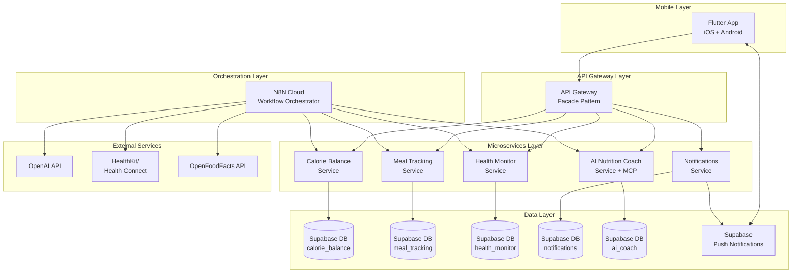

# Architettura NutriFit Platform v2.0

## 🏗️ Architettura Cloud-Native con Orchestrazione N8N

La piattaforma NutriFit adotta un'**architettura a microservizi cloud-native** basata su Python 3.11, con orchestrazione centralizzata tramite **N8N Cloud** e database segregati su **Supabase Cloud**. L'architettura è progettata per scalabilità enterprise, deployment automatizzato su Render.com e testing atomico per servizio.

### 🌐 Stack Tecnologico Unificato

- **Backend**: 5 microservizi Python 3.11 + FastAPI atomici
- **Orchestrazione**: N8N Cloud per workflow complessi e comunicazione inter-service  
- **Database**: Supabase Cloud con database segregati per microservizio
- **Gateway**: API Gateway pattern per comunicazione mobile ↔ microservizi
- **Mobile**: Flutter cross-platform production-ready
- **Deployment**: Render.com + GitHub Actions CI/CD
- **AI Integration**: MCP Server per microservizi con logica AI/ML

## 🏛️ Architettura dei Componenti

### Gateway Pattern per Mobile Communication



### Database Segregation Strategy

Ogni microservizio gestisce il proprio database isolato su Supabase Cloud:

| Microservizio | Database Supabase | Responsabilità |
|---------------|-------------------|----------------|
| **calorie-balance** | `nutrifit_calorie_balance` | Energy balance, goals, BMR calculations |
| **meal-tracking** | `nutrifit_meal_tracking` | Food data, nutrition facts, meal logs |
| **health-monitor** | `nutrifit_health_monitor` | HealthKit data, metrics, trends |
| **notifications** | `nutrifit_notifications` | Push tokens, preferences, templates |
| **ai-coach** | `nutrifit_ai_coach` | AI conversations, knowledge base, RAG vectors |

In sintesi, l'adozione dei microservizi apporta **maggiore agilità** e
**manutenibilità**[\[4\]](https://www.atlassian.com/it/microservices/cloud-computing/advantages-of-microservices#:~:text=1)[\[1\]](https://learn.microsoft.com/it-it/azure/architecture/guide/architecture-styles/microservices#:~:text=I%20microservizi%20sono%20componenti%20di,le%20implementazioni%20interne%20nascoste%20da).
Va tuttavia tenuto conto della complessità aggiuntiva (coordinamento dei
deploy, test d'integrazione, versionamento API) e previsto un robusto
sistema di logging e
monitoring[\[4\]](https://www.atlassian.com/it/microservices/cloud-computing/advantages-of-microservices#:~:text=1)[\[6\]](https://learn.microsoft.com/it-it/azure/architecture/guide/architecture-styles/microservices#:~:text=,ostruzioni%20e%20migliorare%20le%20prestazioni).

## 🔄 N8N Orchestration e Workflow Management

### Ruolo di N8N Cloud come Orchestratore Centrale

**N8N Cloud** gestisce tutti i workflow complessi che richiedono:
- **Comunicazione inter-microservizi** con business logic avanzata
- **Integrazione con AI/OpenAI** per food analysis e coaching
- **Orchestrazione di External APIs** (OpenFoodFacts, HealthKit sync)
- **Workflow asincroni** per processing complesso
- **Error handling e retry logic** enterprise-grade

### Flussi Principali Mobile App ↔ N8N

#### 1. Food Analysis Workflow
```
Mobile App → API Gateway → Meal Tracking Service
                ↓
N8N Workflow: Photo → GPT-4V → OpenFoodFacts Lookup → Nutrition Data
                ↓
Meal Tracking Service ← Processed Food Data ← N8N
```

#### 2. AI Coaching Workflow
```
Mobile App → API Gateway → AI Coach Service (MCP Server)
                ↓
N8N Workflow: User Query → OpenAI → RAG Lookup → Personalized Response
                ↓
AI Coach Service ← AI Response ← N8N
```

#### 3. Health Data Sync Workflow
```
HealthKit/Health Connect → N8N Trigger
                ↓
N8N Workflow: Validate → Transform → Distribute to Multiple Services
                ↓
Health Monitor + Calorie Balance + Notifications Services ← N8N
```

### MCP Server Implementation

I microservizi che gestiscono AI/ML espongono **MCP (Model Context Protocol) Server**:

```python
# AI Coach Service - MCP Server
@mcp_server.endpoint("/nutrition-advice")
async def get_nutrition_advice(context: UserNutritionContext) -> MCPResponse:
    """Exposed to N8N for AI workflow orchestration"""
    pass

# Meal Tracking Service - MCP Server  
@mcp_server.endpoint("/food-analysis")
async def analyze_food_data(food_data: FoodAnalysisRequest) -> MCPResponse:
    """Exposed to N8N for food processing workflow"""
    pass
```

## 🐳 Docker Strategy e Local Development

### Dockerfile Multi-Environment per Render Compatibility

Ogni microservizio ha un Dockerfile ottimizzato per development locale e production su Render:

```dockerfile
# Dockerfile multi-stage per compatibilità locale/Render
FROM python:3.11-slim as base
WORKDIR /app
COPY pyproject.toml poetry.lock ./
RUN pip install poetry && poetry config virtualenvs.create false

# Development stage
FROM base as development
ENV ENVIRONMENT=development
RUN poetry install --with dev
COPY . .
CMD ["poetry", "run", "uvicorn", "app.main:app", "--host", "0.0.0.0", "--port", "8000", "--reload"]

# Production stage (Render)
FROM base as production  
ENV ENVIRONMENT=production
RUN poetry install --only main
COPY . .
EXPOSE 8000
CMD ["poetry", "run", "gunicorn", "app.main:app", "-w", "4", "-k", "uvicorn.workers.UvicornWorker", "--bind", "0.0.0.0:8000"]
```

### Local Development Constraints

**⚠️ Testing Limitations in Local Environment:**
- ✅ **Atomic microservice testing** - Ogni servizio testabile singolarmente
- ✅ **Supabase Cloud access** - Database calls dirette (test data)
- ✅ **Outbound N8N calls** - Microservizi possono chiamare N8N webhooks
- ❌ **Inbound N8N calls** - N8N non può chiamare servizi locali
- ❌ **Full system testing** - Richiede deployment in produzione

### Docker-Compose per Sviluppo Locale

```yaml
# docker-compose.yml - Solo per development locale
version: '3.8'
services:
  calorie-balance:
    build:
      context: ./services/calorie-balance
      target: development
    ports:
      - "8001:8000"
    environment:
      - SUPABASE_URL=${SUPABASE_URL}
      - SUPABASE_ANON_KEY=${SUPABASE_ANON_KEY}
      - N8N_WEBHOOK_URL=${N8N_WEBHOOK_URL}
  
  meal-tracking:
    build:
      context: ./services/meal-tracking  
      target: development
    ports:
      - "8002:8000"
    environment:
      - SUPABASE_URL=${SUPABASE_URL}
      - SUPABASE_ANON_KEY=${SUPABASE_ANON_KEY}
      - N8N_WEBHOOK_URL=${N8N_WEBHOOK_URL}
  
  # ... altri servizi
```
principi, integrando sia il *domain model* (con oggetti e servizi
applicativi fortemente tipizzati) sia componenti di qualità (score,
auditing). Documentazione e test di dati (table di riferimento DRI,
normative europee) vengono inseriti per ogni funzionalità nutrizionale.

## Codice e Precision Management

Il codice del backend è organizzato secondo le best practice *clean
code* e DDD. Ogni microservizio è un progetto Python con FastAPI (o
similare) e utilizza **Poetry** per la gestione delle dipendenze e la
creazione di pacchetti (seguitando le raccomandazioni ufficiali
PyPA)[\[12\]](https://packaging.python.org/en/latest/guides/tool-recommendations/#:~:text=modernize%20a%20setup,for%20migration%20advice).
Gli **endpoint** REST/GraphQL espongono operazioni coerenti con il
dominio, e i livelli di business logic e persistenza sono ben separati
(architettura esagonale o a strati). Si adottano convenzioni di
codifica, linting (flake8, black) e pre-commit per coerenza.

-   **Precision Management:** I valori numerici sono gestiti con la
    precisione richiesta. Ad esempio, il bilancio calorico può usare
    oggetti (Value Object) che arrotondano le quantità (es. grammi) alla
    precisione definita (±20g) e calcolano intervalli di confidenza. Un
    oggetto `FoodQuantity` potrebbe definire un valore e un'unità,
    restituendo sempre il valore arrotondato alla precisione
    specificata. Questo garantisce che i consumi siano normalizzati in
    modo consistente e i risultati (bilancio giornaliero) includano un
    margine di errore predeterminato.
-   **Test e TDD:** Vengono scritti test unitari e di integrazione per
    tutta la logica critica (calcoli nutrizionali, flussi di input,
    regole di portata). Il pipeline di CI esegue i test automaticamente
    su ogni
    commit[\[13\]](https://docs.docker.com/guides/reactjs/configure-github-actions/#:~:text=Now%20you%27ll%20create%20a%20GitHub,the%20image%20to%20Docker%20Hub).
    Usare TDD aiuta a formalizzare i requisiti matematici (es. formule
    calorie, bilancio metabolico) e a prevenire regressioni.
-   **Value Objects:** In ogni dominio si preferiscono tipi espliciti
    (es. `Mass`, `Energy`, `ProteinContent` anziché float primitivi),
    con validazioni interne. Questo riduce errori (ad es. scambio tra
    calorie e joule) e documenta le regole (range di età o attività
    valide). Come suggerisce la letteratura, i Value Object traducono il
    linguaggio di dominio nel
    codice[\[7\]](https://medium.com/@no1.melman10/the-value-of-value-objects-52f9e08e932d#:~:text=IDDD%20also%20states%20%E2%80%94%20A,thing%29%20has%20lived).
-   **Logging e monitoraggio:** Oltre a registrare i dati, il codice
    include log strutturati (JSON) e tracciamento correlato
    (opentracing/Zipkin) per facilitare il debug distribuito. Eventuali
    errori di validazione o eccezioni sollevano allarmi nel sistema di
    monitoraggio.

Le *dinamiche di implementazione* includono l'uso di template ufficiali
(es. Copier di FastAPI) per uniformare i progetti, gestendo boilerplate
e CI/CD. Ogni servizio ha un README e ADR (Architectural Decision
Records) che documentano scelte come l'adozione di un certo DB o
libreria AI.

## AI e RAG System

L'intelligenza artificiale entra in NutriFit soprattutto sotto forma di
**chatbot nutrizionale e suggerimenti personalizzati**. Si utilizzerà un
modello di linguaggio (es. GPT-4 o similare) integrato con la knowledge
base aziendale tramite *Retrieval-Augmented Generation (RAG)*. In
pratica, il modello LLM genera risposte basandosi non solo sui propri
pesi pre-addestrati, ma recuperando prima informazioni da fonti
specifiche (documentazione nutrizionale, database alimentari, storico
dell'utente)[\[14\]](https://aws.amazon.com/what-is/retrieval-augmented-generation/#:~:text=Retrieval,and%20useful%20in%20various%20contexts)[\[15\]](https://aws.amazon.com/what-is/retrieval-augmented-generation/#:~:text=Without%20RAG%2C%20the%20LLM%20takes,an%20overview%20of%20the%20process).

-   **Cos'è RAG:** Come spiegato da AWS, RAG estende il modello LLM
    aggiungendo un componente di recupero informazioni
    esterne[\[14\]](https://aws.amazon.com/what-is/retrieval-augmented-generation/#:~:text=Retrieval,and%20useful%20in%20various%20contexts).
    Questo permette di mantenere risposte aggiornate e pertinenti senza
    riaddestrare il modello ogni volta. L'LLM combina così l'input
    dell'utente con i dati recuperati e produce risposte più accurate
    nel contesto nutrizionale specifico.
-   **Fasi del RAG:** (1) *Indicizzazione:* si crea una knowledge base
    esterna contenente documenti autorizzati (ad esempio linee guida
    nutrizionali, FAQ, dati sui nutrienti). Questi documenti vengono
    trasformati in vettori tramite embedding. (2) *Recupero:* alla query
    utente si calcola l'embedding e si cercano i documenti più rilevanti
    nel DB vettoriale. (3) *Generazione:* l'LLM riceve query e documenti
    rilevanti e produce la risposta finale.
-   **Affidabilità e trasparenza:** RAG migliora la fiducia: l'output
    può includere citazioni o riferimenti alle
    fonti[\[16\]](https://aws.amazon.com/what-is/retrieval-augmented-generation/#:~:text=Enhanced%20user%20trust).
    Gli utenti possono consultare le fonti indicate per verificare i
    consigli. Questo contrasta il rischio di informazioni errate o
    generiche tipiche degli LLM non
    specializzati[\[16\]](https://aws.amazon.com/what-is/retrieval-augmented-generation/#:~:text=Enhanced%20user%20trust).
-   **Esempi di utilizzo:**
-   *Chatbot nutrizionale:* l'utente fa domande (es. "Come posso
    aumentare l'apporto di proteine?") e il sistema genera risposte
    basate sulle preferenze personali, dati storici e raccomandazioni
    aggiornate.
-   *Pianificazione pasti:* il modello suggerisce ricette personalizzate
    unendo dati nutrizionali interni e conoscenza esterna di diete
    efficaci.
-   *Seguire trend:* RAG permette di collegare l'LLM a feed di notizie o
    ricerche recenti per rispondere con informazioni sempre aggiornate.

In breve, l'AI RAG è un'estensione della piattaforma che aggiunge valore
contestualizzato: migliora la qualità dei suggerimenti nutrizionali e
rende il chatbot più preciso e
affidabile[\[14\]](https://aws.amazon.com/what-is/retrieval-augmented-generation/#:~:text=Retrieval,and%20useful%20in%20various%20contexts)[\[16\]](https://aws.amazon.com/what-is/retrieval-augmented-generation/#:~:text=Enhanced%20user%20trust).

## 🚀 CI/CD e Deployment Strategy

### GitHub Actions + Render.com Pipeline

```yaml
# .github/workflows/deploy.yml
name: Deploy Microservices
on:
  push:
    branches: [main]
    paths: ['services/**']

jobs:
  detect-changes:
    runs-on: ubuntu-latest
    outputs:
      services: ${{ steps.changes.outputs.services }}
    steps:
      - uses: actions/checkout@v4
      - id: changes
        run: |
          # Detect which services changed
          changed_services=$(git diff --name-only HEAD~1 | grep '^services/' | cut -d'/' -f2 | sort -u)
          echo "services=${changed_services}" >> $GITHUB_OUTPUT

  deploy-services:
    needs: detect-changes
    if: needs.detect-changes.outputs.services != ''
    strategy:
      matrix:
        service: ${{ fromJson(needs.detect-changes.outputs.services) }}
    runs-on: ubuntu-latest
    steps:
      - uses: actions/checkout@v4
      - name: Deploy ${{ matrix.service }} to Render
        run: |
          # Trigger Render deployment per service
          curl -X POST "https://api.render.com/v1/services/${{ secrets[format('RENDER_{0}_SERVICE_ID', matrix.service)] }}/deploys" \
            -H "Authorization: Bearer ${{ secrets.RENDER_API_KEY }}"
```

### Render Configuration per Microservizio

Ogni microservizio ha una configurazione Render separata:

```yaml
# render.yaml per ogni microservizio
services:
  - type: web
    name: nutrifit-calorie-balance
    env: python
    plan: starter
    buildCommand: "pip install poetry && poetry install --only main"
    startCommand: "poetry run gunicorn app.main:app -w 4 -k uvicorn.workers.UvicornWorker --bind 0.0.0.0:$PORT"
    healthCheckPath: /health
    envVars:
      - key: ENVIRONMENT
        value: production
      - key: SUPABASE_URL
        fromDatabase:
          name: nutrifit-calorie-balance-db
          property: connectionString
      - key: N8N_WEBHOOK_URL
        sync: false
```

### Configuration Management

**Repository Structure per Configurazioni:**
```
config/
├── n8n/
│   ├── workflows/
│   │   ├── food-analysis-workflow.json
│   │   ├── ai-coaching-workflow.json
│   │   └── health-sync-workflow.json
│   └── settings/
│       ├── environments.json
│       └── credentials-template.json
├── supabase/
│   ├── schemas/
│   │   ├── calorie-balance-schema.sql
│   │   ├── meal-tracking-schema.sql
│   │   └── ...
│   └── seeds/
│       ├── test-data.sql
│       └── production-data.sql
└── render/
    ├── service-configs/
    └── environment-variables.json
```

---

## 📋 Summary Architetturale

### ✅ **Caratteristiche Principali**
- **Cloud-Native**: Supabase + N8N Cloud + Render deployment
- **Database Segregation**: Un database Supabase per microservizio  
- **Gateway Pattern**: Facade unico per mobile app communication
- **N8N Orchestration**: Workflow complessi e inter-service communication
- **MCP Integration**: AI/ML capabilities tramite Model Context Protocol
- **Docker Multi-Stage**: Compatibilità development/production automatica
- **Flutter Production**: Mobile cross-platform come strategia principale

### ⚠️ **Constraint di Testing**
- **Atomic Testing**: Solo singoli microservizi testabili in locale
- **System Testing**: Richiede deployment completo in produzione
- **Cloud Dependencies**: Tutti i servizi dipendono da Supabase/N8N Cloud

### 🎯 **Deployment Target**
- **Production**: Render.com con GitHub Actions CI/CD
- **Development**: Docker-compose locale + Supabase Cloud access
- **Configuration**: Versioned in repository per N8N e Supabase

## Applicazione mobile (Flutter)

L'app mobile di NutriFit sarà sviluppata con **Flutter** per supportare
sia iOS che Android da un unico
codebase[\[20\]](https://flutter.dev/multi-platform#:~:text=Flutter%20allows%20you%20to%20build,all%20from%20a%20single%20codebase).
Questo approccio rende lo sviluppo più efficiente (una sola base di
codice) e la UX coerente (design Material/Cupertino
adattabile)[\[20\]](https://flutter.dev/multi-platform#:~:text=Flutter%20allows%20you%20to%20build,all%20from%20a%20single%20codebase).

-   **Integrazione dati:** L'app utilizza un client GraphQL o REST per
    comunicare con i microservizi backend. Per Flutter esistono
    pacchetti come `graphql_flutter` o `dio` per semplificare le
    chiamate. Se necessario si può anche integrare Apollo (tramite
    plugin) per sfruttare caching e gestione query.
-   **Plugin di sistema:** Si usano plugin ufficiali per funzionalità
    native. Ad esempio, il plugin `health` consente di leggere/scrivere
    dati sanitari da Apple HealthKit su iOS e Google Health Connect su
    Android[\[21\]](https://pub.dev/packages/health#:~:text=Wrapper%20for%20Apple%27s%20HealthKit%20on,Google%27s%20Health%20Connect%20on%20Android).
    Similmente, è possibile usare plugin per fotocamera (foto piatti),
    fotodocumentazione, notifiche push, ecc. In Flutter il binding di
    questi plugin è spesso già pronto su pub.dev.
-   **Architettura e state management:** Si adotta un pattern
    organizzativo pulito (ad es. BLoC, Provider, Riverpod) per separare
    UI, logica applicativa e stato. I widget visualizzano dati
    provenienti da store reattivi, e le operazioni asincrone (fetch API,
    scrittura su HealthKit) sono incapsulate in servizi dedicati.
    L'accesso ai dati è mediato da modelli che riflettono il dominio
    (es. classi Dart per User, Meal, Exercise).
-   **Esperienza utente:** L'interfaccia mostra grafici e schede
    riepilogative (calorie, macro, progressi) in modo chiaro e
    responsivo. Si implementano pagine per inserimento pasti, attività
    fisica e monitoraggio dell'utente. Il design è pensato per
    interazioni rapide (es. logging dei pasti con pochi tocchi).
-   **Testing mobile:** Si eseguono test unitari (logica Dart) e test
    widget/integration (es. con Flutter Driver o Integration Test) per
    garantire qualità del client. L'app viene sottoposta anche a beta
    testing (TestFlight / Google Play).

Grazie a Flutter, il team fornisce app native (in termini di performance
e look-and-feel) senza duplicare sforzi di
sviluppo[\[20\]](https://flutter.dev/multi-platform#:~:text=Flutter%20allows%20you%20to%20build,all%20from%20a%20single%20codebase).
L'uso di plugin come `health` facilita l'accesso ai dati sanitari
nativi[\[21\]](https://pub.dev/packages/health#:~:text=Wrapper%20for%20Apple%27s%20HealthKit%20on,Google%27s%20Health%20Connect%20on%20Android),
mentre strumenti come `flutter build` e `flutter test` vengono integrati
nella pipeline CI/CD mobile.

## Conclusioni e Miglioramenti futuri

Questo documento è stato riorganizzato in capitoli chiari (architettura,
dati, codice, AI, CI/CD, mobile) per agevolarne la lettura e coprire
tutti gli aspetti tecnici richiesti. Abbiamo inserito riferimenti a best
practice e documentazione
ufficiale[\[1\]](https://learn.microsoft.com/it-it/azure/architecture/guide/architecture-styles/microservices#:~:text=I%20microservizi%20sono%20componenti%20di,le%20implementazioni%20interne%20nascoste%20da)[\[14\]](https://aws.amazon.com/what-is/retrieval-augmented-generation/#:~:text=Retrieval,and%20useful%20in%20various%20contexts)
per corroborare le scelte architetturali.

**Miglioramenti futuri:** si prevedono ulteriori dettagli e diagrammi
riassuntivi (ER model del datamodel, flow di deployment) nelle revisioni
successive. Si possono anche includere tabelle comparative delle
tecnologie scelte (es. database SQL vs NoSQL) per maggiore chiarezza.
Infine, verrà implementato un sistema di monitoraggio end-to-end (ad es.
ELK stack) e saranno aggiornati i piani di test alla luce di nuovi
requisiti.

**Fonti:** Le informazioni e definizioni tecniche sono tratte da
documentazione e articoli
specializzati[\[1\]](https://learn.microsoft.com/it-it/azure/architecture/guide/architecture-styles/microservices#:~:text=I%20microservizi%20sono%20componenti%20di,le%20implementazioni%20interne%20nascoste%20da)[\[9\]](https://support.cronometer.com/hc/en-us/articles/360042550452-Data-Confidence-Scores#:~:text=Data%20Confidence%20looks%20at%20each,data%20for%20that%20nutrient%20is)[\[14\]](https://aws.amazon.com/what-is/retrieval-augmented-generation/#:~:text=Retrieval,and%20useful%20in%20various%20contexts)[\[17\]](https://octopus.com/devops/ci-cd/ci-cd-with-docker/#:~:text=Create%20a%20consistent%20environment%20with,Docker%20containers),
come indicato nei riferimenti. Gli snippet e le indicazioni di codice si
basano sulla progettazione del dominio (Data Model) esistente e su
pattern DDD
riconosciuti[\[7\]](https://medium.com/@no1.melman10/the-value-of-value-objects-52f9e08e932d#:~:text=IDDD%20also%20states%20%E2%80%94%20A,thing%29%20has%20lived)[\[9\]](https://support.cronometer.com/hc/en-us/articles/360042550452-Data-Confidence-Scores#:~:text=Data%20Confidence%20looks%20at%20each,data%20for%20that%20nutrient%20is).
L'insieme di queste linee guida garantirà una piattaforma NutriFit
solida, scalabile e mantenibile.

[\[1\]](https://learn.microsoft.com/it-it/azure/architecture/guide/architecture-styles/microservices#:~:text=I%20microservizi%20sono%20componenti%20di,le%20implementazioni%20interne%20nascoste%20da)
[\[2\]](https://learn.microsoft.com/it-it/azure/architecture/guide/architecture-styles/microservices#:~:text=,prestazioni%20e%20resilienza%20del%20sistema)
[\[5\]](https://learn.microsoft.com/it-it/azure/architecture/guide/architecture-styles/microservices#:~:text=,e%20il%20controllo%20del%20traffico)
[\[6\]](https://learn.microsoft.com/it-it/azure/architecture/guide/architecture-styles/microservices#:~:text=,ostruzioni%20e%20migliorare%20le%20prestazioni)
Stile dell\'architettura dei microservizi - Azure Architecture Center \|
Microsoft Learn

<https://learn.microsoft.com/it-it/azure/architecture/guide/architecture-styles/microservices>

[\[3\]](https://learn.microsoft.com/en-us/azure/architecture/microservices/design/data-considerations#:~:text=A%20basic%20principle%20of%20microservices,other%20services%20cannot%20access%20directly)
[\[8\]](https://learn.microsoft.com/en-us/azure/architecture/microservices/design/data-considerations#:~:text=,microservices%20for%20further%20component%20guidance)
[\[11\]](https://learn.microsoft.com/en-us/azure/architecture/microservices/design/data-considerations#:~:text=,step%20transaction%20is%20in%20progress)
Data considerations for microservices - Azure Architecture Center \|
Microsoft Learn

<https://learn.microsoft.com/en-us/azure/architecture/microservices/design/data-considerations>

[\[4\]](https://www.atlassian.com/it/microservices/cloud-computing/advantages-of-microservices#:~:text=1)
5 vantaggi dei microservizi \[+ svantaggi\] \| Atlassian

<https://www.atlassian.com/it/microservices/cloud-computing/advantages-of-microservices>

[\[7\]](https://medium.com/@no1.melman10/the-value-of-value-objects-52f9e08e932d#:~:text=IDDD%20also%20states%20%E2%80%94%20A,thing%29%20has%20lived)
The Value of Value Objects. I've given a few talks on "The Value of...
\| by Callum Linington \| Medium

<https://medium.com/@no1.melman10/the-value-of-value-objects-52f9e08e932d>

[\[9\]](https://support.cronometer.com/hc/en-us/articles/360042550452-Data-Confidence-Scores#:~:text=Data%20Confidence%20looks%20at%20each,data%20for%20that%20nutrient%20is)
[\[10\]](https://support.cronometer.com/hc/en-us/articles/360042550452-Data-Confidence-Scores#:~:text=Image%3A%20blobid0)
Data Confidence Scores -- Cronometer

<https://support.cronometer.com/hc/en-us/articles/360042550452-Data-Confidence-Scores>

[\[12\]](https://packaging.python.org/en/latest/guides/tool-recommendations/#:~:text=modernize%20a%20setup,for%20migration%20advice)
Tool recommendations - Python Packaging User Guide

<https://packaging.python.org/en/latest/guides/tool-recommendations/>

[\[13\]](https://docs.docker.com/guides/reactjs/configure-github-actions/#:~:text=Now%20you%27ll%20create%20a%20GitHub,the%20image%20to%20Docker%20Hub)
Automate your builds with GitHub Actions \| Docker Docs

<https://docs.docker.com/guides/reactjs/configure-github-actions/>

[\[14\]](https://aws.amazon.com/what-is/retrieval-augmented-generation/#:~:text=Retrieval,and%20useful%20in%20various%20contexts)
[\[15\]](https://aws.amazon.com/what-is/retrieval-augmented-generation/#:~:text=Without%20RAG%2C%20the%20LLM%20takes,an%20overview%20of%20the%20process)
[\[16\]](https://aws.amazon.com/what-is/retrieval-augmented-generation/#:~:text=Enhanced%20user%20trust)
What is RAG? - Retrieval-Augmented Generation AI Explained - AWS

<https://aws.amazon.com/what-is/retrieval-augmented-generation/>

[\[17\]](https://octopus.com/devops/ci-cd/ci-cd-with-docker/#:~:text=Create%20a%20consistent%20environment%20with,Docker%20containers)
[\[18\]](https://octopus.com/devops/ci-cd/ci-cd-with-docker/#:~:text=This%20involves%20creating%20lean%20Docker,times%20and%20lower%20storage%20requirements)
[\[19\]](https://octopus.com/devops/ci-cd/ci-cd-with-docker/#:~:text=Create%20a%20process%20to%20remove,unused%20images)
CI/CD With Docker: The Basics And A Quick Tutorial \|

<https://octopus.com/devops/ci-cd/ci-cd-with-docker/>

[\[20\]](https://flutter.dev/multi-platform#:~:text=Flutter%20allows%20you%20to%20build,all%20from%20a%20single%20codebase)
Multi-Platform

<https://flutter.dev/multi-platform>

[\[21\]](https://pub.dev/packages/health#:~:text=Wrapper%20for%20Apple%27s%20HealthKit%20on,Google%27s%20Health%20Connect%20on%20Android)
health \| Flutter package

<https://pub.dev/packages/health>
