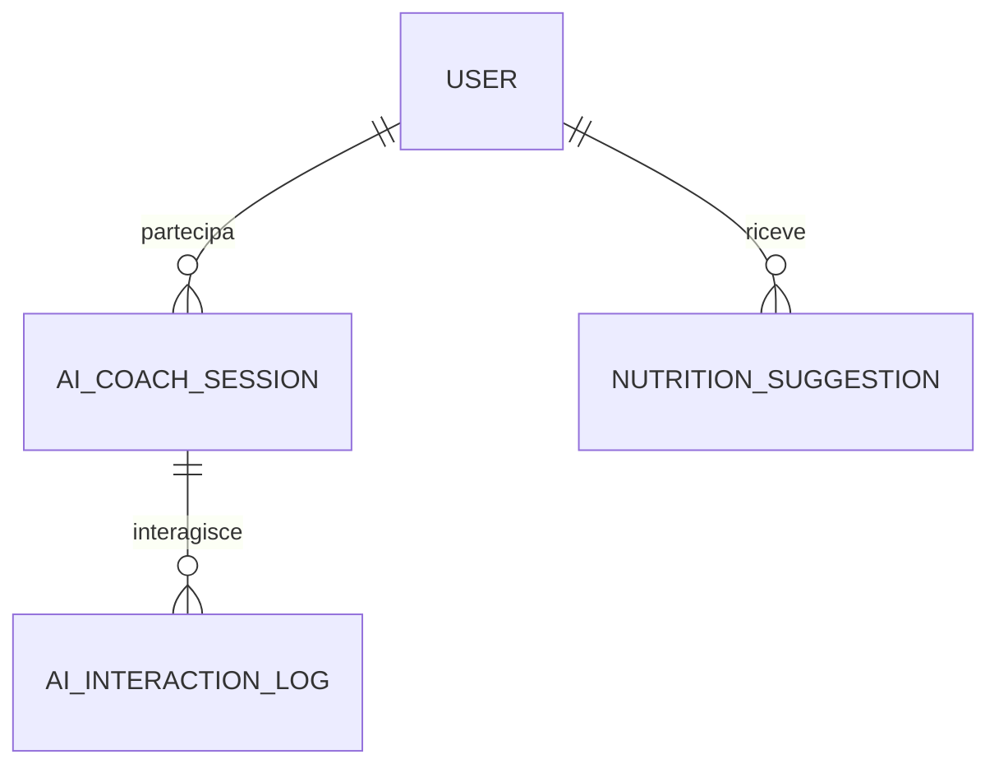

# Descrizione sintetica
Questo datamodel gestisce le sessioni di coaching AI, le interazioni utente-AI e i suggerimenti nutrizionali generati, con tracciamento dettagliato per analisi e miglioramento del servizio.

# Schema ER


# AI Coach - Database Model

Questo documento descrive la struttura del database dedicato al microservizio AI Coach.

## Schema SQL

```sql
-- Tabella sessioni coaching AI
CREATE TABLE ai_coach_session (
    id UUID PRIMARY KEY DEFAULT gen_random_uuid(),
    user_id UUID NOT NULL,
    session_start TIMESTAMP NOT NULL,
    session_end TIMESTAMP,
    feedback TEXT,
    ai_model TEXT, -- es: 'GPT-4V', 'RAG', 'custom'
    score FLOAT, -- valutazione sessione
    created_at TIMESTAMP DEFAULT NOW()
);
-- API: /ai-coach/session/*

-- Tabella log interazioni AI
CREATE TABLE ai_interaction_log (
    id UUID PRIMARY KEY DEFAULT gen_random_uuid(),
    session_id UUID NOT NULL REFERENCES ai_coach_session(id),
    user_message TEXT,
    ai_response TEXT,
    timestamp TIMESTAMP DEFAULT NOW(),
    model_used TEXT
);
-- API: /ai-coach/interactions/*

-- Tabella suggerimenti nutrizionali generati
CREATE TABLE nutrition_suggestion (
    id UUID PRIMARY KEY DEFAULT gen_random_uuid(),
    user_id UUID NOT NULL,
    suggestion TEXT NOT NULL,
    generated_at TIMESTAMP DEFAULT NOW(),
    source TEXT, -- es: 'ai', 'manual', 'coach'
);
-- API: /ai-coach/suggestions/*
```

## Policy di Sicurezza
- Row Level Security abilitata su tutte le tabelle
- Accesso solo tramite credenziali microservizio
- Policy di accesso per user_id e owner

## Strategie di Migrazione
- Utilizzare Supabase migration tool
- Versionamento schema tramite changelog
- Backup automatico settimanale

## Mapping API ↔️ Tabelle
- `/ai-coach/session/*` → ai_coach_session
- `/ai-coach/interactions/*` → ai_interaction_log
- `/ai-coach/suggestions/*` → nutrition_suggestion

## Esempi di Query
```sql
-- Sessioni AI coach per utente
SELECT * FROM ai_coach_session WHERE user_id = '<USER_ID>' ORDER BY session_start DESC;

-- Log interazioni AI per sessione
SELECT * FROM ai_interaction_log WHERE session_id = '<SESSION_ID>';

-- Suggerimenti nutrizionali generati
SELECT * FROM nutrition_suggestion WHERE user_id = '<USER_ID>' ORDER BY generated_at DESC;
```

---

**Ultimo aggiornamento:** 6 settembre 2025
