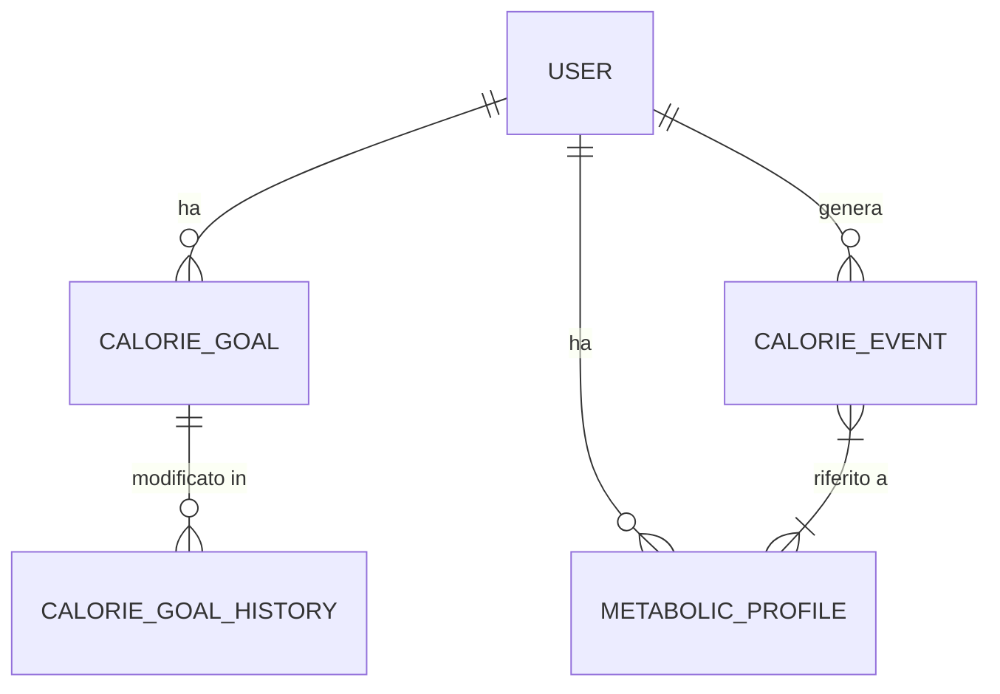

# Descrizione sintetica
Questo datamodel gestisce il bilanciamento calorico utente, obiettivi, profilo metabolico, eventi calorici e storico modifiche. Permette analisi puntuale, aggregata e supporta dashboard real-time.

# Schema ER

# Calorie Balance - Database Model

Questo documento descrive la struttura del database dedicato al microservizio Calorie Balance.

## Schema SQL

```sql
-- Tabella obiettivi calorici
CREATE TABLE calorie_goal (
    id UUID PRIMARY KEY DEFAULT gen_random_uuid(),
    user_id UUID NOT NULL,
    goal INTEGER NOT NULL,
    period_start DATE NOT NULL,
    period_end DATE,
    created_at TIMESTAMP DEFAULT NOW()
);
-- API: /calorie-goal/*

-- Tabella profilo metabolico
CREATE TABLE metabolic_profile (
    id UUID PRIMARY KEY DEFAULT gen_random_uuid(),
    user_id UUID NOT NULL,
    bmr FLOAT NOT NULL,
    calories_burned_bmr FLOAT,
    age INTEGER,
    gender TEXT,
    height FLOAT,
    weight FLOAT,
    created_at TIMESTAMP DEFAULT NOW()
);
-- API: /metabolic-profile/*

-- Tabella eventi calorici (consumo, attività, variazioni)
CREATE TABLE calorie_event (
    id UUID PRIMARY KEY DEFAULT gen_random_uuid(),
    user_id UUID NOT NULL,
    event_type TEXT NOT NULL, -- es: 'intake', 'burn', 'adjustment'
    calories INTEGER NOT NULL,
    event_time TIMESTAMP NOT NULL,
    source TEXT, -- es: 'manual', 'healthkit', 'meal_tracking'
    created_at TIMESTAMP DEFAULT NOW()
);
-- API: /calorie-event/*

-- Tabella log storico modifiche obiettivi
CREATE TABLE calorie_goal_history (
    id UUID PRIMARY KEY DEFAULT gen_random_uuid(),
    calorie_goal_id UUID NOT NULL REFERENCES calorie_goal(id),
    old_goal INTEGER,
    new_goal INTEGER,
    changed_at TIMESTAMP DEFAULT NOW()
);
-- API: /calorie-goal/history
```
## Policy di Sicurezza
- Row Level Security abilitata su tutte le tabelle
- Accesso solo tramite credenziali microservizio
- Policy di accesso per user_id e owner

## Strategie di Migrazione
- Utilizzare Supabase migration tool
-- Viste aggregate per dashboarding

-- Eventi calorici aggregati per ora
CREATE OR REPLACE VIEW calorie_event_hourly AS
SELECT user_id, event_type, date_trunc('hour', event_time) AS hour,
       SUM(calories) AS total_calories, COUNT(*) AS events
FROM calorie_event
GROUP BY user_id, event_type, date_trunc('hour', event_time);

-- Eventi calorici aggregati per giorno
CREATE OR REPLACE VIEW calorie_event_daily AS
SELECT user_id, event_type, date_trunc('day', event_time) AS day,
       SUM(calories) AS total_calories, COUNT(*) AS events
FROM calorie_event
GROUP BY user_id, event_type, date_trunc('day', event_time);

-- Eventi calorici aggregati per settimana
CREATE OR REPLACE VIEW calorie_event_weekly AS
SELECT user_id, event_type, date_trunc('week', event_time) AS week,
       SUM(calories) AS total_calories, COUNT(*) AS events
FROM calorie_event
GROUP BY user_id, event_type, date_trunc('week', event_time);

-- Eventi calorici aggregati per mese
CREATE OR REPLACE VIEW calorie_event_monthly AS
SELECT user_id, event_type, date_trunc('month', event_time) AS month,
       SUM(calories) AS total_calories, COUNT(*) AS events
FROM calorie_event
GROUP BY user_id, event_type, date_trunc('month', event_time);

-- API: /dashboard/calorie-event/hourly, /dashboard/calorie-event/daily, /dashboard/calorie-event/weekly, /dashboard/calorie-event/monthly
- Backup automatico settimanale

## Mapping API ↔️ Tabelle
- `/calorie-goal/*` → calorie_goal, calorie_goal_history
- `/metabolic-profile/*` → metabolic_profile
- `/calorie-event/*` → calorie_event

## Esempi di Query
```sql
-- Recupera obiettivi attivi per utente
SELECT * FROM calorie_goal WHERE user_id = '<USER_ID>' AND period_end IS NULL;

-- Recupera profilo metabolico
SELECT * FROM metabolic_profile WHERE user_id = '<USER_ID>';

-- Eventi calorici per utente in un intervallo
SELECT * FROM calorie_event WHERE user_id = '<USER_ID>' AND event_time BETWEEN '<START>' AND '<END>';

-- Storico modifiche obiettivi
SELECT * FROM calorie_goal_history WHERE calorie_goal_id = '<GOAL_ID>';
```

---

**Ultimo aggiornamento:** 6 settembre 2025
