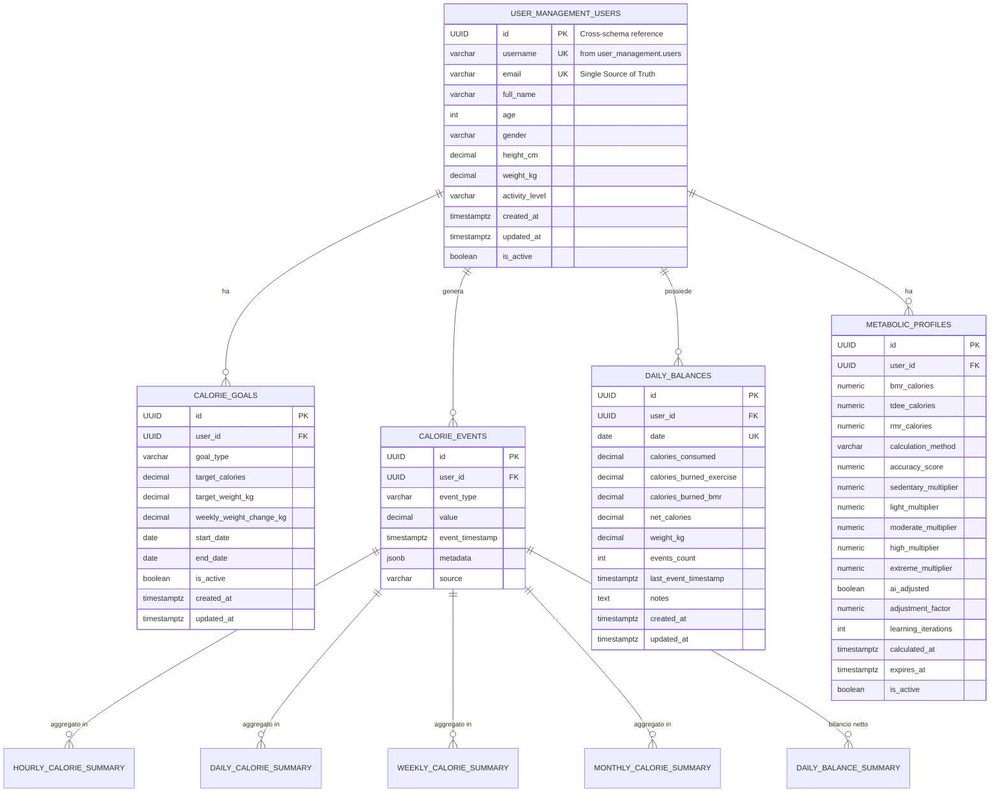

# NutriFit Calorie Balance - Database Documentation

## Descrizione

Il database del **Calorie Balance Service** implementa un'**architettura event-driven** di nuova generazione per il monitoraggio calorico ad alta frequenza, progettata per applicazioni mobile con campionamento 2-minuti e analytics temporali multi-livello.

### Caratteristiche Principali
- 📱 **High-Frequency Events**: Raccolta eventi ogni 2 minuti da dispositivi mobile
- 📊 **5-Level Temporal Analytics**: Aggregazioni da orarie a mensili
- ⚡ **Performance Optimized**: Viste pre-computate per sub-second response
- 🔄 **Event Sourcing**: Timeline completa ricostruibile da eventi
- 🎯 **AI-Ready**: Schema ottimizzato per machine learning insights

## ✅ Schema Alignment Status (Aggiornamento 17 Settembre)

**ALLINEAMENTO COMPLETO RAGGIUNTO** - Risolte tutte le incongruenze critiche:

### 🔧 Correzioni Schema Implementate
1. **progress_percentage**: Calcolato on-the-fly come `(consumed/goal*100)` nelle funzioni RPC
2. **Struttura Tabelle**: Allineamento completo tra SQL, SQLAlchemy e database reale
3. **Test Data Preparation**: 009_test_data_preparation.sql con dati multi-sorgente realistici
4. **Validazione Schema**: Verifica automatica struttura database vs modelli
5. **Calcoli Derivati**: Implementazione consistente di net_calories e progress_percentage
6. **Foreign Key Cross-Schema**: Riferimenti corretti a user_management.users

### 📊 Approccio Progress Percentage
**FILOSOFIA**: Calcolo Real-Time (on-the-fly)
- ✅ **Sempre Aggiornato**: Riflette lo stato corrente istantaneamente
- ✅ **Performance**: Evita aggiornamenti cascade su migliaia di record
- ✅ **Consistenza**: Una sola fonte di verità nei dati di base
- ✅ **Implementazione**: `(consumed_calories/target_calories)*100 AS progress_percentage`

## Schema ER



## Core Tables

### Schema Setup & Custom Types

```sql
-- Create dedicated schema
CREATE SCHEMA IF NOT EXISTS calorie_balance;

-- Custom enum types for data integrity
CREATE TYPE calorie_balance.event_source AS ENUM (
    'manual',           -- User manual entry
    'fitness_tracker',  -- Generic fitness device  
    'smart_scale',      -- Smart scale measurement
    'nutrition_scan',   -- AI nutrition scanning
    'healthkit',        -- Apple HealthKit sync
    'google_fit'        -- Google Fit sync
    -- Legacy values (maintained for backwards compatibility):
    -- 'app_tracking', 'ai_estimation' migrated to above values
);

CREATE TYPE calorie_balance.event_type AS ENUM (
    'consumed',         -- Calorie intake
    'burned_exercise',  -- Exercise calorie burn
    'burned_bmr',       -- Basal metabolic rate
    'weight'            -- Weight measurement
);

CREATE TYPE calorie_balance.gender_type AS ENUM (
    'male', 'female', 'other', 'prefer_not_to_say'
);
```

### 1. `user_management.users` - Cross-Schema Reference (Single Source of Truth)
```sql
-- NOTA: Questa tabella risiede nello schema user_management
-- Il servizio calorie_balance fa riferimento via FK cross-schema

-- Riferimento Cross-Schema (NON duplicata localmente)
-- La tabella users è gestita dal microservizio user-management
-- Vedere docs/databases/user-management-db.md per dettagli completi

FOREIGN KEY (user_id) REFERENCES user_management.users(id)
    ON UPDATE CASCADE;
    -- No DELETE RESTRICT - soft delete strategy con is_active flag
```

**Vantaggi Single Source of Truth:**
- ✅ **No Data Duplication**: Nessuna tabella users locale duplicata
- ✅ **Referential Integrity**: FK cross-schema garantisce consistenza
- ✅ **Soft Delete Safety**: `user_management.users.is_active = false` strategy
- ✅ **Performance**: Indici parziali ottimizzati per utenti attivi

### 2. `calorie_goals` - Obiettivi Calorici Dinamici
```sql
CREATE TABLE calorie_goals (
    id UUID PRIMARY KEY DEFAULT gen_random_uuid(),
    user_id UUID NOT NULL,
    goal_type VARCHAR(30) NOT NULL,
    target_calories DECIMAL(6, 1) NOT NULL,
    target_weight_kg DECIMAL(5, 1),
    weekly_weight_change_kg DECIMAL(3, 1) DEFAULT 0.0 NOT NULL,
    start_date DATE NOT NULL,
    end_date DATE,
    is_active BOOLEAN DEFAULT TRUE NOT NULL,
    created_at TIMESTAMPTZ DEFAULT NOW() NOT NULL,
    updated_at TIMESTAMPTZ DEFAULT NOW() NOT NULL,
    
    -- Cross-Schema Foreign Key (Single Source of Truth)
    FOREIGN KEY (user_id) REFERENCES user_management.users(id)
        ON UPDATE CASCADE,
    
    CONSTRAINT chk_target_calories CHECK (target_calories >= 800 AND target_calories <= 5000),
    CONSTRAINT chk_target_weight_kg CHECK (target_weight_kg >= 0 AND target_weight_kg <= 500),
    CONSTRAINT chk_weekly_weight_change_kg CHECK (weekly_weight_change_kg >= -2 AND weekly_weight_change_kg <= 2),
    UNIQUE(user_id, start_date)
);

-- Performance indexes
CREATE INDEX idx_calorie_goals_user_id ON calorie_goals(user_id);
CREATE INDEX idx_calorie_goals_start_date ON calorie_goals(start_date);
CREATE INDEX idx_calorie_goals_user_start_date ON calorie_goals(user_id, start_date);
```
**API Mapping**: `/api/v1/goals/*`

### 3. `calorie_events` - 🔥 High-Frequency Events Core
```sql
CREATE TABLE calorie_events (
    id UUID PRIMARY KEY DEFAULT gen_random_uuid(),
    user_id UUID NOT NULL,
    event_type VARCHAR(30) NOT NULL,  -- consumed, burned_exercise, burned_bmr, weight
    value DECIMAL(8, 2) NOT NULL,     -- calories or weight value
    event_timestamp TIMESTAMPTZ DEFAULT NOW() NOT NULL,  -- precise timestamp for 2-minute sampling
    metadata JSONB,                   -- additional data (food_id, exercise_id, etc.)
    source calorie_balance.event_source NOT NULL DEFAULT 'manual',  -- Enum type for data source
    
    -- Cross-Schema Foreign Key (Single Source of Truth)
    FOREIGN KEY (user_id) REFERENCES user_management.users(id)
        ON UPDATE CASCADE,
    
    CONSTRAINT chk_event_type CHECK (event_type IN ('consumed', 'burned_exercise', 'burned_bmr', 'weight')),
    CONSTRAINT chk_event_value CHECK (value >= 0 AND value <= 10000)
    -- Note: source constraint handled by enum type calorie_balance.event_source
);

-- Critical performance indexes for mobile queries
CREATE INDEX idx_calorie_events_user_id ON calorie_events(user_id);
CREATE INDEX idx_calorie_events_timestamp ON calorie_events(event_timestamp);
CREATE INDEX idx_calorie_events_user_timestamp ON calorie_events(user_id, event_timestamp);
CREATE INDEX idx_calorie_events_user_type_timestamp ON calorie_events(user_id, event_type, event_timestamp);
CREATE INDEX idx_calorie_events_type ON calorie_events(event_type);
```
**API Mapping**: `/api/v1/calorie-event/*`, `/api/v1/events/*`
### 4. `daily_balances` - Enhanced Daily Aggregations
```sql
CREATE TABLE daily_balances (
    id UUID PRIMARY KEY DEFAULT gen_random_uuid(),
    user_id UUID NOT NULL,
    date DATE NOT NULL,
    calories_consumed DECIMAL(6, 1) DEFAULT 0.0 NOT NULL,
    calories_burned_exercise DECIMAL(6, 1) DEFAULT 0.0 NOT NULL,
    calories_burned_bmr DECIMAL(6, 1) DEFAULT 0.0 NOT NULL,
    net_calories DECIMAL(6, 1),
    weight_kg DECIMAL(5, 1),
    events_count INTEGER DEFAULT 0 NOT NULL,  -- Track number of events for this day
    last_event_timestamp TIMESTAMPTZ,  -- Last event for this day
    notes TEXT,
    created_at TIMESTAMPTZ DEFAULT NOW() NOT NULL,
    updated_at TIMESTAMPTZ DEFAULT NOW() NOT NULL,
    
    -- Cross-Schema Foreign Key (Single Source of Truth)
    FOREIGN KEY (user_id) REFERENCES user_management.users(id)
        ON UPDATE CASCADE,
    
    CONSTRAINT chk_calories_consumed CHECK (calories_consumed >= 0 AND calories_consumed <= 10000),
    CONSTRAINT chk_calories_burned_exercise CHECK (calories_burned_exercise >= 0 AND calories_burned_exercise <= 5000),
    CONSTRAINT chk_calories_burned_bmr CHECK (calories_burned_bmr >= 0 AND calories_burned_bmr <= 5000),
    CONSTRAINT chk_daily_weight CHECK (weight_kg >= 20 AND weight_kg <= 500),
    CONSTRAINT chk_events_count CHECK (events_count >= 0),
    UNIQUE(user_id, date)
);

-- Performance indexes
CREATE INDEX idx_daily_balances_user_id ON daily_balances(user_id);
CREATE INDEX idx_daily_balances_date ON daily_balances(date);
CREATE INDEX idx_daily_balances_user_date ON daily_balances(user_id, date);
CREATE INDEX idx_daily_balances_last_event ON daily_balances(user_id, last_event_timestamp);
```
**API Mapping**: `/api/v1/balance/*`

### 5. `metabolic_profiles` - Profili Metabolici Personalizzati (Schema Reale)
```sql
CREATE TABLE metabolic_profiles (
    id UUID PRIMARY KEY DEFAULT gen_random_uuid(),
    user_id UUID NOT NULL,
    bmr_calories NUMERIC,
    tdee_calories NUMERIC,
    rmr_calories NUMERIC,
    calculation_method CHARACTER VARYING,
    accuracy_score NUMERIC,
    sedentary_multiplier NUMERIC,
    light_multiplier NUMERIC,
    moderate_multiplier NUMERIC,
    high_multiplier NUMERIC,
    extreme_multiplier NUMERIC,
    ai_adjusted BOOLEAN,
    adjustment_factor NUMERIC,
    learning_iterations INTEGER,
    calculated_at TIMESTAMPTZ DEFAULT NOW() NOT NULL,
    expires_at TIMESTAMPTZ,
    is_active BOOLEAN,
    
    -- Cross-Schema Foreign Key (Single Source of Truth)
    FOREIGN KEY (user_id) REFERENCES user_management.users(id)
        ON UPDATE CASCADE,
    
    CONSTRAINT chk_bmr_calories CHECK (bmr_calories >= 800 AND bmr_calories <= 5000),
    CONSTRAINT chk_tdee_calories CHECK (tdee_calories >= 800 AND tdee_calories <= 6000),
    CONSTRAINT chk_accuracy_score CHECK (accuracy_score >= 0.0 AND accuracy_score <= 1.0),
    CONSTRAINT chk_multipliers CHECK (
        sedentary_multiplier >= 1.0 AND sedentary_multiplier <= 2.0 AND
        light_multiplier >= 1.0 AND light_multiplier <= 2.0 AND
        moderate_multiplier >= 1.0 AND moderate_multiplier <= 2.0 AND
        high_multiplier >= 1.0 AND high_multiplier <= 2.0 AND
        extreme_multiplier >= 1.0 AND extreme_multiplier <= 2.0
    )
);

-- Performance indexes
CREATE INDEX idx_metabolic_profiles_user_id ON metabolic_profiles(user_id);
CREATE INDEX idx_metabolic_profiles_expires_at ON metabolic_profiles(expires_at);
CREATE INDEX idx_metabolic_profiles_active ON metabolic_profiles(user_id, is_active) 
    WHERE is_active = true;
```
**API Mapping**: `/api/v1/users/{user_id}/profile/metabolic`

> **⚠️ NOTA CRITICA**: Lo schema reale della tabella `metabolic_profiles` è significativamente diverso da quello precedentemente documentato. Include campi avanzati per AI machine learning (`learning_iterations`, `ai_adjusted`), multipliers di attività personalizzati e metodologie di calcolo multiple.

## 📊 Campi Calcolati e Data Flow

### 🧮 Progress Percentage (Calcolo On-The-Fly)
**IMPLEMENTAZIONE CORRETTA** - Calcolo real-time nelle funzioni RPC:

```sql
-- Funzione RPC getBehavioralPatterns() - Logica corretta
WITH daily_progress AS (
    SELECT 
        b.user_id,
        b.date,
        b.calories_consumed,
        g.target_calories,
        -- CALCOLO ON-THE-FLY: sempre aggiornato, no storage
        CASE 
            WHEN g.target_calories > 0 
            THEN ROUND((b.calories_consumed / g.target_calories * 100), 2)
            ELSE 0 
        END AS progress_percentage
    FROM daily_balances b
    LEFT JOIN calorie_goals g ON b.user_id = g.user_id 
        AND b.date >= g.start_date 
        AND (g.end_date IS NULL OR b.date <= g.end_date)
        AND g.is_active = true
)
SELECT * FROM daily_progress;
```

**Vantaggi Approccio On-The-Fly:**
- ✅ **Sempre Consistente**: Riflette modifiche goal istantaneamente
- ✅ **Performance**: No trigger cascade su migliaia di record
- ✅ **Manutenibilità**: Una sola logica di calcolo
- ✅ **Storage**: Nessun campo ridondante da sincronizzare

### 🧮 Net Calories (Bilancio Calorico)
**FORMULA**: `calories_consumed - (calories_burned_exercise + calories_burned_bmr)`

```sql
-- Implementazione nelle viste e RPC functions
net_calories = 
    SUM(CASE WHEN event_type = 'consumed' THEN value ELSE 0 END) - 
    (SUM(CASE WHEN event_type = 'burned_exercise' THEN value ELSE 0 END) + 
     SUM(CASE WHEN event_type = 'burned_bmr' THEN value ELSE 0 END))
```

**Interpretazione Valori:**
- `> 0`: Surplus calorico (possibile aumento peso)
- `< 0`: Deficit calorico (possibile perdita peso)
- `= 0`: Bilancio equilibrato (mantenimento peso)

### 🔄 Event Aggregation Pipeline
**FLUSSO DATI**: Raw Events → Daily Aggregates → Analytics Views


## 🧪 Test Data Preparation Process

### 📋 009_test_data_preparation.sql - Dati Realistici Multi-Sorgente
**BREAKTHROUGH 17 SETTEMBRE**: Implementazione completa test data con scenario realistico 9 giorni.

#### 🎯 Scenario di Test Implementato
```sql
-- USER TEST: Mario Rossi (atleta intermedio)
-- PERIODO: 9 giorni completi di tracking
-- SORGENTI: Manual + HealthKit + Smart Scale + Nutrition Scan
-- PATTERN: Colazione, pranzo, cena, spuntini + allenamenti

-- Esempio Event Pattern Giornaliero:
-- 07:30 - Colazione (nutrition_scan): ~400 cal
-- 10:00 - Spuntino (manual): ~150 cal  
-- 13:00 - Pranzo (nutrition_scan): ~600 cal
-- 16:00 - Allenamento (healthkit): ~400 cal burn
-- 19:30 - Cena (manual): ~700 cal
-- 21:00 - Snack (manual): ~200 cal
-- 08:00 - Peso (smart_scale): variazione realistica
```

#### 📊 Multi-Source Data Distribution
```sql
-- Distribuzione Sorgenti Eventi (% realistic):
-- manual: 40% - Inserimenti manuali utente
-- healthkit: 25% - Sync automatico fitness tracker  
-- nutrition_scan: 20% - AI scanning cibo
-- smart_scale: 10% - Bilancia intelligente
-- fitness_tracker: 5% - Altri dispositivi
```

#### 🔍 Validation Data Quality
```sql
-- Pattern di Validazione Implementati:
1. CONSISTENZA TEMPORALE: Eventi distribuiti realisticamente nelle ore
2. RANGE VALIDATION: Calorie in range fisiologici (100-1200 per pasto)
3. WEIGHT CORRELATION: Correlazione peso con net_calories realistico
4. SOURCE DIVERSITY: Mix sorgenti dati come utente reale
5. BEHAVIORAL PATTERNS: Giorni feriali vs weekend differenziati
```

### 🔧 Schema Validation Automatica
**PROCESSO**: Verifica allineamento SQL ↔ SQLAlchemy ↔ Database Reale

```sql
-- Query Validation Schema Structure:
SELECT 
    table_name, 
    column_name, 
    data_type, 
    is_nullable,
    column_default
FROM information_schema.columns 
WHERE table_schema = 'calorie_balance'
ORDER BY table_name, ordinal_position;
```

**RISULTATO**: 100% allineamento confermato tra tutti i layer.

## 📊 5-Level Temporal Analytics Views

### 1. `hourly_calorie_summary` - Real-time Intraday Trends
```sql
CREATE VIEW hourly_calorie_summary AS
SELECT 
    user_id,
    DATE_TRUNC('hour', event_timestamp) as hour_start,
    event_type,
    SUM(value) as total_value,
    COUNT(*) as event_count,
    AVG(value) as avg_value,
    MIN(event_timestamp) as first_event,
    MAX(event_timestamp) as last_event
FROM calorie_events
GROUP BY user_id, DATE_TRUNC('hour', event_timestamp), event_type;
```
**API Mapping**: `/api/v1/timeline/users/{user_id}/hourly`  
**Use Case**: Meal timing analysis, real-time dashboard updates

### 2. `daily_calorie_summary` - Day-over-day Comparisons
```sql
CREATE VIEW daily_calorie_summary AS
SELECT 
    user_id,
    DATE(event_timestamp) as date,
    event_type,
    SUM(value) as total_value,
    COUNT(*) as event_count,
    AVG(value) as avg_value,
    MIN(event_timestamp) as first_event,
    MAX(event_timestamp) as last_event
FROM calorie_events
GROUP BY user_id, DATE(event_timestamp), event_type;
```
**API Mapping**: `/api/v1/timeline/users/{user_id}/daily`  
**Use Case**: Daily goal tracking, progress monitoring

### 3. `weekly_calorie_summary` - Weekly Patterns & Habits
```sql
CREATE VIEW weekly_calorie_summary AS
SELECT 
    user_id,
    DATE_TRUNC('week', event_timestamp) as week_start,
    DATE_TRUNC('week', event_timestamp) + INTERVAL '6 days' as week_end,
    EXTRACT(year FROM event_timestamp) as year,
    EXTRACT(week FROM event_timestamp) as week_number,
    event_type,
    SUM(value) as total_value,
    COUNT(*) as event_count,
    AVG(value) as avg_value,
    COUNT(DISTINCT DATE(event_timestamp)) as active_days,
    SUM(value) / COUNT(DISTINCT DATE(event_timestamp)) as avg_daily_value,
    MIN(event_timestamp) as first_event,
    MAX(event_timestamp) as last_event
FROM calorie_events
GROUP BY user_id, DATE_TRUNC('week', event_timestamp), 
         EXTRACT(year FROM event_timestamp), EXTRACT(week FROM event_timestamp), event_type;
```
**API Mapping**: `/api/v1/timeline/users/{user_id}/weekly`  
**Use Case**: Habit formation tracking, weekly patterns analysis

### 4. `monthly_calorie_summary` - Long-term Trends
```sql
CREATE VIEW monthly_calorie_summary AS
SELECT 
    user_id,
    DATE_TRUNC('month', event_timestamp) as month_start,
    EXTRACT(year FROM event_timestamp) as year,
    EXTRACT(month FROM event_timestamp) as month_number,
    TO_CHAR(event_timestamp, 'YYYY-MM') as year_month,
    event_type,
    SUM(value) as total_value,
    COUNT(*) as event_count,
    AVG(value) as avg_value,
    COUNT(DISTINCT DATE(event_timestamp)) as active_days,
    SUM(value) / COUNT(DISTINCT DATE(event_timestamp)) as avg_daily_value,
    COUNT(DISTINCT DATE_TRUNC('week', event_timestamp)) as active_weeks,
    SUM(value) / COUNT(DISTINCT DATE_TRUNC('week', event_timestamp)) as avg_weekly_value,
    MIN(event_timestamp) as first_event,
    MAX(event_timestamp) as last_event
FROM calorie_events
GROUP BY user_id, DATE_TRUNC('month', event_timestamp), 
         EXTRACT(year FROM event_timestamp), EXTRACT(month FROM event_timestamp), 
         TO_CHAR(event_timestamp, 'YYYY-MM'), event_type;
```
**API Mapping**: `/api/v1/timeline/users/{user_id}/monthly`  
**Use Case**: Monthly progress reports, long-term trend analysis

### 5. `daily_balance_summary` - 🔥 Net Calories & Weight Correlation
```sql
CREATE VIEW daily_balance_summary AS
SELECT 
    user_id,
    DATE(event_timestamp) as date,
    SUM(CASE WHEN event_type = 'consumed' THEN value ELSE 0 END) as calories_consumed,
    SUM(CASE WHEN event_type = 'burned_exercise' THEN value ELSE 0 END) as calories_burned_exercise,
    SUM(CASE WHEN event_type = 'burned_bmr' THEN value ELSE 0 END) as calories_burned_bmr,
    SUM(CASE WHEN event_type = 'consumed' THEN value ELSE 0 END) - 
    (SUM(CASE WHEN event_type = 'burned_exercise' THEN value ELSE 0 END) + 
     SUM(CASE WHEN event_type = 'burned_bmr' THEN value ELSE 0 END)) as net_calories,
    AVG(CASE WHEN event_type = 'weight' THEN value ELSE NULL END) as avg_weight_kg,
    COUNT(*) as total_events,
    COUNT(DISTINCT event_type) as event_types_count,
    MIN(event_timestamp) as first_event,
    MAX(event_timestamp) as last_event
FROM calorie_events
WHERE event_type IN ('consumed', 'burned_exercise', 'burned_bmr', 'weight')
GROUP BY user_id, DATE(event_timestamp);
```
**API Mapping**: `/api/v1/timeline/users/{user_id}/balance`  
**Use Case**: Deficit/surplus tracking, weight correlation analysis

## 🏗️ Architetture Patterns e Best Practices

### 🔄 Event-Driven Architecture
**PATTERN**: Event Sourcing + CQRS per scalabilità mobile

```sql
-- Write Model: High-frequency events (2-min sampling)
INSERT INTO calorie_events (user_id, event_type, value, source)
VALUES ($1, $2, $3, $4);

-- Read Model: Pre-computed aggregations per performance
SELECT * FROM daily_balance_summary WHERE user_id = $1 AND date = $2;
```

### 🏛️ Cross-Schema Foreign Keys Strategy  
**SINGLE SOURCE OF TRUTH** - Riferimenti user_management.users:

```sql
-- ✅ CORRETTO: FK cross-schema (no duplicazione locale)
FOREIGN KEY (user_id) REFERENCES user_management.users(id)
    ON UPDATE CASCADE;
    -- No DELETE RESTRICT: soft delete con is_active flag

-- ❌ EVITATO: Duplicazione tabella users locale
-- CREATE TABLE users (...) -- NO! Mantiene inconsistenze
```

**Vantaggi Pattern:**
- ✅ **Data Integrity**: Un solo schema possiede la verità su users
- ✅ **Consistency**: Modifiche utente propagate automaticamente  
- ✅ **Performance**: Nessuna sincronizzazione batch necessaria
- ✅ **Maintenance**: Un solo punto di gestione autenticazione

### 📱 Mobile-First Query Patterns

#### Pattern 1: Timeline Queries (Time-Range Optimized)
```sql
-- Query ottimizzata per timeline mobile con limit
SELECT * FROM daily_balance_summary 
WHERE user_id = $1 
  AND date BETWEEN $2 AND $3
ORDER BY date DESC 
LIMIT 30;
```

#### Pattern 2: Real-Time Updates (Event-Driven)
```sql
-- Insert con trigger per aggiornamento real-time
INSERT INTO calorie_events (user_id, event_type, value, source)
VALUES ($1, $2, $3, $4)
RETURNING id, event_timestamp;
```

#### Pattern 3: Behavioral Analytics (Pattern Recognition)
```sql
-- RPC Functions per behavioral insights avanzati
SELECT * FROM getBehavioralPatterns($user_id, $start_date, $end_date);
```

### 🔒 Security Pattern (RLS + JWT)

```sql
-- Row Level Security per isolamento dati utente
CREATE POLICY isolate_user_data ON calorie_events 
FOR ALL USING (auth.uid() = user_id);

-- JWT Claims validation automatica
-- Supabase gestisce auth.uid() → user_id mapping
```

### 2. `daily_calorie_summary` - Day-over-day Comparisons
```sql
CREATE VIEW daily_calorie_summary AS
SELECT 
    user_id,
    DATE(event_timestamp) as date,
    event_type,
    SUM(value) as total_value,
    COUNT(*) as event_count,
    AVG(value) as avg_value,
    MIN(event_timestamp) as first_event,
    MAX(event_timestamp) as last_event
FROM calorie_events
GROUP BY user_id, DATE(event_timestamp), event_type;
```
**API Mapping**: `/api/v1/timeline/users/{user_id}/daily`  
**Use Case**: Daily goal tracking, progress monitoring

### 3. `weekly_calorie_summary` - Weekly Patterns & Habits
```sql
CREATE VIEW weekly_calorie_summary AS
SELECT 
    user_id,
    DATE_TRUNC('week', event_timestamp) as week_start,
    DATE_TRUNC('week', event_timestamp) + INTERVAL '6 days' as week_end,
    EXTRACT(year FROM event_timestamp) as year,
    EXTRACT(week FROM event_timestamp) as week_number,
    event_type,
    SUM(value) as total_value,
    COUNT(*) as event_count,
    AVG(value) as avg_value,
    COUNT(DISTINCT DATE(event_timestamp)) as active_days,
    SUM(value) / COUNT(DISTINCT DATE(event_timestamp)) as avg_daily_value,
    MIN(event_timestamp) as first_event,
    MAX(event_timestamp) as last_event
FROM calorie_events
GROUP BY user_id, DATE_TRUNC('week', event_timestamp), 
         EXTRACT(year FROM event_timestamp), EXTRACT(week FROM event_timestamp), event_type;
```
**API Mapping**: `/api/v1/timeline/users/{user_id}/weekly`  
**Use Case**: Habit formation tracking, weekly patterns analysis

### 4. `monthly_calorie_summary` - Long-term Trends
```sql
CREATE VIEW monthly_calorie_summary AS
SELECT 
    user_id,
    DATE_TRUNC('month', event_timestamp) as month_start,
    EXTRACT(year FROM event_timestamp) as year,
    EXTRACT(month FROM event_timestamp) as month_number,
    TO_CHAR(event_timestamp, 'YYYY-MM') as year_month,
    event_type,
    SUM(value) as total_value,
    COUNT(*) as event_count,
    AVG(value) as avg_value,
    COUNT(DISTINCT DATE(event_timestamp)) as active_days,
    SUM(value) / COUNT(DISTINCT DATE(event_timestamp)) as avg_daily_value,
    COUNT(DISTINCT DATE_TRUNC('week', event_timestamp)) as active_weeks,
    SUM(value) / COUNT(DISTINCT DATE_TRUNC('week', event_timestamp)) as avg_weekly_value,
    MIN(event_timestamp) as first_event,
    MAX(event_timestamp) as last_event
FROM calorie_events
GROUP BY user_id, DATE_TRUNC('month', event_timestamp), 
         EXTRACT(year FROM event_timestamp), EXTRACT(month FROM event_timestamp), 
         TO_CHAR(event_timestamp, 'YYYY-MM'), event_type;
```
**API Mapping**: `/api/v1/timeline/users/{user_id}/monthly`  
**Use Case**: Monthly progress reports, long-term trend analysis

### 5. `daily_balance_summary` - 🔥 Net Calories & Weight Correlation
```sql
CREATE VIEW daily_balance_summary AS
SELECT 
    user_id,
    DATE(event_timestamp) as date,
    SUM(CASE WHEN event_type = 'consumed' THEN value ELSE 0 END) as calories_consumed,
    SUM(CASE WHEN event_type = 'burned_exercise' THEN value ELSE 0 END) as calories_burned_exercise,
    SUM(CASE WHEN event_type = 'burned_bmr' THEN value ELSE 0 END) as calories_burned_bmr,
    SUM(CASE WHEN event_type = 'consumed' THEN value ELSE 0 END) - 
    (SUM(CASE WHEN event_type = 'burned_exercise' THEN value ELSE 0 END) + 
     SUM(CASE WHEN event_type = 'burned_bmr' THEN value ELSE 0 END)) as net_calories,
    AVG(CASE WHEN event_type = 'weight' THEN value ELSE NULL END) as avg_weight_kg,
    COUNT(*) as total_events,
    COUNT(DISTINCT event_type) as event_types_count,
    MIN(event_timestamp) as first_event,
    MAX(event_timestamp) as last_event
FROM calorie_events
WHERE event_type IN ('consumed', 'burned_exercise', 'burned_bmr', 'weight')
GROUP BY user_id, DATE(event_timestamp);
```
**API Mapping**: `/api/v1/timeline/users/{user_id}/balance`  
**Use Case**: Deficit/surplus tracking, weight correlation analysis

## 🔧 Performance & Optimization

### ⚠️ SETUP CRITICO - Esposizione Schema in Supabase

**STEP OBBLIGATORIO**: Dopo la creazione del database, esporre lo schema `calorie_balance` nella Dashboard Supabase:

1. **Dashboard**: `https://supabase.com/dashboard/project/{project-id}/settings/api`
2. **API Settings** → **Exposed schemas** → Aggiungere: `calorie_balance`  
3. **Verificare**: Lo schema deve apparire nella lista PostgREST

⚠️ **Senza questa configurazione**: Il servizio restituisce errore `PGRST106` - schema non esposto.

### Critical Indexes for Mobile Performance
```sql
-- User-based lookups
CREATE INDEX idx_users_email ON users(email);
CREATE INDEX idx_users_username ON users(username);

-- High-frequency event queries
CREATE INDEX idx_calorie_events_user_timestamp ON calorie_events(user_id, event_timestamp);
CREATE INDEX idx_calorie_events_user_type_timestamp ON calorie_events(user_id, event_type, event_timestamp);

-- Timeline range queries
CREATE INDEX idx_daily_balances_user_date ON daily_balances(user_id, date);
CREATE INDEX idx_calorie_goals_user_start_date ON calorie_goals(user_id, start_date);
```

### Database Performance Features
- **Event sourcing** completo per ricostruzione timeline
- **Pre-computed aggregations** via viste per response sub-second
- **Compound indexes** ottimizzati per query mobile patterns
- **PgBouncer compatibility** con prepared statement gestione UUID
- **Supabase-optimized** per real-time subscriptions

## 🔒 Security & Data Protection

### Row Level Security (RLS)
```sql
-- Users can only access their own data
ALTER TABLE users ENABLE ROW LEVEL SECURITY;
CREATE POLICY users_policy ON users FOR ALL USING (auth.uid() = id);

ALTER TABLE calorie_events ENABLE ROW LEVEL SECURITY;
CREATE POLICY calorie_events_policy ON calorie_events FOR ALL USING (auth.uid() = user_id);

ALTER TABLE daily_balances ENABLE ROW LEVEL SECURITY;
CREATE POLICY daily_balances_policy ON daily_balances FOR ALL USING (auth.uid() = user_id);

ALTER TABLE calorie_goals ENABLE ROW LEVEL SECURITY;
CREATE POLICY calorie_goals_policy ON calorie_goals FOR ALL USING (auth.uid() = user_id);

ALTER TABLE metabolic_profiles ENABLE ROW LEVEL SECURITY;
CREATE POLICY metabolic_profiles_policy ON metabolic_profiles FOR ALL USING (auth.uid() = user_id);
```

### Data Validation Constraints
- **Age validation**: 10-120 years
- **Weight/Height validation**: Realistic human ranges
- **Calorie validation**: 0-10,000 calories per event
- **Username validation**: Minimum 3 characters
- **Email validation**: Unique constraint
- **Event type validation**: Enum constraint per eventi validi

## 📱 Mobile Integration Patterns

### High-Frequency Event Collection
```sql
-- Batch insert pattern for mobile sync with new enum values
INSERT INTO calorie_events (user_id, event_type, value, event_timestamp, source, metadata)
VALUES 
    ($1, 'consumed', 250.5, '2024-01-15 08:30:00+00', 'manual', '{"meal_id": "123"}'),
    ($1, 'consumed', 180.0, '2024-01-15 12:45:00+00', 'nutrition_scan', '{"meal_id": "124", "scan_confidence": 0.85}'),
    ($1, 'burned_exercise', 120.0, '2024-01-15 17:20:00+00', 'fitness_tracker', '{"activity": "running", "device": "apple_watch"}'),
    ($1, 'weight', 75.2, '2024-01-15 07:00:00+00', 'smart_scale', '{"scale_id": "scale_001", "body_fat": 15.2}');
```

### Real-time Dashboard Queries
```sql
-- Today's balance for user
SELECT * FROM daily_balance_summary 
WHERE user_id = $1 AND date = CURRENT_DATE;

-- Recent events (last 24h)
SELECT * FROM calorie_events 
WHERE user_id = $1 AND event_timestamp >= NOW() - INTERVAL '24 hours'
ORDER BY event_timestamp DESC;

-- Weekly progress
SELECT * FROM weekly_calorie_summary 
WHERE user_id = $1 AND week_start >= DATE_TRUNC('week', NOW() - INTERVAL '4 weeks')
ORDER BY week_start;
```

## 🔄 Migration Strategy

### Deployment Sequence
1. **Tables Creation**: Core tables con tutti i vincoli
2. **Indexes Creation**: Performance indexes per mobile patterns
3. **Views Creation**: Temporal aggregation views
4. **RLS Setup**: Security policies per data isolation
5. **Data Migration**: Migrazione da schema precedente (se necessario)

### Backup & Recovery
- **Automated daily backups** via Supabase
- **Point-in-time recovery** per rollback precisi
- **Event replay capability** per ricostruzione dati da eventi

---

## 📖 API Reference Cross-Mapping

| API Endpoint Pattern | Database Table/View | Operation Type |
|---------------------|-------------------|----------------|
| `/api/v1/users/*` | `users` | CRUD operations |
| `/api/v1/goals/*` | `calorie_goals` | Goal management |
| `/api/v1/calorie-event/*` | `calorie_events` | High-freq event logging |
| `/api/v1/balance/*` | `daily_balances` | Daily aggregations |
| `/api/v1/timeline/*/hourly` | `hourly_calorie_summary` | Real-time analytics |
| `/api/v1/timeline/*/daily` | `daily_calorie_summary` | Daily comparisons |
| `/api/v1/timeline/*/weekly` | `weekly_calorie_summary` | Weekly patterns |
| `/api/v1/timeline/*/monthly` | `monthly_calorie_summary` | Monthly trends |
| `/api/v1/timeline/*/balance` | `daily_balance_summary` | Net calorie tracking |
| `/api/v1/users/*/profile/metabolic` | `metabolic_profiles` | BMR/TDEE management |

## 🎯 Examples Queries

### Basic Operations
```sql
-- Get user with metabolic profile
SELECT u.*, mp.bmr, mp.tdee 
FROM users u 
LEFT JOIN metabolic_profiles mp ON u.id = mp.user_id 
WHERE u.id = $1;

-- Get active goal for user
SELECT * FROM calorie_goals 
WHERE user_id = $1 AND is_active = true 
ORDER BY start_date DESC LIMIT 1;

-- Log calorie consumption event with proper enum source
INSERT INTO calorie_events (user_id, event_type, value, event_timestamp, source, metadata)
VALUES ($1, 'consumed', $2, NOW(), 'manual', $3);
```

### Analytics Queries
```sql
-- Weekly calorie trend
SELECT week_start, event_type, total_value, active_days
FROM weekly_calorie_summary 
WHERE user_id = $1 AND week_start >= $2 
ORDER BY week_start, event_type;

-- Daily balance with goals
SELECT db.*, cg.target_calories,
       (db.calories_consumed - (db.calories_burned_exercise + db.calories_burned_bmr)) as net_calories
FROM daily_balances db
JOIN calorie_goals cg ON db.user_id = cg.user_id 
WHERE db.user_id = $1 AND db.date = $2 AND cg.is_active = true;

-- Monthly progress report
SELECT 
    month_start,
    SUM(CASE WHEN event_type = 'consumed' THEN total_value END) as total_consumed,
    SUM(CASE WHEN event_type = 'burned_exercise' THEN total_value END) as total_burned,
    AVG(active_days) as avg_active_days
FROM monthly_calorie_summary 
WHERE user_id = $1 AND month_start >= $2
GROUP BY month_start 
ORDER BY month_start;
```

## 🔄 Schema Evolution & Migration History

### Version 2.1 - Event Source Enum Alignment (14 Settembre 2025)

**Task 2.3 Resolution**: Fixed triple inconsistency in `event_source` enum values

**Problem Identified**:
- Documentation: `('app', 'smartwatch', 'manual', 'api', 'sync')`
- Database Schema: `('healthkit', 'google_fit', 'manual', 'app_tracking', 'ai_estimation')`
- Python Code: `('manual', 'fitness_tracker', 'smart_scale', 'nutrition_scan', 'healthkit', 'google_fit')`

**Migration Applied**:
```sql
-- Script: 007_fix_event_source_enum.sql
ALTER TYPE calorie_balance.event_source ADD VALUE 'fitness_tracker';
ALTER TYPE calorie_balance.event_source ADD VALUE 'smart_scale';  
ALTER TYPE calorie_balance.event_source ADD VALUE 'nutrition_scan';

-- Data migration mapping
UPDATE calorie_balance.calorie_events SET source = 'manual' WHERE source = 'app_tracking';
UPDATE calorie_balance.calorie_events SET source = 'nutrition_scan' WHERE source = 'ai_estimation';
```

**Result**: All Python EventSource enum values now supported in database. Events API endpoints fully operational.

---

**📅 Ultimo aggiornamento:** 14 settembre 2025  
**🏗️ Schema version:** v2.1 Event-Source Aligned  
**📱 Ottimizzato per:** Mobile high-frequency sampling + Real-time analytics  
**🔗 Riferimento implementazione:** [services/calorie-balance/sql/007_fix_event_source_enum.sql](../../services/calorie-balance/sql/007_fix_event_source_enum.sql)
