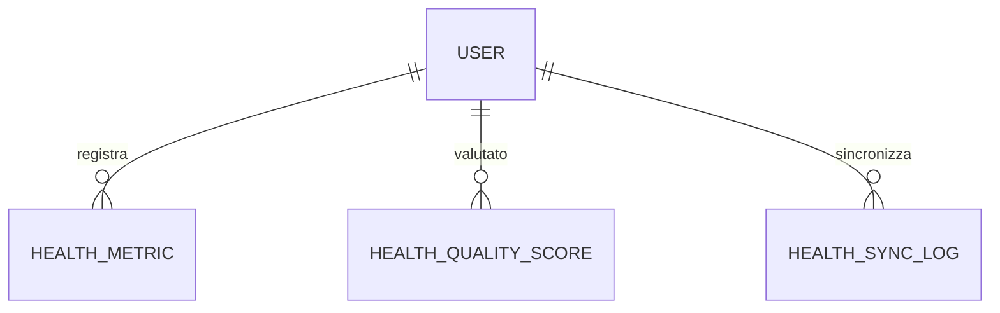

# Descrizione sintetica
Questo datamodel gestisce la raccolta delle metriche salute (HealthKit/Health Connect), il calcolo dei punteggi qualità, la registrazione dei log di sincronizzazione e supporta analisi aggregate per dashboard salute.

# Schema ER


# Health Monitor - Database Model

Questo documento descrive la struttura del database dedicato al microservizio Health Monitor.

## Schema SQL

```sql
-- Tabella metriche salute (sincronizzate da HealthKit/Health Connect)
CREATE TABLE health_metric (
    id UUID PRIMARY KEY DEFAULT gen_random_uuid(),
    user_id UUID NOT NULL,
    metric_type TEXT NOT NULL, -- es: 'steps', 'heart_rate', 'sleep', 'weight', 'blood_pressure'
    value FLOAT NOT NULL,
    unit TEXT, -- es: 'bpm', 'kg', 'hours', 'mmHg'
    measured_at TIMESTAMP NOT NULL,
    source TEXT, -- es: 'healthkit', 'manual', 'device'
    created_at TIMESTAMP DEFAULT NOW()
);
-- Viste aggregate per dashboarding

-- Metriche salute aggregate per ora
CREATE OR REPLACE VIEW health_metric_hourly AS
SELECT user_id, metric_type, date_trunc('hour', measured_at) AS hour,
       AVG(value) AS avg_value, SUM(value) AS total_value, COUNT(*) AS samples
FROM health_metric
GROUP BY user_id, metric_type, date_trunc('hour', measured_at);

-- Metriche salute aggregate per giorno
CREATE OR REPLACE VIEW health_metric_daily AS
SELECT user_id, metric_type, date_trunc('day', measured_at) AS day,
       AVG(value) AS avg_value, SUM(value) AS total_value, COUNT(*) AS samples
FROM health_metric
GROUP BY user_id, metric_type, date_trunc('day', measured_at);

-- Metriche salute aggregate per settimana
CREATE OR REPLACE VIEW health_metric_weekly AS
SELECT user_id, metric_type, date_trunc('week', measured_at) AS week,
       AVG(value) AS avg_value, SUM(value) AS total_value, COUNT(*) AS samples
FROM health_metric
GROUP BY user_id, metric_type, date_trunc('week', measured_at);

-- Metriche salute aggregate per mese
CREATE OR REPLACE VIEW health_metric_monthly AS
SELECT user_id, metric_type, date_trunc('month', measured_at) AS month,
       AVG(value) AS avg_value, SUM(value) AS total_value, COUNT(*) AS samples
FROM health_metric
GROUP BY user_id, metric_type, date_trunc('month', measured_at);

-- API: /dashboard/health-metric/hourly, /dashboard/health-metric/daily, /dashboard/health-metric/weekly, /dashboard/health-metric/monthly
CREATE TABLE health_quality_score (
    id UUID PRIMARY KEY DEFAULT gen_random_uuid(),
    user_id UUID NOT NULL,
    score FLOAT NOT NULL,
    period_start DATE NOT NULL,
    period_end DATE,
    calculated_at TIMESTAMP DEFAULT NOW()
);
-- API: /health-quality-score/*

-- Log sincronizzazione dati
CREATE TABLE health_sync_log (
    id UUID PRIMARY KEY DEFAULT gen_random_uuid(),
    user_id UUID NOT NULL,
    sync_time TIMESTAMP NOT NULL,
    source TEXT,
    status TEXT, -- es: 'success', 'error'
    details TEXT,
    created_at TIMESTAMP DEFAULT NOW()
);
-- API: /health-sync/log
```

## Policy di Sicurezza
- Row Level Security abilitata su tutte le tabelle
- Accesso solo tramite credenziali microservizio
- Policy di accesso per user_id e owner

## Strategie di Migrazione
- Utilizzare Supabase migration tool
- Versionamento schema tramite changelog
- Backup automatico settimanale

## Mapping API ↔️ Tabelle
- `/health-metric/*` → health_metric
- `/health-quality-score/*` → health_quality_score
- `/health-sync/log` → health_sync_log

## Esempi di Query
```sql
-- Metriche salute per utente
SELECT * FROM health_metric WHERE user_id = '<USER_ID>' ORDER BY measured_at DESC;

-- Score qualità salute per periodo
SELECT * FROM health_quality_score WHERE user_id = '<USER_ID>' AND period_end IS NULL;

-- Log sincronizzazione
SELECT * FROM health_sync_log WHERE user_id = '<USER_ID>' ORDER BY sync_time DESC;
```

---

**Ultimo aggiornamento:** 6 settembre 2025
