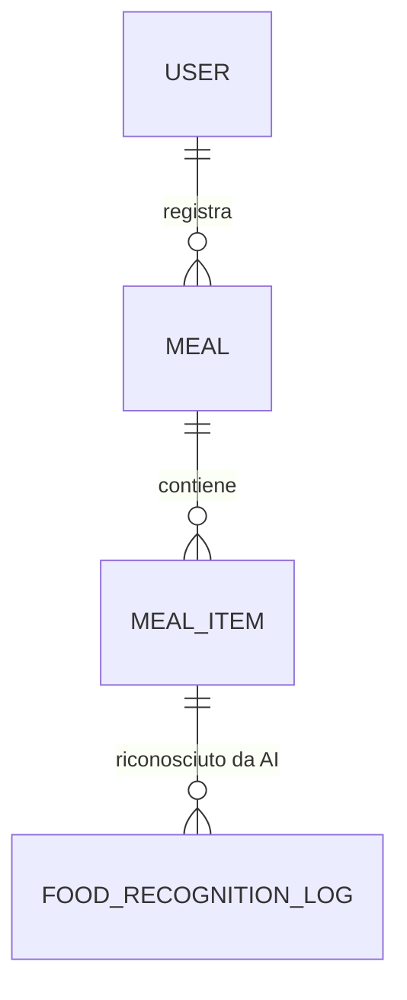

# Descrizione sintetica
Questo datamodel gestisce la registrazione dei pasti, degli alimenti consumati, il riconoscimento AI degli alimenti e supporta analisi aggregate per dashboard nutrizionali e food tracking.

# Schema ER


# Meal Tracking - Database Model

Questo documento descrive la struttura del database dedicato al microservizio Meal Tracking.

## Schema SQL

```sql
-- Tabella pasti
CREATE TABLE meal (
    id UUID PRIMARY KEY DEFAULT gen_random_uuid(),
    user_id UUID NOT NULL,
    meal_time TIMESTAMP NOT NULL,
    description TEXT,
    calories INTEGER,
    meal_type TEXT, -- es: 'breakfast', 'lunch', 'dinner', 'snack'
    created_at TIMESTAMP DEFAULT NOW()
);
-- API: /meal/*

-- Tabella alimenti consumati nel pasto
CREATE TABLE meal_item (
    id UUID PRIMARY KEY DEFAULT gen_random_uuid(),
    meal_id UUID NOT NULL REFERENCES meal(id),
    food_name TEXT NOT NULL,
    food_code TEXT, -- OpenFoodFacts code
    quantity FLOAT,
    unit TEXT, -- es: 'g', 'ml', 'piece'
    calories INTEGER,
    ai_recognition BOOLEAN DEFAULT FALSE, -- se identificato da AI
    created_at TIMESTAMP DEFAULT NOW()
);
-- API: /meal-item/*, /food-recognition/*

-- Tabella log riconoscimento alimenti AI
CREATE TABLE food_recognition_log (
    id UUID PRIMARY KEY DEFAULT gen_random_uuid(),
    meal_item_id UUID NOT NULL REFERENCES meal_item(id),
    ai_model TEXT,
    confidence FLOAT,
    recognized_at TIMESTAMP DEFAULT NOW()
);
-- API: /food-recognition/log
```
## Policy di Sicurezza
- Row Level Security abilitata su tutte le tabelle
- Accesso solo tramite credenziali microservizio
- Policy di accesso per user_id e owner

## Strategie di Migrazione
- Utilizzare Supabase migration tool
-- Viste aggregate per dashboarding

-- Pasti aggregati per ora
CREATE OR REPLACE VIEW meal_hourly AS
SELECT user_id, meal_type, date_trunc('hour', meal_time) AS hour,
       COUNT(*) AS meals, SUM(calories) AS total_calories
FROM meal
GROUP BY user_id, meal_type, date_trunc('hour', meal_time);

-- Pasti aggregati per giorno
CREATE OR REPLACE VIEW meal_daily AS
SELECT user_id, meal_type, date_trunc('day', meal_time) AS day,
       COUNT(*) AS meals, SUM(calories) AS total_calories
FROM meal
GROUP BY user_id, meal_type, date_trunc('day', meal_time);

-- Pasti aggregati per settimana
CREATE OR REPLACE VIEW meal_weekly AS
SELECT user_id, meal_type, date_trunc('week', meal_time) AS week,
       COUNT(*) AS meals, SUM(calories) AS total_calories
FROM meal
GROUP BY user_id, meal_type, date_trunc('week', meal_time);

-- Pasti aggregati per mese
CREATE OR REPLACE VIEW meal_monthly AS
SELECT user_id, meal_type, date_trunc('month', meal_time) AS month,
       COUNT(*) AS meals, SUM(calories) AS total_calories
FROM meal
GROUP BY user_id, meal_type, date_trunc('month', meal_time);

-- Alimenti aggregati per giorno
CREATE OR REPLACE VIEW meal_item_daily AS
SELECT user_id, food_name, date_trunc('day', meal_time) AS day,
       SUM(quantity) AS total_quantity, SUM(calories) AS total_calories
FROM meal_item
JOIN meal ON meal_item.meal_id = meal.id
GROUP BY user_id, food_name, date_trunc('day', meal_time);

-- API: /dashboard/meal/hourly, /dashboard/meal/daily, /dashboard/meal/weekly, /dashboard/meal/monthly, /dashboard/meal-item/daily
- Backup automatico settimanale

## Mapping API ↔️ Tabelle
- `/meal/*` → meal
- `/meal-item/*` → meal_item
- `/food-recognition/*` → meal_item, food_recognition_log

## Esempi di Query
```sql
-- Recupera pasti per utente
SELECT * FROM meal WHERE user_id = '<USER_ID>' ORDER BY meal_time DESC;

-- Recupera alimenti di un pasto
SELECT * FROM meal_item WHERE meal_id = '<MEAL_ID>';

-- Log riconoscimento AI per alimento
SELECT * FROM food_recognition_log WHERE meal_item_id = '<ITEM_ID>';
```

---

**Ultimo aggiornamento:** 6 settembre 2025
