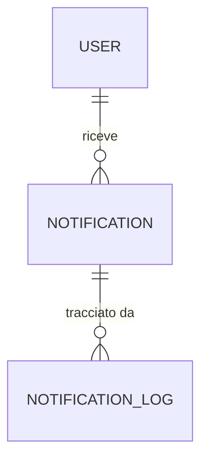

# Descrizione sintetica
Questo datamodel gestisce l'invio, la ricezione e il tracciamento delle notifiche utente, con log dettagliato per monitoraggio e audit.

# Schema ER


# Notifications - Database Model

Questo documento descrive la struttura del database dedicato al microservizio Notifications.

## Schema SQL

```sql
-- Tabella notifiche inviate
CREATE TABLE notification (
    id UUID PRIMARY KEY DEFAULT gen_random_uuid(),
    user_id UUID NOT NULL,
    message TEXT NOT NULL,
    type TEXT, -- es: 'reminder', 'alert', 'coach_prompt'
    sent_at TIMESTAMP DEFAULT NOW(),
    read BOOLEAN DEFAULT FALSE,
    channel TEXT, -- es: 'push', 'email', 'sms'
    priority INTEGER DEFAULT 1, -- 1=bassa, 2=media, 3=alta
    created_at TIMESTAMP DEFAULT NOW()
);
-- API: /notification/*

-- Tabella log invio notifiche
CREATE TABLE notification_log (
    id UUID PRIMARY KEY DEFAULT gen_random_uuid(),
    notification_id UUID NOT NULL REFERENCES notification(id),
    status TEXT, -- es: 'sent', 'failed', 'delivered'
    log_time TIMESTAMP DEFAULT NOW(),
    details TEXT
);
-- API: /notification/log
```

## Policy di Sicurezza
- Row Level Security abilitata su tutte le tabelle
- Accesso solo tramite credenziali microservizio
- Policy di accesso per user_id e owner

## Strategie di Migrazione
- Utilizzare Supabase migration tool
- Versionamento schema tramite changelog
- Backup automatico settimanale

## Mapping API ↔️ Tabelle
- `/notification/*` → notification
- `/notification/log` → notification_log

## Esempi di Query
```sql
-- Notifiche per utente
SELECT * FROM notification WHERE user_id = '<USER_ID>' ORDER BY sent_at DESC;

-- Log invio per notifica
SELECT * FROM notification_log WHERE notification_id = '<NOTIFICATION_ID>';
```

---

**Ultimo aggiornamento:** 6 settembre 2025
