# User Management Service Database Schema

**Service:** user-management  
**Database:** Shared Supabase Database  
**Schema:** `user_management`  
**Version:** v1.1.0  
**Last Updated:** 10 settembre 2025  
**Scripts:** `001_initial_schema.sql` + `002_auth_tables_fix.sql`

## 🎯 Database Purpose

**CRITICAL INFRASTRUCTURE**: User Management Service fornisce l'autenticazione centralizzata per tutta la piattaforma NutriFit, implementato con schema dedicato `user_management` in database Supabase condiviso per ottimizzazione costi.

**Core Responsibilities:**
- 🔐 **Autenticazione centralizzata** con JWT tokens e session management
- 👤 **Gestione profili utente** unificata con privacy settings GDPR
- 🔑 **Social authentication** (Google, Apple, Facebook) 
- 📱 **Cross-device session management** e device tracking
- 🛡️ **Security features**: password reset, email verification, audit logging
- 📋 **GDPR compliance** con consent management e data export
- 🔗 **Service integration** tramite view `user_service_context`

**Architecture**: Schema-based multi-tenancy con database condiviso Supabase

---

## 📊 Database Schema Overview

### Core Tables Structure

```mermaid
erDiagram
    users ||--|| user_profiles : has
    users ||--o{ auth_credentials : has
    users ||--o{ social_auth_profiles : has
    users ||--o{ auth_sessions : has
    users ||--|| privacy_settings : has
    users ||--o{ audit_logs : generates
    users ||--o{ password_reset_tokens : has
    users ||--o{ email_verification_tokens : has
    
    users {
        uuid id PK "Primary key"
        string email UK "Unique email"
        string username UK "Unique username"
        enum status "active|inactive|suspended|deleted"
        timestamp email_verified_at "Email verification"
        timestamp created_at "Creation timestamp"
        timestamp updated_at "Last update"
        timestamp last_login_at "Last login"
    }
    
    user_profiles {
        uuid id PK "Primary key"
        uuid user_id FK "User reference"
        string first_name "Given name"
        string last_name "Family name"
        string display_name "Public display name"
        string avatar_url "Profile picture URL"
        date date_of_birth "Birth date"
        enum gender "male|female|other|prefer_not_to_say"
        string timezone "User timezone"
        string locale "Language/region"
        jsonb preferences "User preferences"
        timestamp created_at "Profile creation"
        timestamp updated_at "Profile update"
    }
    
    auth_credentials {
        uuid id PK "Primary key"
        uuid user_id FK "User reference"
        string password_hash "Hashed password"
        string salt "Password salt"
        enum status "active|expired|disabled"
        timestamp password_changed_at "Last password change"
        int failed_attempts "Failed login count"
        timestamp locked_until "Account lock expiry"
        timestamp last_login "Last login timestamp"
        boolean requires_password_change "Force password change"
        timestamp created_at "Credential creation"
        timestamp updated_at "Credential update"
    }
    
    password_reset_tokens {
        uuid id PK "Primary key"
        uuid user_id FK "User reference"
        string token UK "Reset token"
        timestamp expires_at "Token expiry"
        timestamp used_at "Usage timestamp"
        timestamp created_at "Token creation"
    }
    
    email_verification_tokens {
        uuid id PK "Primary key"
        uuid user_id FK "User reference"
        string token UK "Verification token"
        timestamp expires_at "Token expiry"
        timestamp verified_at "Verification timestamp"
        timestamp created_at "Token creation"
    }
    
    social_auth_profiles {
        uuid id PK "Primary key"
        uuid user_id FK "User reference"
        enum provider "google|apple|facebook"
        string provider_user_id "External user ID"
        string provider_email "Provider email"
        jsonb provider_data "Additional provider data"
        enum status "active|revoked|expired"
        timestamp connected_at "Connection time"
        timestamp last_used_at "Last usage"
        timestamp updated_at "Profile update"
    }
    
    auth_sessions {
        uuid id PK "Primary key"
        uuid user_id FK "User reference"
        string session_token "JWT session token"
        string refresh_token "JWT refresh token"
        string device_id "Device identifier"
        enum device_type "mobile|web|desktop"
        string user_agent "Browser/app info"
        inet ip_address "Client IP"
        string location "Geographic location"
        enum status "active|expired|revoked"
        timestamp expires_at "Session expiry"
        timestamp last_activity_at "Last activity"
        timestamp created_at "Session creation"
    }
    
    privacy_settings {
        uuid id PK "Primary key"
        uuid user_id FK "User reference"
        boolean data_processing_consent "GDPR consent"
        boolean marketing_consent "Marketing emails"
        boolean analytics_consent "Usage analytics"
        boolean profile_visibility "Public profile"
        boolean health_data_sharing "Health data consent"
        jsonb preferences "Privacy preferences"
        timestamp consent_given_at "Consent timestamp"
        timestamp updated_at "Settings update"
    }
    
    audit_logs {
        uuid id PK "Primary key"
        uuid user_id FK "User reference"
        string action "Action performed"
        string resource "Resource affected"
        jsonb data "Action details"
        string ip_address "Client IP"
        string user_agent "Client info"
        timestamp created_at "Log timestamp"
    }
```



---

## 🗄️ Database Tables Detail

### 1. users - Core User Identity

**Purpose:** Central user identity table for all NutriFit platform authentication.

```sql
CREATE TABLE users (
    id UUID PRIMARY KEY DEFAULT gen_random_uuid(),
    email VARCHAR(255) UNIQUE NOT NULL,
    username VARCHAR(50) UNIQUE NOT NULL,
    status user_status DEFAULT 'active',
    email_verified_at TIMESTAMP,
    created_at TIMESTAMP DEFAULT CURRENT_TIMESTAMP,
    updated_at TIMESTAMP DEFAULT CURRENT_TIMESTAMP,
    last_login_at TIMESTAMP,
    
    -- Constraints
    CONSTRAINT email_format CHECK (email ~* '^[A-Za-z0-9._%+-]+@[A-Za-z0-9.-]+\.[A-Za-z]{2,}$'),
    CONSTRAINT username_format CHECK (username ~* '^[a-zA-Z0-9_]{3,50}$')
);

-- Custom enum for user status
CREATE TYPE user_status AS ENUM ('active', 'inactive', 'suspended', 'deleted');

-- Indexes for performance
CREATE INDEX idx_users_email ON users(email);
CREATE INDEX idx_users_username ON users(username);
CREATE INDEX idx_users_status ON users(status);
CREATE INDEX idx_users_last_login ON users(last_login_at);
```

### 2. user_profiles - Extended User Information

**Purpose:** Detailed user profile information for personalization and app functionality.

```sql
CREATE TABLE user_profiles (
    id UUID PRIMARY KEY DEFAULT gen_random_uuid(),
    user_id UUID NOT NULL REFERENCES users(id) ON DELETE CASCADE,
    first_name VARCHAR(100),
    last_name VARCHAR(100),
    display_name VARCHAR(150),
    avatar_url TEXT,
    date_of_birth DATE,
    gender gender_type,
    timezone VARCHAR(50) DEFAULT 'UTC',
    locale VARCHAR(10) DEFAULT 'en-US',
    preferences JSONB DEFAULT '{}',
    created_at TIMESTAMP DEFAULT CURRENT_TIMESTAMP,
    updated_at TIMESTAMP DEFAULT CURRENT_TIMESTAMP,
    
    -- Constraints
    CONSTRAINT unique_user_profile UNIQUE(user_id),
    CONSTRAINT age_check CHECK (date_of_birth <= CURRENT_DATE - INTERVAL '13 years')
);

-- Custom enum for gender
CREATE TYPE gender_type AS ENUM ('male', 'female', 'other', 'prefer_not_to_say');

-- Indexes
CREATE UNIQUE INDEX idx_user_profiles_user_id ON user_profiles(user_id);
CREATE INDEX idx_user_profiles_display_name ON user_profiles(display_name);
```

### 3. auth_credentials - Password Management

**Purpose:** Secure password storage and authentication attempt tracking.

```sql
CREATE TABLE user_management.auth_credentials (
    id UUID PRIMARY KEY DEFAULT gen_random_uuid(),
    user_id UUID NOT NULL REFERENCES user_management.users(id) ON DELETE CASCADE,
    password_hash VARCHAR(255) NOT NULL,
    salt VARCHAR(255) NOT NULL,
    status user_management.credential_status DEFAULT 'active',
    password_changed_at TIMESTAMP DEFAULT CURRENT_TIMESTAMP,
    failed_attempts INTEGER DEFAULT 0,
    locked_until TIMESTAMP,
    last_login TIMESTAMP,
    requires_password_change BOOLEAN DEFAULT FALSE,
    created_at TIMESTAMP DEFAULT CURRENT_TIMESTAMP,
    updated_at TIMESTAMP DEFAULT CURRENT_TIMESTAMP,
    
    -- Constraints
    CONSTRAINT unique_user_credentials UNIQUE(user_id),
    CONSTRAINT failed_attempts_check CHECK (failed_attempts >= 0 AND failed_attempts <= 10)
);

-- Custom enum for credential status
CREATE TYPE user_management.credential_status AS ENUM ('active', 'expired', 'disabled');

-- Indexes
CREATE UNIQUE INDEX idx_auth_credentials_user_id ON user_management.auth_credentials(user_id);
CREATE INDEX idx_auth_credentials_status ON user_management.auth_credentials(status);
CREATE INDEX idx_auth_credentials_last_login ON user_management.auth_credentials(last_login);
```

### 4. password_reset_tokens - Password Reset Management

**Purpose:** Secure password reset token management with expiration.

```sql
CREATE TABLE user_management.password_reset_tokens (
    id UUID PRIMARY KEY DEFAULT gen_random_uuid(),
    user_id UUID NOT NULL REFERENCES user_management.users(id) ON DELETE CASCADE,
    token VARCHAR(255) UNIQUE NOT NULL,
    expires_at TIMESTAMP NOT NULL,
    used_at TIMESTAMP,
    created_at TIMESTAMP DEFAULT CURRENT_TIMESTAMP,
    
    -- Constraints
    CONSTRAINT token_not_expired CHECK (expires_at > created_at)
);

-- Indexes
CREATE INDEX idx_password_reset_user_id ON user_management.password_reset_tokens(user_id);
CREATE INDEX idx_password_reset_expires ON user_management.password_reset_tokens(expires_at);
CREATE UNIQUE INDEX idx_password_reset_token ON user_management.password_reset_tokens(token);
```

### 5. email_verification_tokens - Email Verification Management

**Purpose:** Email verification token management for account activation.

```sql
CREATE TABLE user_management.email_verification_tokens (
    id UUID PRIMARY KEY DEFAULT gen_random_uuid(),
    user_id UUID NOT NULL REFERENCES user_management.users(id) ON DELETE CASCADE,
    token VARCHAR(255) UNIQUE NOT NULL,
    expires_at TIMESTAMP NOT NULL,
    verified_at TIMESTAMP,
    created_at TIMESTAMP DEFAULT CURRENT_TIMESTAMP,
    
    -- Constraints
    CONSTRAINT verification_token_not_expired CHECK (expires_at > created_at)
);

-- Indexes
CREATE INDEX idx_email_verification_user_id ON user_management.email_verification_tokens(user_id);
CREATE INDEX idx_email_verification_expires ON user_management.email_verification_tokens(expires_at);
CREATE UNIQUE INDEX idx_email_verification_token ON user_management.email_verification_tokens(token);
```

### 6. social_auth_profiles - OAuth Integration

**Purpose:** Social media authentication integration (Google, Apple, Facebook).

```sql
CREATE TABLE user_management.social_auth_profiles (
    id UUID PRIMARY KEY DEFAULT gen_random_uuid(),
    user_id UUID NOT NULL REFERENCES user_management.users(id) ON DELETE CASCADE,
    provider user_management.auth_provider NOT NULL,
    provider_user_id VARCHAR(255) NOT NULL,
    provider_email VARCHAR(255),
    provider_data JSONB DEFAULT '{}',
    status user_management.social_auth_status DEFAULT 'active',
    connected_at TIMESTAMP DEFAULT CURRENT_TIMESTAMP,
    last_used_at TIMESTAMP,
    updated_at TIMESTAMP DEFAULT CURRENT_TIMESTAMP,
    
    -- Constraints
    CONSTRAINT unique_provider_user UNIQUE(provider, provider_user_id),
    CONSTRAINT unique_user_provider UNIQUE(user_id, provider)
);

-- Custom enums
CREATE TYPE user_management.auth_provider AS ENUM ('google', 'apple', 'facebook');
CREATE TYPE user_management.social_auth_status AS ENUM ('active', 'revoked', 'expired');

-- Indexes
CREATE INDEX idx_social_auth_user_id ON user_management.social_auth_profiles(user_id);
CREATE INDEX idx_social_auth_provider ON user_management.social_auth_profiles(provider);
CREATE UNIQUE INDEX idx_social_auth_provider_user ON user_management.social_auth_profiles(provider, provider_user_id);
```

### 7. auth_sessions - Session Management

**Purpose:** JWT session tracking and device management for security.

```sql
CREATE TABLE user_management.auth_sessions (
    id UUID PRIMARY KEY DEFAULT gen_random_uuid(),
    user_id UUID NOT NULL REFERENCES user_management.users(id) ON DELETE CASCADE,
    session_token VARCHAR(500) NOT NULL,
    refresh_token VARCHAR(500) NOT NULL,
    device_id VARCHAR(255),
    device_type user_management.device_type,
    user_agent TEXT,
    ip_address INET,
    location VARCHAR(255),
    status user_management.session_status DEFAULT 'active',
    expires_at TIMESTAMP NOT NULL,
    last_activity_at TIMESTAMP DEFAULT CURRENT_TIMESTAMP,
    created_at TIMESTAMP DEFAULT CURRENT_TIMESTAMP,
    
    -- Constraints
    CONSTRAINT unique_session_token UNIQUE(session_token),
    CONSTRAINT unique_refresh_token UNIQUE(refresh_token),
    CONSTRAINT expires_future CHECK (expires_at > created_at)
);

-- Custom enums
CREATE TYPE user_management.device_type AS ENUM ('mobile', 'web', 'desktop');
CREATE TYPE user_management.session_status AS ENUM ('active', 'expired', 'revoked');

-- Indexes
CREATE INDEX idx_auth_sessions_user_id ON user_management.auth_sessions(user_id);
CREATE INDEX idx_auth_sessions_status ON user_management.auth_sessions(status);
CREATE INDEX idx_auth_sessions_expires ON user_management.auth_sessions(expires_at);
CREATE UNIQUE INDEX idx_auth_sessions_token ON user_management.auth_sessions(session_token);
CREATE UNIQUE INDEX idx_auth_sessions_refresh ON user_management.auth_sessions(refresh_token);
```

### 8. privacy_settings - GDPR Compliance

**Purpose:** User privacy preferences and GDPR compliance tracking.

```sql
CREATE TABLE user_management.privacy_settings (
    id UUID PRIMARY KEY DEFAULT gen_random_uuid(),
    user_id UUID NOT NULL REFERENCES user_management.users(id) ON DELETE CASCADE,
    data_processing_consent BOOLEAN DEFAULT false,
    marketing_consent BOOLEAN DEFAULT false,
    analytics_consent BOOLEAN DEFAULT false,
    profile_visibility BOOLEAN DEFAULT false,
    health_data_sharing BOOLEAN DEFAULT false,
    preferences JSONB DEFAULT '{}',
    consent_given_at TIMESTAMP,
    updated_at TIMESTAMP DEFAULT CURRENT_TIMESTAMP,
    
    -- Constraints
    CONSTRAINT unique_user_privacy UNIQUE(user_id)
);

-- Indexes
CREATE UNIQUE INDEX idx_privacy_settings_user_id ON user_management.privacy_settings(user_id);
CREATE INDEX idx_privacy_consent_given ON user_management.privacy_settings(consent_given_at);
```

### 9. audit_logs - Security Audit Trail

**Purpose:** Complete audit trail of user actions for security and compliance.

```sql
CREATE TABLE user_management.audit_logs (
    id UUID PRIMARY KEY DEFAULT gen_random_uuid(),
    user_id UUID REFERENCES user_management.users(id) ON DELETE SET NULL,
    action VARCHAR(100) NOT NULL,
    resource VARCHAR(100) NOT NULL,
    data JSONB DEFAULT '{}',
    ip_address INET,
    user_agent TEXT,
    created_at TIMESTAMP DEFAULT CURRENT_TIMESTAMP
);

-- Indexes
CREATE INDEX idx_audit_logs_user_id ON user_management.audit_logs(user_id);
CREATE INDEX idx_audit_logs_action ON user_management.audit_logs(action);
CREATE INDEX idx_audit_logs_resource ON user_management.audit_logs(resource);
CREATE INDEX idx_audit_logs_created_at ON user_management.audit_logs(created_at);
```

---

## 🗄️ Database Implementation Details

### SQL Scripts Overview

The user-management database is implemented through two complementary SQL scripts:

1. **`001_initial_schema.sql`** - Foundation setup with core tables and basic authentication structure
2. **`002_auth_tables_fix.sql`** - Authentication tables enhancement with all required fields

### Schema Deployment Process

```sql
-- Step 1: Execute foundation schema
\i sql/001_initial_schema.sql

-- Step 2: Apply authentication enhancements  
\i sql/002_auth_tables_fix.sql
```

### Trigger Functions

```sql
-- Schema-specific trigger function for updated_at fields
CREATE OR REPLACE FUNCTION user_management.update_updated_at_column()
RETURNS TRIGGER AS $$
BEGIN
    NEW.updated_at = CURRENT_TIMESTAMP;
    RETURN NEW;
END;
$$ language 'plpgsql';
```

---

## 🔗 Cross-Service Integration

### User Context API for Microservices

**Purpose:** Provide user context to other microservices without exposing sensitive data.

```sql
-- View for service integration (schema-specific)
CREATE VIEW user_management.user_service_context AS
SELECT 
    u.id as user_id,
    u.username,
    u.status as user_status,
    up.display_name,
    up.timezone,
    up.locale,
    up.preferences,
    ps.health_data_sharing,
    ps.analytics_consent,
    u.updated_at
FROM user_management.users u
LEFT JOIN user_management.user_profiles up ON u.id = up.user_id
LEFT JOIN user_management.privacy_settings ps ON u.id = ps.user_id
WHERE u.status = 'active';
```

### Cross-Schema Integration Pattern

```sql
-- Example: How other microservices reference users
-- From calorie_balance schema:
CREATE TABLE calorie_balance.daily_goals (
    id UUID PRIMARY KEY DEFAULT gen_random_uuid(),
    user_id UUID NOT NULL, -- References user_management.users(id)
    target_calories INTEGER NOT NULL,
    created_at TIMESTAMP DEFAULT CURRENT_TIMESTAMP
);

-- Cross-schema constraint (if needed)
ALTER TABLE calorie_balance.daily_goals 
ADD CONSTRAINT fk_user_management_user 
FOREIGN KEY (user_id) REFERENCES user_management.users(id);
```

---

## 📈 Performance Optimization

### Database Indexes Strategy

```sql
-- Core performance indexes (schema-specific)
CREATE INDEX CONCURRENTLY idx_users_composite ON user_management.users(status, email_verified_at);
CREATE INDEX CONCURRENTLY idx_sessions_active ON user_management.auth_sessions(user_id, status, expires_at);
CREATE INDEX CONCURRENTLY idx_audit_logs_time_user ON user_management.audit_logs(created_at, user_id);

-- Partial indexes for common queries
CREATE INDEX CONCURRENTLY idx_users_active ON user_management.users(id) WHERE status = 'active';
CREATE INDEX CONCURRENTLY idx_sessions_valid ON user_management.auth_sessions(user_id) WHERE status = 'active' AND expires_at > NOW();
```

### Connection Pool Configuration

```python
# Database connection settings for high performance
DATABASE_CONFIG = {
    "pool_size": 20,
    "max_overflow": 30,
    "pool_timeout": 30,
    "pool_recycle": 3600,
    "pool_pre_ping": True
}
```

---

## 🛡️ Security Implementation

### Row Level Security (RLS)

```sql
-- Enable RLS on sensitive tables
ALTER TABLE user_management.users ENABLE ROW LEVEL SECURITY;
ALTER TABLE user_management.user_profiles ENABLE ROW LEVEL SECURITY;
ALTER TABLE user_management.auth_credentials ENABLE ROW LEVEL SECURITY;
ALTER TABLE user_management.privacy_settings ENABLE ROW LEVEL SECURITY;

-- RLS policies for user data access (Supabase-compatible)
CREATE POLICY "Service role full access" ON user_management.users
    FOR ALL TO service_role USING (true) WITH CHECK (true);

CREATE POLICY "Service role full access" ON user_management.user_profiles
    FOR ALL TO service_role USING (true) WITH CHECK (true);

CREATE POLICY "Service role full access" ON user_management.auth_credentials
    FOR ALL TO service_role USING (true) WITH CHECK (true);

CREATE POLICY "Service role full access" ON user_management.privacy_settings
    FOR ALL TO service_role USING (true) WITH CHECK (true);
```

### Data Encryption

```sql
-- Sensitive data encryption
CREATE EXTENSION IF NOT EXISTS pgcrypto;

-- Example: Encrypt sensitive profile data
ALTER TABLE user_profiles 
ADD COLUMN encrypted_personal_data BYTEA;

-- Encryption function
CREATE OR REPLACE FUNCTION encrypt_personal_data(data TEXT)
RETURNS BYTEA AS $$
BEGIN
    RETURN pgp_sym_encrypt(data, current_setting('app.encryption_key'));
END;
$$ LANGUAGE plpgsql SECURITY DEFINER;
```

---

## 📊 Analytics & Monitoring

### Key Metrics Tables

```sql
-- User metrics view (schema-specific)
CREATE VIEW user_management.user_metrics AS
SELECT 
    DATE_TRUNC('day', created_at) as date,
    COUNT(*) as new_users,
    COUNT(*) FILTER (WHERE email_verified_at IS NOT NULL) as verified_users,
    COUNT(*) FILTER (WHERE last_login_at >= NOW() - INTERVAL '30 days') as active_users
FROM user_management.users
GROUP BY DATE_TRUNC('day', created_at);

-- Authentication metrics
CREATE VIEW user_management.auth_metrics AS
SELECT 
    DATE_TRUNC('hour', created_at) as hour,
    COUNT(*) as total_sessions,
    COUNT(DISTINCT user_id) as unique_users,
    AVG(EXTRACT(EPOCH FROM (COALESCE(last_activity_at, created_at) - created_at))) as avg_session_duration
FROM user_management.auth_sessions
GROUP BY DATE_TRUNC('hour', created_at);
```

---

## 🔄 Database Maintenance

### Automated Cleanup Jobs

```sql
-- Clean up expired sessions (schema-specific)
DELETE FROM user_management.auth_sessions 
WHERE status = 'expired' 
   OR expires_at < NOW() - INTERVAL '7 days';

-- Archive old audit logs (keep 1 year)
DELETE FROM user_management.audit_logs 
WHERE created_at < NOW() - INTERVAL '1 year';

-- Clean up deleted users (after 30 days grace period)
DELETE FROM user_management.users 
WHERE status = 'deleted' 
  AND updated_at < NOW() - INTERVAL '30 days';

-- Clean up expired tokens
DELETE FROM user_management.password_reset_tokens 
WHERE expires_at < NOW() - INTERVAL '1 day';

DELETE FROM user_management.email_verification_tokens 
WHERE expires_at < NOW() - INTERVAL '1 day';
```

### Backup Strategy

```bash
# Schema-specific backup
pg_dump --schema=user_management -h your-supabase-host.supabase.co -U postgres database_name > user_management_backup_$(date +%Y%m%d).sql

# Full database backup (all schemas)
pg_dump -h your-supabase-host.supabase.co -U postgres database_name > full_backup_$(date +%Y%m%d).sql
```

---

## 🚀 Deployment Configuration

### Supabase Schema Setup

```sql
-- Supabase setup for user-management schema
-- Run via Supabase SQL editor

-- Enable required extensions (global)
CREATE EXTENSION IF NOT EXISTS "uuid-ossp";
CREATE EXTENSION IF NOT EXISTS "pgcrypto";

-- Create user_management schema
CREATE SCHEMA IF NOT EXISTS user_management;

-- Execute schema scripts in order
\i sql/001_initial_schema.sql
\i sql/002_auth_tables_fix.sql
```

### Environment Variables

```bash
# User Management Service configuration (schema-based)
SUPABASE_URL=https://your-project.supabase.co
SUPABASE_SERVICE_ROLE_KEY=your-service-role-key
DATABASE_SCHEMA=user_management
JWT_SECRET=your-super-secret-jwt-key
JWT_EXPIRY=3600
REFRESH_TOKEN_EXPIRY=2592000
BCRYPT_ROUNDS=12

# Social authentication
GOOGLE_CLIENT_ID=your-google-client-id
GOOGLE_CLIENT_SECRET=your-google-client-secret
APPLE_CLIENT_ID=your-apple-client-id
FACEBOOK_APP_ID=your-facebook-app-id
```

---

**Database Status:** ✅ **PRODUCTION READY** - Schema implemented with 001 + 002 scripts  
**Current Version:** v1.1.0 (002_auth_tables_fix.sql)  
**Architecture:** Schema-based multi-tenancy on Supabase  
**Tables:** 9 core tables with complete authentication system  
**Critical Features:** JWT sessions, password reset, email verification, audit logging, GDPR compliance

**Next Steps:** Integration testing, GraphQL federation setup, mobile app authentication flow
