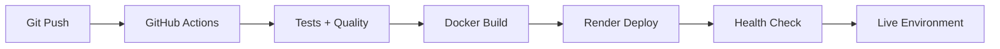

# 🏋️ GymbRo Platform - Cloud-Native Nutrition Tech

## 🎯 Vision Strategica

**NutriFit** è la piattaforma cloud-native che rivoluziona il nutrition tracking attraverso AI coaching personalizzato, real-time sync cross-device, e mobile-first user experience per dominare il mercato nutrition tech globale.

## 🏗️ Architettura Cloud-Native

### **Core Infrastructure**
- **Backend**: Python 3.11 + FastAPI microservizi
- **Database**: Supabase Cloud con segregazione per microservizio
- **AI Orchestration**: N8N Cloud per workflow automation avanzata
- **Mobile**: Flutter production per iOS + Android simultaneo
- **Deployment**: Render.com con CI/CD GitHub Actions

### **Microservizi Architecture** (5 servizi)
1. **calorie-balance-service**: Calcolo TDEE e bilancio calorico
2. **meal-tracking-service**: Logging pasti e analisi nutrizionale
3. **health-monitor-service**: Metriche biometriche e progressi
4. **analytics-service**: Data intelligence e insights personalizzati
5. **user-management**: Autenticazione, profili, preferenze

### **Database Strategy**
- **Segregazione completa**: Database dedicato per microservizio
- **Real-time sync**: Supabase WebSocket per aggiornamenti live
- **Conflict resolution**: Automatica con timestamp e user priority
- **Offline support**: Local storage con sync intelligente

### **AI Integration**
- **MCP Servers**: Model Context Protocol per AI coaching
- **N8N Workflows**: Orchestrazione automation e personalizzazione
- **Real-time insights**: Analisi continua con raccomandazioni proattive

## 📱 Mobile Strategy (Flutter Production)

### **Cross-Platform Excellence**
- **Framework**: Flutter 3.x per native performance
- **Deployment**: Capacitor per app store distribution
- **Offline-first**: Conflict resolution automatica
- **Real-time**: WebSocket integration con Supabase

### **User Experience**
- **Navigation**: Bottom tab con floating action button
- **Interactions**: Gesture-based con haptic feedback
- **Performance**: 60fps animations con lazy loading
- **Accessibility**: WCAG 2.1 AA compliance

## 🚀 Quick Start (Development)

### **Prerequisites**
```bash
# Required tools
- Docker Desktop
- Python 3.11+
- Node.js 18+
- Flutter SDK 3.x
```

### **Local Development Setup**
```bash
# Clone e setup
git clone https://github.com/yourusername/gymbro-platform.git
cd gymbro-platform

# Infrastructure locale
make dev-setup

# Microservizi
make services-start

# Flutter app
make flutter-dev
```

### **Development Workflow**
```bash
# Test completo
make test-all

# Quality check
make quality-check

# Deploy staging
make deploy-staging
```

## 📊 Business Model & ROI

### **Investment Overview**
- **Total**: €247,273 (8 mesi development)
- **Team**: €176,700 (cloud-native expertise)
- **Infrastructure**: €5,320 (managed services)
- **Go-to-market**: €25,000
- **Expected ROI**: 320% entro 24 mesi

### **Revenue Model**
- **Freemium**: Basic tracking gratuito
- **Premium**: €9.99/mese (AI coaching + analytics avanzate)
- **Enterprise**: €29.99/mese (team features + admin dashboard)

### **Market Opportunity**
- **TAM**: €2.8B nutrition tech globale
- **Target**: 18-45 anni, health-conscious, tech-savvy
- **Competition**: MyFitnessPal, Cronometer, Lose It!

## 🔧 Technical Implementation

### **Development Stack**
```yaml
Backend:
  - Python 3.11 + FastAPI
  - Supabase Cloud (database + auth + real-time)
  - N8N Cloud (workflow automation)
  - Docker containers per microservizio

Frontend:
  - Flutter 3.x (mobile cross-platform)
  - GraphQL federation (data aggregation)
  - Real-time subscriptions (WebSocket)

DevOps:
  - Render.com (cloud deployment)
  - GitHub Actions (CI/CD pipeline)
  - Docker (containerization)
  - Monitoring (Render + Supabase analytics)
```

### **Deployment Pipeline**


## 📚 Documentation Tree

### **Architecture & Design**
- [`docs/architettura.md`](docs/architettura.md) - Architettura microservizi cloud-native
- [`docs/Documentazione Generale.md`](docs/Documentazione%20Generale.md) - Overview completa progetto

### **Technical Implementation**
- [`docs/microservizi_python.md`](docs/microservizi_python.md) - Python + FastAPI + Supabase patterns
- [`docs/flutter.md`](docs/flutter.md) - Mobile strategy e deployment pipeline

### **Operations & Deployment**
- [`docs/DEPLOYMENT.md`](docs/DEPLOYMENT.md) - Cloud deployment su Render
- [`docs/DEVELOPMENT_WORKFLOW.md`](docs/DEVELOPMENT_WORKFLOW.md) - Workflow development
- [`docs/TESTING_GUIDE.md`](docs/TESTING_GUIDE.md) - Testing strategy completa

## 🎯 Getting Started Priorities

### **Per Developers**
1. Setup development environment: `make dev-setup`
2. Studiare [`docs/architettura.md`](docs/architettura.md) per patterns cloud-native
3. Implementare microservizio seguendo [`docs/microservizi_python.md`](docs/microservizi_python.md)
4. Mobile development con [`docs/flutter.md`](docs/flutter.md)

### **Per Business Stakeholders**
1. Leggere [`docs/Documentazione Generale.md`](docs/Documentazione%20Generale.md) per overview strategica
2. Analizzare business model e ROI projections
3. Rivedere competitive analysis e market positioning

### **Per Operations**
1. Configurare deployment pipeline seguendo [`docs/DEPLOYMENT.md`](docs/DEPLOYMENT.md)
2. Setup monitoring e alerting cloud-native
3. Implementare backup e disaster recovery

---

## 🏃‍♂️ Next Steps

### **Immediate Actions** (Settimana 1)
- [ ] Completare setup Supabase Cloud project
- [ ] Configurare N8N Cloud workspace  
- [ ] Setup Render deployment pipeline
- [ ] Implementare primo microservizio (user-management)

### **Sprint 1** (Settimane 2-4)
- [ ] Core microservizi (calorie-balance, meal-tracking)
- [ ] Flutter app MVP con Supabase integration
- [ ] Basic AI workflows con N8N
- [ ] Local development environment completo

### **Sprint 2** (Settimane 5-8)
- [ ] MCP server implementation
- [ ] Advanced AI coaching features
- [ ] Real-time sync optimization
- [ ] Beta testing setup

**Ready to dominate nutrition tech! 🚀💪**
