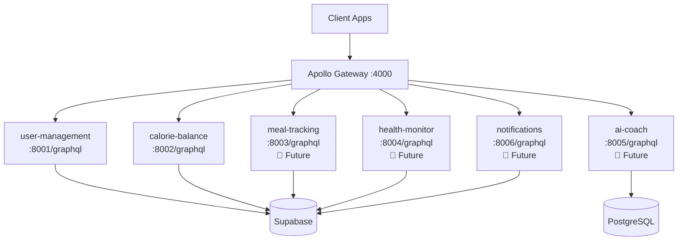

# 🌐 Apollo Gateway - API Roadmap

**GymBro Platform Federation Gateway** | **Status**: 🚧 Beta  
**Version**: 1.0.0 | **Updated**: 16 settembre 2025

---

## 🎯 Current Status

### ✅ Implemented Features

**Core Federation**
- ✅ Apollo Federation v2.5 Gateway
- ✅ Schema composition from subgraphs
- ✅ Query planning and execution
- ✅ Health monitoring
- ✅ Error handling and logging

**Subgraph Integration**
- ✅ user-management integration (port 8001)
- ✅ calorie-balance integration (port 8002)
- ✅ Federation SDL introspection
- ✅ Cross-service query routing

**Development Tooling**
- ✅ Development scripts (start-dev.sh, stop-dev.sh)
- ✅ Docker configuration
- ✅ Integration testing suite
- ✅ Health check endpoints

**Configuration**
- ✅ Environment-based configuration
- ✅ CORS support
- ✅ Security headers (Helmet.js)
- ✅ Graceful shutdown handling

### 🚧 In Development

**Additional Subgraphs**
- 🔄 meal-tracking GraphQL integration
- 🔄 health-monitor GraphQL integration  
- 🔄 ai-coach GraphQL integration
- 🔄 notifications GraphQL integration

**Performance & Optimization**
- 🔄 Response caching with Redis
- 🔄 Query complexity analysis
- 🔄 Rate limiting implementation

---

## 🗓️ Roadmap

### 📋 Phase 1: Foundation (CURRENT)
**Target**: Q4 2025 | **Status**: 90% Complete

- [x] **Gateway Setup**: Apollo Federation v2.5 configuration
- [x] **Core Services**: user-management + calorie-balance integration
- [x] **Development Environment**: Scripts, Docker, testing
- [x] **Basic Security**: CORS, Helmet, error handling
- [ ] **Documentation**: Complete API documentation
- [ ] **Production Config**: Environment variables validation

### 📋 Phase 2: Service Expansion
**Target**: Q1 2026 | **Status**: 0% Complete

- [ ] **meal-tracking Integration**: GraphQL schema + federation
- [ ] **health-monitor Integration**: GraphQL schema + federation
- [ ] **ai-coach Integration**: GraphQL schema + federation
- [ ] **notifications Integration**: GraphQL schema + federation
- [ ] **Schema Stitching**: Cross-service relationships
- [ ] **Federation Testing**: Comprehensive cross-service tests

### 📋 Phase 3: Production Features
**Target**: Q1 2026 | **Status**: 0% Complete

- [ ] **Authentication**: JWT token validation middleware
- [ ] **Authorization**: Role-based access control
- [ ] **Caching Strategy**: Redis-based response caching
- [ ] **Rate Limiting**: Query complexity + request throttling
- [ ] **Monitoring**: Apollo Studio integration
- [ ] **Metrics**: Performance monitoring and alerting

### 📋 Phase 4: Advanced Features
**Target**: Q2 2026 | **Status**: 0% Complete

- [ ] **Subscriptions**: Real-time GraphQL subscriptions
- [ ] **Batch Processing**: DataLoader implementation
- [ ] **Schema Versioning**: Backward compatibility management
- [ ] **Federation 2.0**: Advanced directives (@requires, @provides)
- [ ] **Performance**: Query optimization and caching strategies
- [ ] **Deployment**: CI/CD pipeline integration

---

## 🔌 API Endpoints

### GraphQL Federation
```
POST /graphql
```
**Description**: Main GraphQL federation endpoint  
**Features**:
- Schema composition from all subgraphs
- Query planning and execution
- Error handling and validation
- Development GraphiQL interface

**Example Query**:
```graphql
query GetUserWithData {
  listUsers(limit: 5) {
    success
    data {
      id
      email
      username
    }
  }
  listCalorieBalances(limit: 5) {
    success
    data {
      id
      name
      description
    }
  }
}
```

### Health Check
```
GET /health
```
**Description**: Gateway health status  
**Response**:
```json
{
  "status": "ok",
  "service": "apollo-gateway",
  "timestamp": "2025-09-16T10:52:03.781Z",
  "environment": "development"
}
```

---

## 🏗️ Federation Architecture



---

## 📊 Current Subgraphs

| Service | Port | Status | Types | Federation |
|---------|------|--------|-------|------------|
| **user-management** | 8001 | ✅ Active | UserType, CreateUserInput, UserListResponse | ✅ v2.3 |
| **calorie-balance** | 8002 | ✅ Active | UcalorieUbalanceType, CreateUcalorieUbalanceInput | ✅ v2.3 |
| **meal-tracking** | 8003 | 🚧 Pending | - | 🚧 Pending |
| **health-monitor** | 8004 | 🚧 Pending | - | 🚧 Pending |
| **ai-coach** | 8005 | 🚧 Pending | - | 🚧 Pending |
| **notifications** | 8006 | 🚧 Pending | - | 🚧 Pending |

---

## 🚀 Development

### Quick Start
```bash
# Start required services first
cd ../user-management && ./start-dev.sh
cd ../calorie-balance && ./start-dev.sh

# Start gateway
cd ../apollo-gateway
npm install
./start-dev.sh
```

### Testing
```bash
# Run integration tests
npm test

# Health check
curl http://localhost:4000/health

# GraphQL query test
curl -X POST http://localhost:4000/graphql \
  -H "Content-Type: application/json" \
  -d '{"query": "{ __schema { types { name } } }"}'
```

### Docker Development
```bash
# Build and run with docker-compose
docker-compose up --build

# Scale for load testing
docker-compose up --scale apollo-gateway=3
```

---

## 📈 Performance Metrics

**Current Benchmarks** (Development Environment):
- **Schema Composition**: ~200ms initial load
- **Query Response**: <500ms for simple queries
- **Subgraph Health Check**: ~50ms per service
- **Memory Usage**: ~80MB base + ~20MB per active connection

**Performance Targets** (Production):
- **Query Response**: <200ms p95
- **Throughput**: 1000+ queries/second
- **Schema Hot Reload**: <5s for schema changes
- **Error Rate**: <0.1%

---

## 🔒 Security Features

### Current Security
- ✅ **CORS**: Configurable origin validation
- ✅ **Helmet.js**: Security headers
- ✅ **Input Validation**: GraphQL schema validation
- ✅ **Error Sanitization**: No sensitive data in errors

### Planned Security
- 🔄 **JWT Authentication**: Token validation
- 🔄 **Rate Limiting**: Request throttling
- 🔄 **Query Complexity**: Deep query protection
- 🔄 **HTTPS Only**: Production SSL enforcement

---

## 🎯 Success Metrics

### Technical KPIs
- **Federation Composition**: 100% schema compatibility
- **Query Success Rate**: >99.5%
- **Response Time**: <200ms p95
- **Service Availability**: >99.9%

### Business Impact
- **API Unification**: Single GraphQL endpoint for all services
- **Developer Experience**: Simplified client integration
- **Performance**: Optimized query execution
- **Scalability**: Independent service scaling

---

**Next Review**: 1 ottobre 2025  
**Owner**: GymBro Platform Team  
**Contact**: [API Architecture Team]