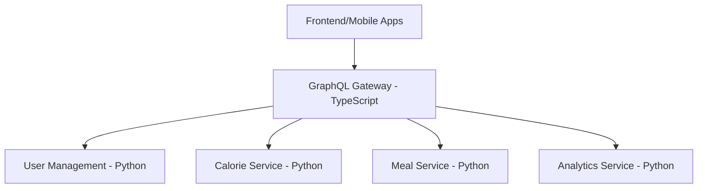

# 🏋️ GymBro Platform - GraphQL Gateway v0.2.0

## 🚀 Panoramica

Il **GraphQL Gateway** è il punto di ingresso unificato per tutte le API del GymBro Platform. Implementato con **TypeScript + Apollo Server**, fornisce un layer di federazione GraphQL che aggrega tutti i microservizi Python in un'unica API consistente.

## 🎯 Architettura Decisionale

### Perché TypeScript + Apollo Server?

**Stack Decisionale**:
- **Gateway Layer**: TypeScript + Apollo Server (questo servizio)
- **Business Logic Services**: Python + FastAPI + Strawberry GraphQL
- **Pattern**: Separation of Concerns per performance ottimale

**Vantaggi Performance**:
- ⚡ **Event Loop Optimization**: Node.js gestisce meglio migliaia di connessioni I/O concorrenti
- 📉 **Memory Footprint**: ~30-50MB vs ~100-200MB Python per gateway
- 🚀 **Latency**: <10ms overhead vs ~20-50ms Python per request forwarding
- 🔗 **Apollo Federation**: Standard industry maturo per federazione microservizi

**Architettura Ibrida**:


## 🏗️ Setup e Sviluppo

### Prerequisiti
- Node.js 20+ 
- npm o yarn
- PostgreSQL (per servizi backend)

### Installazione
```bash
cd services/graphql-gateway
npm install
```

### Configurazione
Crea file `.env`:
```env
NODE_ENV=development
PORT=4000
USER_MANAGEMENT_URL=http://localhost:8001
CORS_ORIGINS=*
LOG_LEVEL=debug
```

### Avvio Sviluppo
```bash
# Compilazione TypeScript + avvio
npm run dev

# Solo compilazione
npm run build

# Avvio produzione
npm start

# Test
npm test

# Linting
npm run lint
```

## 📊 API Endpoints

### Health Checks
- `GET /ping` - Test connettività base
- `GET /health` - Health check semplice  
- `GET /health/detailed` - Health check completo con stato subgraph

### GraphQL
- `POST /graphql` - Endpoint GraphQL principale
- `GET /graphql` - GraphQL Playground (solo development)

## 🔧 Configurazione

### Environment Variables
| Variabile | Default | Descrizione |
|-----------|---------|-------------|
| `PORT` | `4000` | Porta server (dynamic per Render.com) |
| `NODE_ENV` | `development` | Environment |
| `USER_MANAGEMENT_URL` | `http://localhost:8001` | URL User Management Service |
| `CORS_ORIGINS` | `*` | Domini CORS permessi |
| `LOG_LEVEL` | `debug` | Livello logging |

### Subgraph Configuration
Il gateway aggrega automaticamente gli schemi GraphQL da:
- **User Management**: Autenticazione, profili utente
- **Calorie Service**: Calcoli calorici (future)
- **Meal Service**: Gestione pasti (future)  
- **Analytics Service**: Reportistica (future)

## 🐳 Docker

### Build
```bash
docker build -t gymbro-graphql-gateway .
```

### Run
```bash
docker run -p 4000:4000 \
  -e USER_MANAGEMENT_URL=http://user-service:8000 \
  gymbro-graphql-gateway
```

## 🚀 Deployment

### Render.com (Raccomandato)
Il servizio è ottimizzato per Render.com seguendo le [lezioni apprese](../../CHECKPOINT.md) dal deployment di User Management:

**render.yaml**:
```yaml
services:
  - type: web
    name: gymbro-graphql-gateway
    env: node
    buildCommand: npm ci && npm run build
    startCommand: npm start
    healthCheckPath: /health
    envVars:
      - key: PORT
        generateValue: true
      - key: USER_MANAGEMENT_URL
        value: https://gymbro-user-service.onrender.com
```

### Best Practices Applicate
✅ **Port Binding Dinamico**: `PORT=${PORT:-4000}`  
✅ **Health Checks**: Endpoint `/health` + `/ping`  
✅ **CORS Permissivo**: Per debug MVP  
✅ **Multi-stage Docker**: Build ottimizzato  
✅ **Error Handling**: Graceful degradation  

## 🧪 Testing

### Test Strategy
- **Unit Tests**: Logic del gateway e configurazione
- **Integration Tests**: Connettività con subgraph
- **E2E Tests**: GraphQL queries complete

### Comandi Test
```bash
# Test unitari
npm test

# Test con coverage
npm run test:coverage

# Test integration (richiede servizi attivi)
npm run test:integration
```

## 📈 Monitoring

### Health Monitoring
```bash
# Test connettività
curl http://localhost:4000/ping

# Health check basic
curl http://localhost:4000/health

# Health check dettagliato
curl http://localhost:4000/health/detailed
```

### GraphQL Introspection
```bash
# Schema introspection
curl -X POST http://localhost:4000/graphql \
  -H "Content-Type: application/json" \
  -d '{"query":"query IntrospectionQuery { __schema { types { name } } }"}'
```

## 🔄 Development Workflow

### Federation Development
1. **Implementa nuovo servizio** (es. Calorie Service con Strawberry)
2. **Aggiungi subgraph** nel gateway configuration
3. **Update schema** via Apollo introspection
4. **Test integration** con Postman/GraphQL Playground

### Code Quality
- **TypeScript Strict**: Configurazione rigorosa
- **ESLint + Prettier**: Code formatting automatico  
- **Husky**: Pre-commit hooks
- **Jest**: Test framework

## 🔗 Collegamenti
- **Production URL**: TBD (dopo deployment)
- **User Management API**: https://gymbro-user-service.onrender.com
- **Main Repository**: https://github.com/giamma80/gymbro-platform
- **Architecture Docs**: [../../docs/](../../docs/)

---

**Versione**: v0.2.0  
**Deployment**: Render.com ready  
**Stack**: TypeScript + Apollo Server + Express  
**Status**: 🔄 In Development
